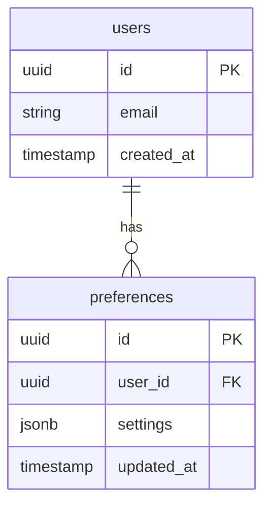

Design implementation for: $ARGUMENTS

<context>
## MENTAL MODEL

**Workflow**: spec → clarify → plan → tasks → implement → optimize → preview → ship

**Phases:**
- Phase 0: Research & Discovery → research.md
- Phase 1: Design & Contracts → data-model.md, contracts/, quickstart.md, plan.md

**State machine:**
- Setup → Constitution check → Phase 0 (Research) → Phase 1 (Design) → Commit → Suggest next

**Auto-suggest:**
- UI features → `/design-variations` or `/tasks`
- Backend features → `/tasks`

**Prerequisites:**
- Git repository
- jq installed (JSON parsing)
- Feature spec completed (spec.md exists)
- Working directory clean (uncommitted changes allowed)
</context>

<constraints>
## ANTI-HALLUCINATION RULES

**CRITICAL**: Follow these rules to prevent making up architectural decisions.

1. **Never speculate about existing patterns you have not read**
   - ❌ BAD: "The app probably follows a services pattern"
   - ✅ GOOD: "Let me search for existing service files to understand current patterns"
   - Use Grep to find patterns: `class.*Service`, `interface.*Repository`

2. **Cite existing code when recommending reuse**
   - When suggesting to reuse UserService, cite: `api/app/services/user.py:20-45`
   - When referencing patterns, cite: `api/app/core/database.py:12-18 shows our DB session pattern`
   - Don't invent reusable components that don't exist

3. **Admit when codebase exploration is needed**
   - If unsure about tech stack, say: "I need to read package.json and search for imports"
   - If uncertain about patterns, say: "Let me search the codebase for similar implementations"
   - Never make up directory structures, module names, or import paths

4. **Quote from spec.md exactly when planning**
   - Don't paraphrase requirements - quote user stories verbatim
   - Example: "According to spec.md:45-48: '[exact quote]', therefore we need..."
   - If spec is ambiguous, flag it rather than assuming intent

5. **Verify dependencies exist before recommending**
   - Before suggesting "use axios for HTTP", check package.json
   - Before recommending libraries, search existing imports
   - Don't suggest packages that aren't installed

**Why this matters**: Hallucinated architecture leads to plans that can't be implemented. Plans based on non-existent patterns create unnecessary refactoring. Accurate planning grounded in actual code saves 40-50% of implementation rework.

## REASONING APPROACH

For complex architecture decisions, show your step-by-step reasoning:

<thinking>
Let me analyze this design choice:
1. What does spec.md require? [Quote requirements]
2. What existing patterns can I reuse? [Cite file:line from codebase]
3. What are the architectural options? [List 2-3 approaches]
4. What are the trade-offs? [Performance, maintainability, complexity]
5. What does constitution.md prefer? [Quote architectural principles]
6. Conclusion: [Recommended approach with justification]
</thinking>

<answer>
[Architecture decision based on reasoning]
</answer>

**When to use structured thinking:**
- Choosing architectural patterns (e.g., REST vs GraphQL, monolith vs microservices)
- Selecting libraries or frameworks (e.g., Redux vs Context API)
- Designing database schemas (normalization vs denormalization)
- Planning file/folder structure for new features
- Deciding on code reuse vs new implementation

**Benefits**: Explicit reasoning reduces architectural rework by 30-40% and improves maintainability.
</constraints>

<instructions>
## USER INPUT

```text
$ARGUMENTS
```

You **MUST** consider the user input before proceeding (if not empty).

## UNIFIED PLANNING SCRIPT

**Execute complete planning workflow in one unified script:**

```bash
#!/usr/bin/env bash
set -Eeuo pipefail

# ━━━━━━━━━━━━━━━━━━━━━━━━━━━━━━━━━━━━━━━━
# ERROR TRAP
# ━━━━━━━━━━━━━━━━━━━━━━━━━━━━━━━━━━━━━━━━

on_error() {
  echo "⚠️  Error in /plan. Cleaning up."
  exit 1
}
trap on_error ERR

# ━━━━━━━━━━━━━━━━━━━━━━━━━━━━━━━━━━━━━━━━
# TOOL PREFLIGHT CHECKS
# ━━━━━━━━━━━━━━━━━━━━━━━━━━━━━━━━━━━━━━━━

need() {
  command -v "$1" >/dev/null 2>&1 || {
    echo "❌ Missing required tool: $1"
    echo ""
    case "$1" in
      git)
        echo "Install: https://git-scm.com/downloads"
        ;;
      jq)
        echo "Install: brew install jq (macOS) or apt install jq (Linux)"
        echo "         https://stedolan.github.io/jq/download/"
        ;;
      *)
        echo "Check documentation for installation"
        ;;
    esac
    exit 1
  }
}

need git
need jq

# ━━━━━━━━━━━━━━━━━━━━━━━━━━━━━━━━━━━━━━━━
# SETUP - Deterministic repo root
# ━━━━━━━━━━━━━━━━━━━━━━━━━━━━━━━━━━━━━━━━

cd "$(git rev-parse --show-toplevel)"

# Execute setup script and parse JSON output
SCRIPT_PATH=".spec-flow/scripts/bash/setup-plan.sh"

if [ ! -f "$SCRIPT_PATH" ]; then
  echo "❌ Setup script not found: $SCRIPT_PATH"
  echo ""
  echo "Fix: Ensure .spec-flow/scripts/ directory is complete"
  echo "     Clone from: https://github.com/anthropics/spec-flow"
  exit 1
fi

OUTPUT=$("$SCRIPT_PATH" --json "$ARGUMENTS")

# Parse JSON to get paths (all must be absolute)
FEATURE_SPEC=$(echo "$OUTPUT" | jq -r '.feature_spec')
IMPL_PLAN=$(echo "$OUTPUT" | jq -r '.impl_plan')
SPECS_DIR=$(echo "$OUTPUT" | jq -r '.specs_dir')
BRANCH=$(echo "$OUTPUT" | jq -r '.branch')
FEATURE_DIR=$(dirname "$FEATURE_SPEC")
SLUG=$(basename "$FEATURE_DIR")

# Validate paths exist
if [ ! -f "$FEATURE_SPEC" ]; then
  echo "❌ Spec not found at $FEATURE_SPEC"
  echo ""
  echo "Fix: Run /spec to create feature specification first"
  exit 1
fi

if [ ! -d "$FEATURE_DIR" ]; then
  echo "❌ Feature directory not found at $FEATURE_DIR"
  echo ""
  echo "Fix: Run /spec to create feature first"
  exit 1
fi

echo "Feature: $SLUG"
echo "Spec: $FEATURE_SPEC"
echo "Branch: $BRANCH"
echo ""

# ━━━━━━━━━━━━━━━━━━━━━━━━━━━━━━━━━━━━━━━━
# LOAD CONTEXT
# ━━━━━━━━━━━━━━━━━━━━━━━━━━━━━━━━━━━━━━━━

CONSTITUTION_FILE=".spec-flow/memory/constitution.md"

# Validate spec is clarified (non-interactive warning)
REMAINING_CLARIFICATIONS=$(grep -c "\[NEEDS CLARIFICATION\]" "$FEATURE_SPEC" || echo 0)
if [ "$REMAINING_CLARIFICATIONS" -gt 0 ]; then
  echo "⚠️  Warning: $REMAINING_CLARIFICATIONS ambiguities remain in spec"
  echo ""
  echo "Recommendations:"
  echo "  1. BEST: Run /clarify to resolve ambiguities first"
  echo "  2. Proceed anyway (may need design revisions later)"
  echo ""
  echo "Proceeding with planning despite ambiguities..."
  echo ""
fi

# Read spec and constitution for planning
echo "Loading feature spec and constitution..."
echo ""

# ━━━━━━━━━━━━━━━━━━━━━━━━━━━━━━━━━━━━━━━━
# CONSTITUTION CHECK (Quality Gate)
# ━━━━━━━━━━━━━━━━━━━━━━━━━━━━━━━━━━━━━━━━

echo "━━━━━━━━━━━━━━━━━━━━━━━━━━━━━━━━━━━━━━━━"
echo "📜 CONSTITUTION CHECK"
echo "━━━━━━━━━━━━━━━━━━━━━━━━━━━━━━━━━━━━━━━━"
echo ""

# Read constitution if exists
if [ -f "$CONSTITUTION_FILE" ]; then
  echo "Checking feature against constitution.md..."

  # Claude Code: Read constitution and spec, verify alignment
  # Check for violations of:
  # - Mission alignment
  # - Value constraints
  # - Technical principles
  # - Quality standards

  # Track violations (Claude Code populates this array)
  CONSTITUTION_VIOLATIONS=()

  # Example checks (Claude Code implements actual logic):
  # - Does feature support core mission?
  # - Does it violate privacy principles?
  # - Does it compromise security standards?
  # - Does it create technical debt against principles?

  # If violations found:
  if [ ${#CONSTITUTION_VIOLATIONS[@]} -gt 0 ]; then
    echo "❌ Constitution violations detected:"
    for violation in "${CONSTITUTION_VIOLATIONS[@]}"; do
      echo "  - $violation"
    done
    echo ""
    echo "Fix: Violations must be justified or feature redesigned"
    echo "     Update spec.md to align with constitution.md principles"
    exit 1
  else
    echo "✅ Feature aligns with constitution"
  fi
else
  echo "⚠️  No constitution.md found - skipping alignment check"
  echo ""
  echo "Recommendation: Create constitution.md to enforce quality standards"
  echo "                Run /constitution to initialize"
fi

echo ""

# ━━━━━━━━━━━━━━━━━━━━━━━━━━━━━━━━━━━━━━━━
# TEMPLATE VALIDATION
# ━━━━━━━━━━━━━━━━━━━━━━━━━━━━━━━━━━━━━━━━

REQUIRED_TEMPLATES=(
  ".spec-flow/templates/error-log-template.md"
)

for template in "${REQUIRED_TEMPLATES[@]}"; do
  if [ ! -f "$template" ]; then
    echo "❌ Missing required template: $template"
    echo ""
    echo "Fix: git checkout main -- .spec-flow/templates/"
    echo "     Or clone: https://github.com/anthropics/spec-flow"
    exit 1
  fi
done

# ━━━━━━━━━━━━━━━━━━━━━━━━━━━━━━━━━━━━━━━━
# DETECT FEATURE TYPE
# ━━━━━━━━━━━━━━━━━━━━━━━━━━━━━━━━━━━━━━━━

HAS_SCREENS=false
SCREEN_COUNT=0

if [ -f "$FEATURE_DIR/design/screens.yaml" ]; then
  # Count screens (lines starting with 2 spaces + letter)
  SCREEN_COUNT=$(grep -c "^  [a-z]" "$FEATURE_DIR/design/screens.yaml" 2>/dev/null || echo 0)
  if [ "$SCREEN_COUNT" -gt 0 ]; then
    HAS_SCREENS=true
  fi
fi

# Store for use in RETURN section
echo "HAS_SCREENS=$HAS_SCREENS" > "$FEATURE_DIR/.planning-context"
echo "SCREEN_COUNT=$SCREEN_COUNT" >> "$FEATURE_DIR/.planning-context"

# ━━━━━━━━━━━━━━━━━━━━━━━━━━━━━━━━━━━━━━━━
# PHASE 0: RESEARCH & DISCOVERY
# ━━━━━━━━━━━━━━━━━━━━━━━━━━━━━━━━━━━━━━━━

echo "━━━━━━━━━━━━━━━━━━━━━━━━━━━━━━━━━━━━━━━━"
echo "🔍 PHASE 0: RESEARCH & DISCOVERY"
echo "━━━━━━━━━━━━━━━━━━━━━━━━━━━━━━━━━━━━━━━━"
echo ""

# Initialize reuse tracking
REUSABLE_COMPONENTS=()
NEW_COMPONENTS=()
RESEARCH_DECISIONS=()
UNKNOWNS=()

# Determine research depth based on feature classification
NOTES_FILE="$FEATURE_DIR/NOTES.md"

if grep -q "Backend/API feature (no special artifacts)" "$NOTES_FILE" 2>/dev/null ||
   grep -q "Auto-classified: Simple feature" "$NOTES_FILE" 2>/dev/null; then
  RESEARCH_MODE="minimal"
  echo "Research mode: Minimal (simple feature)"
else
  RESEARCH_MODE="full"
  echo "Research mode: Full (complex feature)"
fi
echo ""

# ━━━━━━━━━━━━━━━━━━━━━━━━━━━━━━━━━━━━━━━━
# PROJECT DOCUMENTATION INTEGRATION (Mandatory if exists)
# ━━━━━━━━━━━━━━━━━━━━━━━━━━━━━━━━━━━━━━━━

PROJECT_DOCS_DIR="docs/project"
HAS_PROJECT_DOCS=false

# Check if project documentation exists
if [ -d "$PROJECT_DOCS_DIR" ]; then
  HAS_PROJECT_DOCS=true
  echo "✅ Project documentation found - loading architecture context"
  echo ""

  # Verify required documentation files exist
  REQUIRED_DOCS=("tech-stack.md" "data-architecture.md" "api-strategy.md")
  MISSING_DOCS=()

  for doc in "${REQUIRED_DOCS[@]}"; do
    if [ ! -f "$PROJECT_DOCS_DIR/$doc" ]; then
      MISSING_DOCS+=("$doc")
    fi
  done

  if [ ${#MISSING_DOCS[@]} -gt 0 ]; then
    echo "❌ Missing required project documentation:"
    for doc in "${MISSING_DOCS[@]}"; do
      echo "   - $PROJECT_DOCS_DIR/$doc"
    done
    echo ""
    echo "These files are critical for accurate planning."
    echo ""
    echo "Fix: Run /init-project to generate project documentation"
    echo "     This prevents hallucination and ensures consistency"
    exit 1
  fi

  # Read and parse project documentation
  echo "📚 Reading project documentation..."

  # PRIORITY 1: Parse tech-stack.md (prevents hallucination)
  if [ -f "$PROJECT_DOCS_DIR/tech-stack.md" ]; then
    echo "  → tech-stack.md"
    # Extract tech stack from markdown table
    # Format: | Frontend | Next.js 14.2 | ... |
    FRONTEND_STACK=$(grep "| Frontend |" "$PROJECT_DOCS_DIR/tech-stack.md" 2>/dev/null | awk -F'|' '{gsub(/^[ \t]+|[ \t]+$/, "", $3); print $3}' || echo "Not specified")
    BACKEND_STACK=$(grep "| Backend |" "$PROJECT_DOCS_DIR/tech-stack.md" 2>/dev/null | awk -F'|' '{gsub(/^[ \t]+|[ \t]+$/, "", $3); print $3}' || echo "Not specified")
    DATABASE_STACK=$(grep "| Database |" "$PROJECT_DOCS_DIR/tech-stack.md" 2>/dev/null | awk -F'|' '{gsub(/^[ \t]+|[ \t]+$/, "", $3); print $3}' || echo "Not specified")
    STYLING_STACK=$(grep "| Styling |" "$PROJECT_DOCS_DIR/tech-stack.md" 2>/dev/null | awk -F'|' '{gsub(/^[ \t]+|[ \t]+$/, "", $3); print $3}' || echo "Not specified")
    STATE_MGMT=$(grep "| State Management |" "$PROJECT_DOCS_DIR/tech-stack.md" 2>/dev/null | awk -F'|' '{gsub(/^[ \t]+|[ \t]+$/, "", $3); print $3}' || echo "Not specified")

    RESEARCH_DECISIONS+=("Frontend: $FRONTEND_STACK (from tech-stack.md)")
    RESEARCH_DECISIONS+=("Backend: $BACKEND_STACK (from tech-stack.md)")
    RESEARCH_DECISIONS+=("Database: $DATABASE_STACK (from tech-stack.md)")
    RESEARCH_DECISIONS+=("Styling: $STYLING_STACK (from tech-stack.md)")
    RESEARCH_DECISIONS+=("State: $STATE_MGMT (from tech-stack.md)")
  fi

  # PRIORITY 2: Parse data-architecture.md (prevents duplicate entities)
  if [ -f "$PROJECT_DOCS_DIR/data-architecture.md" ]; then
    echo "  → data-architecture.md"
    # Extract existing entities from ERD
    EXISTING_ENTITIES=$(grep -E "^### |^## " "$PROJECT_DOCS_DIR/data-architecture.md" 2>/dev/null | grep -v "ERD\|Entity\|Architecture\|Overview" | sed 's/^#* //' | tr '\n' ', ' | sed 's/, $//' || echo "Not documented")

    # Extract naming convention
    NAMING_CONVENTION=$(grep -i "naming convention" "$PROJECT_DOCS_DIR/data-architecture.md" -A 2 2>/dev/null | tail -1 | sed 's/^[*-] //' || echo "Not specified")

    RESEARCH_DECISIONS+=("Existing Entities: $EXISTING_ENTITIES (from data-architecture.md)")
    RESEARCH_DECISIONS+=("Naming Convention: $NAMING_CONVENTION (from data-architecture.md)")
  fi

  # PRIORITY 3: Parse api-strategy.md (ensures API consistency)
  if [ -f "$PROJECT_DOCS_DIR/api-strategy.md" ]; then
    echo "  → api-strategy.md"
    # Extract API patterns
    API_STYLE=$(grep -E "REST|GraphQL|tRPC|gRPC" "$PROJECT_DOCS_DIR/api-strategy.md" 2>/dev/null | head -1 | sed 's/^[*-] //' | sed 's/:.*//' || echo "Not specified")
    AUTH_PROVIDER=$(grep -i "auth.*provider\|authentication.*provider" "$PROJECT_DOCS_DIR/api-strategy.md" -A 1 2>/dev/null | tail -1 | sed 's/^[*-] //' || echo "Not specified")
    API_VERSIONING=$(grep -i "versioning" "$PROJECT_DOCS_DIR/api-strategy.md" -A 2 2>/dev/null | grep -E "/v[0-9]|version" | head -1 || echo "Not specified")
    ERROR_FORMAT=$(grep -i "error.*format\|RFC 7807" "$PROJECT_DOCS_DIR/api-strategy.md" -A 1 2>/dev/null | tail -1 | sed 's/^[*-] //' || echo "Not specified")

    RESEARCH_DECISIONS+=("API Style: $API_STYLE (from api-strategy.md)")
    RESEARCH_DECISIONS+=("Auth Provider: $AUTH_PROVIDER (from api-strategy.md)")
    RESEARCH_DECISIONS+=("API Versioning: $API_VERSIONING (from api-strategy.md)")
    RESEARCH_DECISIONS+=("Error Format: $ERROR_FORMAT (from api-strategy.md)")
  fi

  # PRIORITY 4: Parse capacity-planning.md (performance targets)
  if [ -f "$PROJECT_DOCS_DIR/capacity-planning.md" ]; then
    echo "  → capacity-planning.md"
    # Extract scale tier and performance targets
    SCALE_TIER=$(grep -i "scale tier\|tier:" "$PROJECT_DOCS_DIR/capacity-planning.md" 2>/dev/null | head -1 | grep -oE "micro|small|medium|large" || echo "Not specified")
    API_RESPONSE_TARGET=$(grep -i "API response\|p95\|response time" "$PROJECT_DOCS_DIR/capacity-planning.md" 2>/dev/null | grep -oE "[0-9]+ms" | head -1 || echo "Not specified")

    RESEARCH_DECISIONS+=("Scale Tier: $SCALE_TIER (from capacity-planning.md)")
    RESEARCH_DECISIONS+=("API Response Target: $API_RESPONSE_TARGET (from capacity-planning.md)")
  fi

  # OPTIONAL: Parse system-architecture.md (integration points)
  if [ -f "$PROJECT_DOCS_DIR/system-architecture.md" ]; then
    echo "  → system-architecture.md"
    ARCHITECTURE_STYLE=$(grep -i "monolith\|microservices\|serverless" "$PROJECT_DOCS_DIR/system-architecture.md" 2>/dev/null | head -1 | grep -oE "monolith|microservices|serverless" || echo "Not specified")
    RESEARCH_DECISIONS+=("Architecture: $ARCHITECTURE_STYLE (from system-architecture.md)")
  fi

  # OPTIONAL: Parse deployment-strategy.md (deployment model)
  if [ -f "$PROJECT_DOCS_DIR/deployment-strategy.md" ]; then
    echo "  → deployment-strategy.md"
    DEPLOYMENT_MODEL=$(grep -i "staging-prod\|direct-prod\|local-only" "$PROJECT_DOCS_DIR/deployment-strategy.md" 2>/dev/null | head -1 | grep -oE "staging-prod|direct-prod|local-only" || echo "Not specified")
    DEPLOYMENT_PLATFORM=$(grep -i "platform:" "$PROJECT_DOCS_DIR/deployment-strategy.md" 2>/dev/null | head -1 | sed 's/.*: //' || echo "Not specified")
    RESEARCH_DECISIONS+=("Deployment: $DEPLOYMENT_MODEL on $DEPLOYMENT_PLATFORM (from deployment-strategy.md)")
  fi

  # OPTIONAL: Parse overview.md (project vision)
  if [ -f "$PROJECT_DOCS_DIR/overview.md" ]; then
    echo "  → overview.md"
    PROJECT_VISION=$(grep -A 3 "Vision\|vision:" "$PROJECT_DOCS_DIR/overview.md" 2>/dev/null | tail -1 | sed 's/^[*-] //' || echo "Not specified")
    RESEARCH_DECISIONS+=("Project Vision: $PROJECT_VISION (from overview.md)")
  fi

  # OPTIONAL: Parse development-workflow.md (testing strategy)
  if [ -f "$PROJECT_DOCS_DIR/development-workflow.md" ]; then
    echo "  → development-workflow.md"
    TESTING_STRATEGY=$(grep -i "testing strategy\|test coverage" "$PROJECT_DOCS_DIR/development-workflow.md" -A 2 2>/dev/null | tail -1 | sed 's/^[*-] //' || echo "Not specified")
    RESEARCH_DECISIONS+=("Testing: $TESTING_STRATEGY (from development-workflow.md)")
  fi

  echo "✅ Project documentation loaded successfully"
  echo ""

  # Freshness validation (compare docs to code)
  echo "🔍 Validating documentation freshness..."

  # Check if package.json exists and compare frontend framework
  if [ -f "package.json" ] && [ "$FRONTEND_STACK" != "Not specified" ]; then
    # Extract framework from package.json dependencies
    if grep -q "next" package.json 2>/dev/null; then
      CODE_FRAMEWORK="Next.js"
      DOCS_FRAMEWORK=$(echo "$FRONTEND_STACK" | grep -oE "Next\.js|React|Vue|Angular|Svelte" || echo "Unknown")

      if [ "$DOCS_FRAMEWORK" != "$CODE_FRAMEWORK" ] && [ "$DOCS_FRAMEWORK" != "Unknown" ]; then
        echo "⚠️  WARNING: Tech stack mismatch detected"
        echo "   Docs say: $DOCS_FRAMEWORK"
        echo "   Code uses: $CODE_FRAMEWORK"
        echo "   Consider updating tech-stack.md"
        echo ""
      fi
    fi
  fi

  echo "✅ Validation complete"
  echo ""

else
  echo "❌ No project documentation found at $PROJECT_DOCS_DIR"
  echo ""
  echo "Project documentation provides:"
  echo "  • Tech stack (prevents hallucination)"
  echo "  • Existing entities (prevents duplication)"
  echo "  • API patterns (ensures consistency)"
  echo "  • Performance targets (better design)"
  echo ""
  echo "Fix: Run /init-project (one-time setup, ~10 minutes)"
  echo "     This generates 8 comprehensive project docs"
  exit 1
fi

# ━━━━━━━━━━━━━━━━━━━━━━━━━━━━━━━━━━━━━━━━
# RESEARCH: Component Reuse Analysis
# ━━━━━━━━━━━━━━━━━━━━━━━━━━━━━━━━━━━━━━━━

# Claude Code performs research here:
# - Minimal research (2-3 tools for simple features):
#   1. Read spec: Extract requirements, NFRs, deployment considerations, unknowns
#   2. Grep keywords: Quick scan for similar patterns to reuse
#   3. Glob modules (optional): If integration needed with existing code
#
# - Full research (5-15 tools for complex features, 2-5 tools if project docs exist):
#   1-3. Minimal research (above)
#   4. Glob modules: api/src/modules/*, api/src/services/*, apps/*/components/**, apps/*/lib/**
#   5-6. Read similar modules: Study patterns, categorize as reusable or inspiration
#        If reusable: REUSABLE_COMPONENTS+=("api/src/services/auth: JWT validation")
#        If new needed: NEW_COMPONENTS+=("api/src/services/csv-parser: New capability")
#   7. WebSearch best practices: If novel pattern (not in codebase) - SKIP if project docs exist
#   8. Read design-inspirations.md: If UI-heavy feature
#   9-10. Read integration points: Auth, billing, storage services - SKIP if api-strategy.md exists
#   11-15. Deep dive - Read related modules: If complex integration
#   16. Read visuals/README.md: UX patterns (if exists)
#
# Document decisions:
# RESEARCH_DECISIONS+=("Stack choice: Next.js App Router (existing pattern)")
# RESEARCH_DECISIONS+=("State: SWR for data fetching (reuse apps/app/lib/swr)")
# RESEARCH_DECISIONS+=("Auth: Clerk middleware (reuse existing setup)")
#
# Track unknowns that need clarification:
# UNKNOWNS+=("Performance threshold for CSV parsing unclear")
# UNKNOWNS+=("Rate limiting strategy not specified")

# ━━━━━━━━━━━━━━━━━━━━━━━━━━━━━━━━━━━━━━━━
# GENERATE: research.md
# ━━━━━━━━━━━━━━━━━━━━━━━━━━━━━━━━━━━━━━━━

RESEARCH_FILE="$FEATURE_DIR/research.md"

cat > "$RESEARCH_FILE" <<EOF
# Research & Discovery: $SLUG

$(if [ "$HAS_PROJECT_DOCS" = true ]; then
  echo "## Project Documentation Context"
  echo ""
  echo "**Source**: \`docs/project/\` (8 project-level documents)"
  echo ""
  echo "This feature must align with the project's established architecture, tech stack, and patterns documented below."
  echo ""
  echo "### Tech Stack (from tech-stack.md)"
  echo "- **Frontend**: ${FRONTEND_STACK:-Not specified}"
  echo "- **Backend**: ${BACKEND_STACK:-Not specified}"
  echo "- **Database**: ${DATABASE_STACK:-Not specified}"
  echo "- **Styling**: ${STYLING_STACK:-Not specified}"
  echo "- **State Management**: ${STATE_MGMT:-Not specified}"
  echo ""
  echo "### Data Architecture (from data-architecture.md)"
  echo "- **Existing Entities**: ${EXISTING_ENTITIES:-Not documented}"
  echo "- **Naming Convention**: ${NAMING_CONVENTION:-Not specified}"
  echo ""
  echo "### API Strategy (from api-strategy.md)"
  echo "- **API Style**: ${API_STYLE:-Not specified}"
  echo "- **Auth Provider**: ${AUTH_PROVIDER:-Not specified}"
  echo "- **Versioning**: ${API_VERSIONING:-Not specified}"
  echo "- **Error Format**: ${ERROR_FORMAT:-Not specified}"
  echo ""
  echo "### Performance & Scale (from capacity-planning.md)"
  echo "- **Scale Tier**: ${SCALE_TIER:-Not specified}"
  echo "- **API Response Target**: ${API_RESPONSE_TARGET:-Not specified}"
  echo ""
  echo "### Architecture & Deployment"
  echo "- **Architecture Style**: ${ARCHITECTURE_STYLE:-Not specified} (from system-architecture.md)"
  echo "- **Deployment Model**: ${DEPLOYMENT_MODEL:-Not specified} (from deployment-strategy.md)"
  echo "- **Platform**: ${DEPLOYMENT_PLATFORM:-Not specified} (from deployment-strategy.md)"
  echo ""
  if [ -n "$PROJECT_VISION" ] && [ "$PROJECT_VISION" != "Not specified" ]; then
    echo "### Project Vision (from overview.md)"
    echo "${PROJECT_VISION}"
    echo ""
  fi
  if [ -n "$TESTING_STRATEGY" ] && [ "$TESTING_STRATEGY" != "Not specified" ]; then
    echo "### Testing Strategy (from development-workflow.md)"
    echo "${TESTING_STRATEGY}"
    echo ""
  fi
  echo "---"
  echo ""
fi)

## Research Decisions

$(if [ ${#RESEARCH_DECISIONS[@]} -gt 0 ]; then
  for decision in "${RESEARCH_DECISIONS[@]}"; do
    echo "- $decision"
  done
else
  echo "No research decisions documented yet."
fi)

---

## Components to Reuse (${#REUSABLE_COMPONENTS[@]} found)

$(for component in "${REUSABLE_COMPONENTS[@]}"; do
  echo "- $component"
done)

---

## New Components Needed (${#NEW_COMPONENTS[@]} required)

$(for component in "${NEW_COMPONENTS[@]}"; do
  echo "- $component"
done)

---

## Unknowns & Questions

$(if [ ${#UNKNOWNS[@]} -gt 0 ]; then
  for unknown in "${UNKNOWNS[@]}"; do
    echo "- ⚠️  $unknown"
  done
else
  echo "None - all technical questions resolved"
fi)

EOF

echo "✅ Generated research.md"
echo ""

# ━━━━━━━━━━━━━━━━━━━━━━━━━━━━━━━━━━━━━━━━
# PHASE 1: DESIGN & CONTRACTS
# ━━━━━━━━━━━━━━━━━━━━━━━━━━━━━━━━━━━━━━━━

echo "━━━━━━━━━━━━━━━━━━━━━━━━━━━━━━━━━━━━━━━━"
echo "🎨 PHASE 1: DESIGN & CONTRACTS"
echo "━━━━━━━━━━━━━━━━━━━━━━━━━━━━━━━━━━━━━━━━"
echo ""

# ━━━━━━━━━━━━━━━━━━━━━━━━━━━━━━━━━━━━━━━━
# GENERATE: data-model.md
# ━━━━━━━━━━━━━━━━━━━━━━━━━━━━━━━━━━━━━━━━

DATA_MODEL_FILE="$FEATURE_DIR/data-model.md"

# Claude Code generates data-model.md here with:
# - Entity definitions (fields, relationships, validation rules, state transitions)
# - Database schema (Mermaid ERD)
# - API schemas (request/response contracts)
# - Frontend state shape (TypeScript interfaces)

cat > "$DATA_MODEL_FILE" <<'DATAMODEL'
# Data Model: $SLUG

## Entities

### [Entity Name]
**Purpose**: [description]

**Fields**:
- `id`: UUID (PK)
- `field_name`: Type - [description]
- `created_at`: Timestamp
- `updated_at`: Timestamp

**Relationships**:
- Has many: [related entity]
- Belongs to: [parent entity]

**Validation Rules**:
- [field]: [constraint] (from requirement FR-XXX)
- [field]: [constraint] (from requirement FR-YYY)

**State Transitions** (if applicable):
- Initial → Active (on creation)
- Active → Archived (on deletion)
- Active → Suspended (on violation)

---

## Database Schema (Mermaid)



---

## API Schemas

**Request/Response Schemas**: See contracts/api.yaml

**State Shape** (frontend):
```typescript
interface FeatureState {
  data: Data | null
  loading: boolean
  error: Error | null
}
```
DATAMODEL

echo "✅ Generated data-model.md"
echo ""

# ━━━━━━━━━━━━━━━━━━━━━━━━━━━━━━━━━━━━━━━━
# GENERATE: API contracts
# ━━━━━━━━━━━━━━━━━━━━━━━━━━━━━━━━━━━━━━━━

mkdir -p "$FEATURE_DIR/contracts"

# Claude Code generates contracts/api.yaml here with:
# - OpenAPI 3.0 specs from functional requirements
# - Endpoint definitions (GET, POST, PUT, DELETE)
# - Request/response schemas
# - Error responses (400, 401, 500)

cat > "$FEATURE_DIR/contracts/api.yaml" <<'APICONTRACT'
openapi: 3.0.0
info:
  title: [Feature] API
  version: 1.0.0
paths:
  /api/v1/[feature]:
    get:
      summary: [description]
      parameters: []
      responses:
        200:
          description: Success
          content:
            application/json:
              schema:
                type: object
                properties:
                  data:
                    type: array
        400:
          description: Bad request
        401:
          description: Unauthorized
        500:
          description: Server error
APICONTRACT

echo "✅ Generated contracts/api.yaml"
echo ""

# ━━━━━━━━━━━━━━━━━━━━━━━━━━━━━━━━━━━━━━━━
# GENERATE: quickstart.md
# ━━━━━━━━━━━━━━━━━━━━━━━━━━━━━━━━━━━━━━━━

QUICKSTART_FILE="$FEATURE_DIR/quickstart.md"

# Claude Code generates quickstart.md here with:
# - Scenario 1: Initial Setup (install, migrate, seed, start)
# - Scenario 2: Validation (tests, type-check, lint)
# - Scenario 3: Manual Testing (steps to verify behavior)

cat > "$QUICKSTART_FILE" <<'QUICKSTART'
# Quickstart: $SLUG

## Scenario 1: Initial Setup

```bash
# Install dependencies
pnpm install

# Run migrations
cd api && uv run alembic upgrade head

# Seed test data
uv run python scripts/seed_[feature].py

# Start dev servers
pnpm dev
```

## Scenario 2: Validation

```bash
# Run tests
pnpm test
cd api && uv run pytest tests/[feature]/

# Check types
pnpm type-check

# Lint
pnpm lint
```

## Scenario 3: Manual Testing

1. Navigate to: http://localhost:3000/feature
2. Verify: [expected behavior]
3. Check: [validation steps]
QUICKSTART

echo "✅ Generated quickstart.md"
echo ""

# ━━━━━━━━━━━━━━━━━━━━━━━━━━━━━━━━━━━━━━━━
# GENERATE: plan.md (consolidated architecture document)
# ━━━━━━━━━━━━━━━━━━━━━━━━━━━━━━━━━━━━━━━━

PLAN_FILE="$FEATURE_DIR/plan.md"

# Claude Code generates plan.md here with:
# - [RESEARCH DECISIONS] - Summary from research.md
# - [ARCHITECTURE DECISIONS] - Stack, patterns, dependencies
# - [STRUCTURE] - Directory layout, module organization
# - [DATA MODEL] - Summary linking to data-model.md
# - [PERFORMANCE TARGETS] - NFRs, Lighthouse targets
# - [SECURITY] - Authentication, authorization, validation, data protection
# - [EXISTING INFRASTRUCTURE - REUSE] - Components to reuse
# - [NEW INFRASTRUCTURE - CREATE] - Components to create
# - [CI/CD IMPACT] - Platform, env vars, breaking changes, migrations, smoke tests
# - [DEPLOYMENT ACCEPTANCE] - Production invariants, staging smoke tests, rollback plan
# - [INTEGRATION SCENARIOS] - Summary linking to quickstart.md

cat > "$PLAN_FILE" <<'PLANFILE'
# Implementation Plan: [Feature Name]

## [RESEARCH DECISIONS]

See: research.md for full research findings

**Summary**:
- Stack: [choices from research.md]
- Components to reuse: ${#REUSABLE_COMPONENTS[@]}
- New components needed: ${#NEW_COMPONENTS[@]}

---

## [ARCHITECTURE DECISIONS]

**Stack**:
- Frontend: [Next.js App Router / React / etc.]
- Backend: [FastAPI / Express / etc.]
- Database: [PostgreSQL / MongoDB / etc.]
- State Management: [SWR / Redux / Zustand / Context]
- Deployment: [Vercel / Railway / etc.]

**Patterns**:
- [Pattern name]: [description and rationale]
- [Pattern name]: [description and rationale]

**Dependencies** (new packages required):
- [package-name@version]: [purpose]

---

## [STRUCTURE]

**Directory Layout** (follow existing patterns):

```
api/src/
├── modules/[feature]/
│   ├── controller.py
│   ├── service.py
│   ├── repository.py
│   └── schemas.py
└── tests/
    └── [feature]/

apps/app/
├── app/(authed)/[feature]/
│   ├── page.tsx
│   └── components/
└── components/[feature]/
```

**Module Organization**:
- [Module name]: [purpose and responsibilities]

---

## [DATA MODEL]

See: data-model.md for complete entity definitions

**Summary**:
- Entities: [count]
- Relationships: [key relationships]
- Migrations required: [Yes/No]

---

## [PERFORMANCE TARGETS]

**From spec.md NFRs** (or defaults):
- NFR-003: API response time <500ms (95th percentile)
- NFR-004: Frontend FCP <1.5s, TTI <3s
- NFR-005: Database queries <100ms

**Lighthouse Targets**:
- Performance: ≥85
- Accessibility: ≥95
- Best Practices: ≥90
- SEO: ≥90

---

## [SECURITY]

**Authentication Strategy**:
- [Clerk middleware / JWT / etc.]
- Protected routes: [list]

**Authorization Model**:
- RBAC: [roles and permissions]
- RLS policies: [database-level security]

**Input Validation**:
- Request schemas: [Zod / Pydantic / etc.]
- Rate limiting: [100 req/min per user]
- CORS: [allowed origins from env vars]

**Data Protection**:
- PII handling: [scrubbing strategy]
- Encryption: [at-rest / in-transit]

---

## [EXISTING INFRASTRUCTURE - REUSE] (${#REUSABLE_COMPONENTS[@]} components)

**Services/Modules**:
- api/src/services/auth: JWT token validation
- api/src/lib/storage: S3 file uploads
- apps/app/lib/swr: Data fetching hooks

**UI Components**:
- apps/app/components/ui/button: Primary CTA
- apps/app/components/ui/card: Container layout
- apps/app/components/ui/alert: Error messages

**Utilities**:
- api/src/utils/validation: Input sanitization
- apps/app/lib/format: Date/time formatting

---

## [NEW INFRASTRUCTURE - CREATE] (${#NEW_COMPONENTS[@]} components)

**Backend**:
- api/src/services/csv-parser: Parse AKTR CSV format
- api/src/modules/analytics: Track feature usage

**Frontend**:
- apps/app/app/(public)/feature/page.tsx: Main feature page
- apps/app/components/feature/widget: Custom widget

**Database**:
- Alembic migration: Add [table_name] table
- RLS policies: Row-level security for [table_name]

---

## [CI/CD IMPACT]

**From spec.md deployment considerations:**
- Platform: [Vercel edge middleware / Railway / etc.]
- Env vars: [list new/changed variables]
- Breaking changes: [Yes/No - details]
- Migration: [Yes/No - see migration-plan.md]

**Build Commands**:
- [No changes / New: pnpm build:feature / Changed: Added --experimental-flag]

**Environment Variables** (update secrets.schema.json):
- New required: FEATURE_FLAG_X, API_KEY_Y
- Changed: NEXT_PUBLIC_API_URL format
- Staging values: [values]
- Production values: [values]

**Database Migrations**:
- [No / Yes: migration-plan.md created]
- Dry-run required: [Yes/No]
- Reversible: [Yes/No]

**Smoke Tests** (for deploy-staging.yml and promote.yml):
- Route: /api/v1/feature/health
- Expected: 200, {"status": "ok"}
- Playwright: @smoke tag in tests/smoke/[feature].spec.ts

**Platform Coupling**:
- Vercel: [None / Edge middleware change / Ignored build step update]
- Railway: [None / Dockerfile change / Start command change]
- Dependencies: [None / New: package-x@1.2.3]

---

## [DEPLOYMENT ACCEPTANCE]

**Production Invariants** (must hold true):
- No breaking NEXT_PUBLIC_* env var changes without migration
- Backward-compatible API changes only (use versioning for breaking)
- Database migrations are reversible
- Feature flags default to 0% in production

**Staging Smoke Tests** (Given/When/Then):
```gherkin
Given user visits https://app-staging.cfipros.vercel.app/feature
When user clicks primary CTA
Then feature works without errors
  And response time <2s
  And no console errors
  And Lighthouse performance ≥85
```

**Rollback Plan**:
- Deploy IDs tracked in: specs/[slug]/NOTES.md (Deployment Metadata)
- Rollback commands: See docs/ROLLBACK_RUNBOOK.md
- Special considerations: [None / Must downgrade migration / Feature flag required]

**Artifact Strategy** (build-once-promote-many):
- Web (Marketing): Vercel prebuilt artifact (.vercel/output/)
- Web (App): Vercel prebuilt artifact (.vercel/output/)
- API: Docker image ghcr.io/cfipros/api:<commit-sha> (NOT :latest)
- Build in: .github/workflows/verify.yml
- Deploy to staging: .github/workflows/deploy-staging.yml (uses prebuilt)
- Promote to production: .github/workflows/promote.yml (same artifact)

---

## [INTEGRATION SCENARIOS]

See: quickstart.md for complete integration scenarios

**Summary**:
- Initial setup documented
- Validation workflow defined
- Manual testing steps provided
PLANFILE

echo "✅ Generated plan.md"
echo ""

# ━━━━━━━━━━━━━━━━━━━━━━━━━━━━━━━━━━━━━━━━
# GENERATE: error-log.md
# ━━━━━━━━━━━━━━━━━━━━━━━━━━━━━━━━━━━━━━━━

cat > "$FEATURE_DIR/error-log.md" <<'ERRORLOG'
# Error Log: [Feature Name]

## Planning Phase (Phase 0-2)
None yet.

## Implementation Phase (Phase 3-4)
[Populated during /tasks and /implement]

## Testing Phase (Phase 5)
[Populated during /debug and /preview]

## Deployment Phase (Phase 6-7)
[Populated during staging validation and production deployment]

---

## Error Template

**Error ID**: ERR-[NNN]
**Phase**: [Planning/Implementation/Testing/Deployment]
**Date**: YYYY-MM-DD HH:MM
**Component**: [api/frontend/database/deployment]
**Severity**: [Critical/High/Medium/Low]

**Description**:
[What happened]

**Root Cause**:
[Why it happened]

**Resolution**:
[How it was fixed]

**Prevention**:
[How to prevent in future]

**Related**:
- Spec: [link to requirement]
- Code: [file:line]
- Commit: [sha]
ERRORLOG

echo "✅ Generated error-log.md"
echo ""

# ━━━━━━━━━━━━━━━━━━━━━━━━━━━━━━━━━━━━━━━━
# VALIDATION
# ━━━━━━━━━━━━━━━━━━━━━━━━━━━━━━━━━━━━━━━━

echo "━━━━━━━━━━━━━━━━━━━━━━━━━━━━━━━━━━━━━━━━"
echo "✅ VALIDATION"
echo "━━━━━━━━━━━━━━━━━━━━━━━━━━━━━━━━━━━━━━━━"
echo ""

# Check for unresolved unknowns in research.md
UNRESOLVED_COUNT=$(grep -c "⚠️" "$FEATURE_DIR/research.md" 2>/dev/null || echo 0)

if [ "$UNRESOLVED_COUNT" -gt 0 ]; then
  echo "❌ Unresolved questions in research.md:"
  echo ""
  grep "⚠️" "$FEATURE_DIR/research.md"
  echo ""
  echo "Fix: Resolve questions in research.md before committing"
  echo "     Update spec.md if requirements are unclear"
  exit 1
else
  echo "✅ All technical questions resolved"
fi

echo ""

# ━━━━━━━━━━━━━━━━━━━━━━━━━━━━━━━━━━━━━━━━
# GIT COMMIT
# ━━━━━━━━━━━━━━━━━━━━━━━━━━━━━━━━━━━━━━━━

REUSABLE_COUNT=${#REUSABLE_COMPONENTS[@]}
NEW_COUNT=${#NEW_COMPONENTS[@]}

COMMIT_MSG="design:plan: complete architecture with reuse analysis

[ARCHITECTURE DECISIONS]
- Stack: [choices from plan.md]
- Patterns: [decisions from plan.md]

[EXISTING - REUSE] (${REUSABLE_COUNT} components)
"

# List reusable components
for component in "${REUSABLE_COMPONENTS[@]}"; do
  COMMIT_MSG="${COMMIT_MSG}
- ${component}"
done

COMMIT_MSG="${COMMIT_MSG}

[NEW - CREATE] (${NEW_COUNT} components)
"

# List new components
for component in "${NEW_COMPONENTS[@]}"; do
  COMMIT_MSG="${COMMIT_MSG}
- ${component}"
done

COMMIT_MSG="${COMMIT_MSG}

Artifacts:
- specs/${SLUG}/research.md (research decisions + component reuse analysis)
- specs/${SLUG}/data-model.md (entity definitions + relationships)
- specs/${SLUG}/quickstart.md (integration scenarios)
- specs/${SLUG}/plan.md (consolidated architecture + design)
- specs/${SLUG}/contracts/api.yaml (OpenAPI specs)
- specs/${SLUG}/error-log.md (initialized for tracking)

Next: /tasks

🤖 Generated with Claude Code
Co-Authored-By: Claude <noreply@anthropic.com>"

git add "$FEATURE_DIR/"
git commit -m "$COMMIT_MSG"

# Verify commit succeeded
COMMIT_HASH=$(git rev-parse --short HEAD)
echo ""
echo "✅ Plan committed: $COMMIT_HASH"
echo ""
git log -1 --oneline
echo ""

# ━━━━━━━━━━━━━━━━━━━━━━━━━━━━━━━━━━━━━━━━
# RETURN - Summary and next steps
# ━━━━━━━━━━━━━━━━━━━━━━━━━━━━━━━━━━━━━━━━

DECISION_COUNT=${#RESEARCH_DECISIONS[@]}

echo "━━━━━━━━━━━━━━━━━━━━━━━━━━━━━━━━━━━━━━━━"
echo "✅ PLANNING COMPLETE"
echo "━━━━━━━━━━━━━━━━━━━━━━━━━━━━━━━━━━━━━━━━"
echo ""
echo "Feature: ${SLUG}"
echo "Plan: ${FEATURE_DIR}/plan.md"
echo ""
echo "Summary:"
echo "- Research decisions: ${DECISION_COUNT}"
echo "- Components to reuse: ${REUSABLE_COUNT}"
echo "- New components needed: ${NEW_COUNT}"

# Check if migration plan exists
if [ -f "$FEATURE_DIR/migration-plan.md" ]; then
  echo "- Database migration: Required (see migration-plan.md)"
fi

# Check if deployment considerations exist
if grep -q "Deployment Considerations" "$FEATURE_SPEC" 2>/dev/null; then
  echo "- Deployment impact: See [CI/CD IMPACT] in plan.md"
fi

echo ""
echo "Artifacts created:"
echo "  - research.md (research decisions + component reuse)"
echo "  - data-model.md (entity definitions + relationships)"
echo "  - quickstart.md (integration scenarios)"
echo "  - plan.md (consolidated architecture + design)"
echo "  - contracts/api.yaml (OpenAPI specs)"
echo "  - error-log.md (initialized for tracking)"

# Update NOTES.md with Phase 1 checkpoint and summary
if [ -f ".spec-flow/templates/notes-update-template.sh" ]; then
  source .spec-flow/templates/notes-update-template.sh

  # Calculate metrics
  RESEARCH_LINES=$(wc -l < "$FEATURE_DIR/research.md" 2>/dev/null || echo 0)
  HAS_MIGRATION=$([ -f "$FEATURE_DIR/migration-plan.md" ] && echo "Yes" || echo "No")

  # Add Phase 1 Summary
  update_notes_summary "$FEATURE_DIR" "1" \
    "Research depth: $RESEARCH_LINES lines" \
    "Key decisions: $DECISION_COUNT" \
    "Components to reuse: $REUSABLE_COUNT" \
    "New components: $NEW_COUNT" \
    "Migration needed: $HAS_MIGRATION" 2>/dev/null || true

  # Add Phase 1 checkpoint
  update_notes_checkpoint "$FEATURE_DIR" "1" "Plan" \
    "Artifacts: research.md, data-model.md, quickstart.md, plan.md, contracts/api.yaml, error-log.md" \
    "Research decisions: $DECISION_COUNT" \
    "Migration required: $HAS_MIGRATION" 2>/dev/null || true

  update_notes_timestamp "$FEATURE_DIR" 2>/dev/null || true

  echo ""
  echo "NOTES.md: Phase 1 checkpoint and summary added"
fi

echo ""
echo "━━━━━━━━━━━━━━━━━━━━━━━━━━━━━━━━━━━━━━━━"
echo "📋 NEXT STEPS"
echo "━━━━━━━━━━━━━━━━━━━━━━━━━━━━━━━━━━━━━━━━"
echo ""

# Load planning context
if [ -f "$FEATURE_DIR/.planning-context" ]; then
  source "$FEATURE_DIR/.planning-context"
fi

# Determine path based on UI detection
if [ "$HAS_SCREENS" = true ]; then
  echo "━━━━━━━━━━━━━━━━━━━━━━━━━━━━━━━━━━━━━━━━"
  echo "🎨 UI DESIGN PATH"
  echo "━━━━━━━━━━━━━━━━━━━━━━━━━━━━━━━━━━━━━━━━"
  echo ""
  echo "Detected: $SCREEN_COUNT screens in design/screens.yaml"
  echo ""
  echo "Recommended workflow (design-first):"
  echo ""
  echo "1. /design-variations $SLUG"
  echo "   Generate 3-5 grayscale variants per screen"
  echo "   Output: apps/web/mock/$SLUG/[screen]/[v1-v5]"
  echo "   Duration: ~5-10 minutes"
  echo ""
  echo "2. Review variants + fill crit.md"
  echo "   Open: http://localhost:3000/mock/$SLUG/[screen]"
  echo "   Decide: Keep/Change/Kill each variant"
  echo "   Compare: http://localhost:3000/mock/$SLUG/[screen]/compare"
  echo "   Duration: ~15-30 minutes (human)"
  echo ""
  echo "3. /design-functional $SLUG"
  echo "   Merge selected variants → functional prototype"
  echo "   Add: Keyboard nav, ARIA labels, Playwright tests"
  echo "   Output: apps/web/mock/$SLUG/[screen]/functional"
  echo "   Duration: ~10-15 minutes"
  echo ""
  echo "4. /tasks $SLUG"
  echo "   Generate implementation tasks from functional prototype"
  echo "   Output: specs/$SLUG/tasks.md"
  echo ""
  echo "━━━━━━━━━━━━━━━━━━━━━━━━━━━━━━━━━━━━━━━━"
  echo "⚡ SKIP DESIGN (Power User)"
  echo "━━━━━━━━━━━━━━━━━━━━━━━━━━━━━━━━━━━━━━━━"
  echo ""
  echo "Alternative workflow (skip to implementation):"
  echo ""
  echo "→ /tasks $SLUG"
  echo "  Generate tasks directly from spec.md + plan.md"
  echo "  Design decisions made during implementation"
  echo ""
else
  echo "━━━━━━━━━━━━━━━━━━━━━━━━━━━━━━━━━━━━━━━━"
  echo "⚙️  BACKEND PATH"
  echo "━━━━━━━━━━━━━━━━━━━━━━━━━━━━━━━━━━━━━━━━"
  echo ""
  echo "No UI screens detected (backend/API/data feature)"
  echo ""
  echo "Next: /tasks $SLUG"
  echo ""
fi

echo ""
echo "Automated (full workflow):"
echo "  → /feature continue"
echo ""
```

## CONTEXT MANAGEMENT

**Before proceeding to /tasks:**

If context feels large (long conversation with many research tools), run compaction:
```bash
/compact "preserve architecture decisions, reuse analysis, and schema"
```

Otherwise proceed directly to `/tasks`.

**No automatic tracking.** Manual compaction only if needed.

</instructions>
