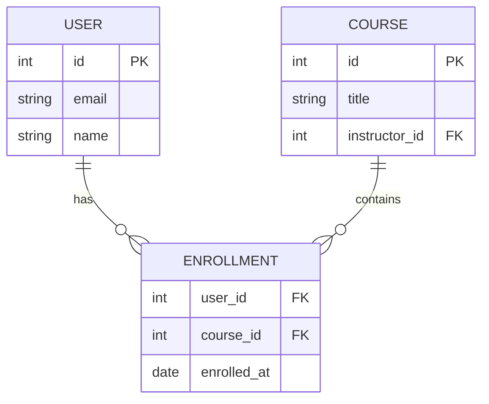

# Data Model Planning

**Purpose**: Design entities, relationships, and database migrations.

---

## Entity Design

### Identify Entities

From spec requirements, identify:
- Primary entities (main data objects)
- Relationship tables (many-to-many)
- Lookup tables (enum values)

### Create ERD (Mermaid)



---

## Migration Planning

**Check existing migrations**:
```bash
ls -la migrations/  # or alembic/versions/, prisma/migrations/
```

**Plan new migration**:
- Add new tables
- Modify existing columns
- Create indexes
- Add constraints

**See [../reference.md](../reference.md#data-model) for complete patterns**
