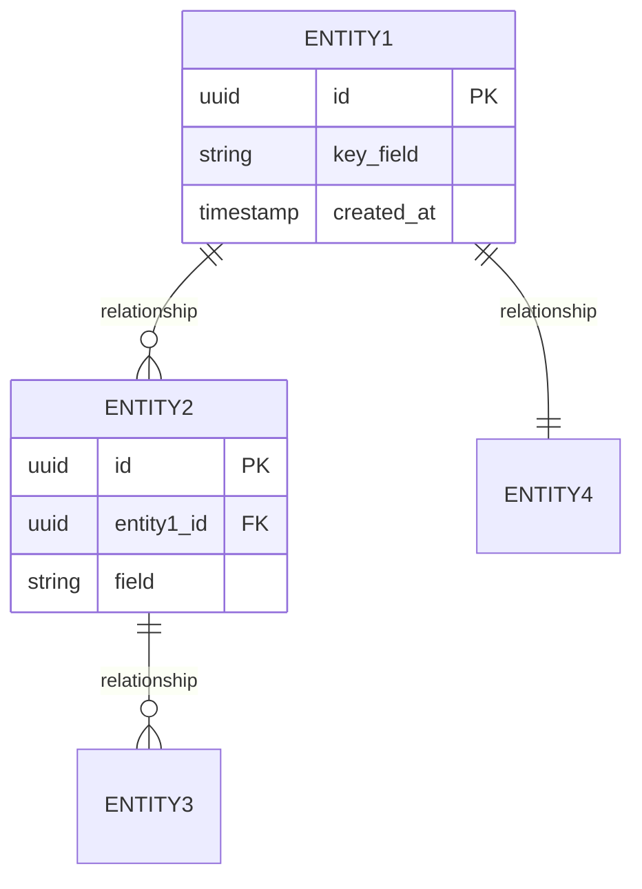
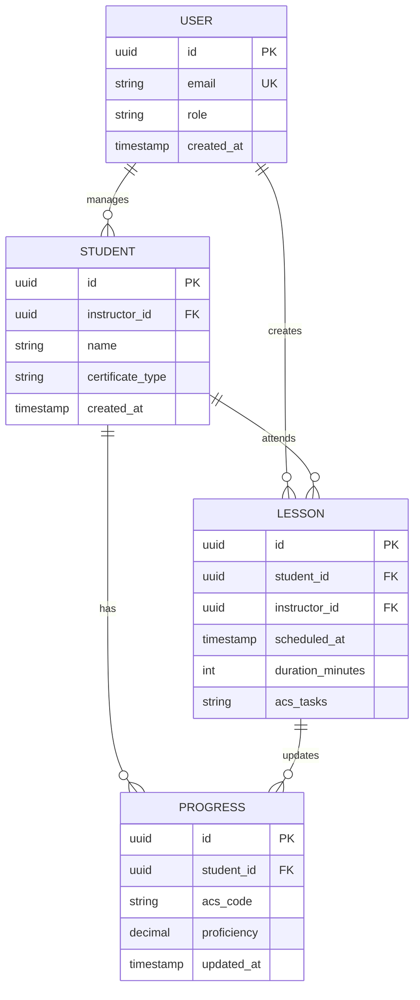

# Data Architecture

**Last Updated**: [DATE]
**Related Docs**: See `system-architecture.md` for how data flows, `tech-stack.md` for database choices

## High-Level Domain Model

**Purpose**: Define major entities and their relationships (technology-agnostic)



**Example**:


---

## Entities & Schemas

### Entity: [Entity Name]

**Purpose**: [What this entity represents]

**Fields**:

| Field | Type | Constraints | Purpose |
|-------|------|-------------|---------|
| `id` | UUID | PK | Unique identifier |
| [field] | [type] | [constraints] | [purpose] |

**Relationships**:
- Has many: [Related entity]
- Belongs to: [Parent entity]
- Many-to-many with: [Related entity] (via [junction table])

**Validation Rules**:
- [Rule 1]: [Description] (e.g., email must match regex)
- [Rule 2]: [Description] (e.g., proficiency between 0.0-1.0)

**Example**:

### Entity: Student

**Purpose**: Represents a student pilot being instructed

**Fields**:

| Field | Type | Constraints | Purpose |
|-------|------|-------------|---------|
| `id` | UUID | PK | Unique identifier |
| `instructor_id` | UUID | FK → users(id), NOT NULL | CFI managing this student |
| `name` | VARCHAR(200) | NOT NULL | Student full name |
| `email` | VARCHAR(255) | UNIQUE | Contact email |
| `certificate_type` | ENUM | 'private', 'instrument', 'commercial' | What certificate pursuing |
| `flight_hours` | DECIMAL(6,2) | >= 0 | Total logged hours |
| `created_at` | TIMESTAMP | NOT NULL, DEFAULT NOW() | When added to system |
| `updated_at` | TIMESTAMP | NOT NULL, DEFAULT NOW() | Last modified |

**Relationships**:
- Belongs to: User (instructor)
- Has many: Lesson
- Has many: Progress (ACS tracking)

**Validation Rules**:
- Email must be valid format (if provided)
- `certificate_type` must be one of allowed enum values
- `flight_hours` cannot be negative
- `instructor_id` must reference existing user with role='instructor'

**Indexes**:
- `idx_students_instructor_id` ON (instructor_id) - Fast lookup of students per instructor
- `idx_students_email` ON (email) - Email uniqueness check

---

## Storage Strategy

### Primary Data Storage

**Type**: [Relational | Document | Key-Value]
**Technology**: [PostgreSQL | MongoDB | etc.]
**Rationale**: [Why this type]

**Example**:
**Type**: Relational (PostgreSQL)
**Rationale**:
- Structured data with clear relationships (students → lessons → progress)
- Need for ACID transactions (billing, progress updates)
- Complex queries (reports, analytics)
- Strong consistency requirements

### Caching Layer

**Type**: [In-memory cache]
**Technology**: [Redis | Memcached]
**What to Cache**: [Categories of data]
**TTL Strategy**: [How long to cache]

**Example**:
**Type**: In-memory cache
**Technology**: Redis
**What to Cache**:
- User sessions (30 min TTL)
- Student progress summaries (5 min TTL)
- ACS reference data (24 hour TTL, rarely changes)
**Invalidation**: Explicit invalidation on writes (e.g., PROGRESS_UPDATE → delete cache key)

### Blob Storage

**Type**: [Object storage]
**Technology**: [S3 | Blob | etc.]
**What to Store**: [File types]

**Example**:
**Type**: Object storage
**Technology**: Vercel Blob
**What to Store**:
- Lesson plan PDFs
- Student uploaded documents (medical certificates, logbook scans)
- Instructor profile photos
**Organization**: `/{instructor_id}/{resource_type}/{file_id}.{ext}`
**Size Limits**: Max 50MB per file

---

## Data Access Patterns

### Read Patterns

**Pattern 1**: [Description]
- **Query**: [SQL or description]
- **Frequency**: [How often]
- **Optimization**: [Index, cache, etc.]

**Example**:

**Pattern: Instructor Dashboard Load**
- **Query**: Get all students for instructor with latest progress
  ```sql
  SELECT s.*,
         AVG(p.proficiency) as overall_proficiency,
         COUNT(DISTINCT p.acs_code) as acs_codes_practiced
  FROM students s
  LEFT JOIN progress p ON p.student_id = s.id
  WHERE s.instructor_id = $1
  GROUP BY s.id
  ORDER BY s.created_at DESC
  ```
- **Frequency**: Every page load (high frequency)
- **Optimization**:
  - Cache result in Redis (5 min TTL)
  - Index on `students.instructor_id`
  - Composite index on `progress(student_id, acs_code)`

**Pattern: Student Progress Detail**
- **Query**: Get all progress records for specific student
- **Frequency**: Medium (when viewing student detail)
- **Optimization**: Cache per student (invalidate on progress update)

### Write Patterns

**Pattern 1**: [Description]
- **Operation**: [INSERT | UPDATE | DELETE]
- **Frequency**: [How often]
- **Consistency Requirements**: [Strong | Eventual]

**Example**:

**Pattern: Log Lesson Completion**
- **Operation**: INSERT lesson + UPDATE multiple progress records
- **Frequency**: After each flight (~10-20 per instructor per day)
- **Consistency**: Strong (use transaction)
- **Example**:
  ```sql
  BEGIN;
    INSERT INTO lessons (...) VALUES (...);
    UPDATE progress SET proficiency = proficiency + 0.1
    WHERE student_id = $1 AND acs_code IN (...);
  COMMIT;
  ```
- **Side Effects**: Invalidate student progress cache

---

## Data Lifecycle

### Retention Policy

| Data Type | Retention Period | Archive Strategy | Delete Strategy |
|-----------|------------------|------------------|----------------|
| [Type] | [How long] | [Where/how archived] | [When/how deleted] |

**Example**:

| Data Type | Retention Period | Archive Strategy | Delete Strategy |
|-----------|------------------|------------------|----------------|
| Active student data | Indefinite (while active) | N/A | N/A |
| Inactive student data (no activity 2 years) | 5 years | Copy to S3 cold storage, mark as archived in DB | After 5 years, hard delete |
| Lesson logs | Indefinite (regulatory) | N/A | Never (FAA requirement) |
| User sessions | 30 minutes | N/A | Auto-expire in Redis |
| Uploaded files | While student active + 2 years | S3 Glacier after 1 year inactive | After 3 years inactive |
| Audit logs | 7 years | S3 after 1 year | After 7 years |

### Backup Strategy

**Frequency**: [How often]
**Retention**: [How long to keep backups]
**Recovery Point Objective (RPO)**: [Max data loss acceptable]
**Recovery Time Objective (RTO)**: [Max downtime acceptable]

**Example**:
**Frequency**: Daily automated backups (Railway managed)
**Retention**: 7 daily, 4 weekly, 12 monthly
**RPO**: 24 hours (acceptable to lose 1 day of data)
**RTO**: 4 hours (can restore from backup within 4 hours)
**Testing**: Quarterly restore tests to validate backups

---

## Privacy & Compliance

### Personal Identifiable Information (PII)

**What PII Stored**:
- [List PII fields]

**How Protected**:
- [Encryption, access controls, etc.]

**Example**:
**What PII Stored**:
- User/student email addresses
- Student names
- Phone numbers (if provided)
- Uploaded documents (medical certificates)

**How Protected**:
- Encryption at rest (database-level, provider-managed)
- Encryption in transit (TLS 1.3)
- Access controls: Row-Level Security (RLS) policies ensure instructors only see own students
- No PII in logs (email masked as `u***@domain.com` in application logs)

### Regulatory Compliance

**Requirements**: [GDPR | CCPA | HIPAA | Industry-specific]

**How Compliant**:
- [Data portability]
- [Right to deletion]
- [Consent management]

**Example**:
**Requirements**: GDPR (EU users), CCPA (California users)

**How Compliant**:
- **Data portability**: Export endpoint generates JSON of all user/student data
- **Right to deletion**: Delete account → hard delete PII, anonymize lesson logs (replace student_id with 'DELETED_USER')
- **Consent management**: Terms acceptance logged in `user_consents` table
- **Data processing addendum**: Vercel & Railway are GDPR-compliant processors

---

## Multi-Tenancy Strategy

**Model**: [Single DB shared | Schema per tenant | DB per tenant]
**Isolation**: [How tenants isolated]

**Example**:
**Model**: Single database, row-level isolation
**Isolation**:
- All student/lesson tables have `instructor_id` foreign key
- PostgreSQL Row-Level Security (RLS) policies enforce: `current_user_id() = instructor_id`
- API middleware validates user owns requested resources
- **Why this model**: Simple, cost-effective for < 10K users; can migrate to schema-per-tenant if needed at scale

---

## Data Integrity

### Constraints

**Entity**: [Entity name]
**Constraints**: [List constraints]

**Example**:

**Entity: Progress**
**Constraints**:
- `CHECK (proficiency >= 0.0 AND proficiency <= 1.0)` - Proficiency is 0-100%
- `FOREIGN KEY (student_id) REFERENCES students(id) ON DELETE CASCADE` - Delete progress when student deleted
- `UNIQUE (student_id, acs_code)` - One progress record per ACS code per student

**Entity: Lesson**
**Constraints**:
- `CHECK (duration_minutes > 0)` - Lessons must have positive duration
- `CHECK (scheduled_at >= created_at)` - Can't schedule in the past (from creation time)

### Referential Integrity

**Cascade Rules**: [How deletions propagate]

**Example**:
- Delete user → CASCADE delete all students (and their lessons, progress)
- Delete student → CASCADE delete lessons, progress
- Delete lesson → SET NULL in progress records (keep progress, unlink from lesson)

---

## Migrations Strategy

**Tool**: [Alembic | Flyway | etc.]
**Process**: [How migrations applied]
**Rollback**: [How to revert]

**Example**:
**Tool**: Alembic (Python)
**Process**:
1. Generate migration: `alembic revision --autogenerate -m "description"`
2. Review generated SQL (manual check for safety)
3. Test locally
4. Apply to staging: `alembic upgrade head`
5. Validate staging data
6. Apply to production: `alembic upgrade head`

**Rollback**:
- All migrations reversible: `alembic downgrade -1`
- Before deploying, test: `upgrade → downgrade → upgrade` cycle
- Production rollback: `alembic downgrade <prev_revision>`

**Zero-Downtime Migrations**:
- Expand-contract pattern:
  1. Add new column (nullable)
  2. Deploy app code (dual-write to old + new column)
  3. Backfill data
  4. Switch app to read new column
  5. Remove old column

---

## Scalability Considerations

### Current Capacity

**Database**: [Max connections, storage, IOPS]
**Limitations**: [Known bottlenecks]

**Example**:
**Database**: PostgreSQL on Railway
- Max connections: 100
- Storage: 10GB (upgradeable to 100GB)
- IOPS: ~3,000 (managed by provider)

**Limitations**:
- Single instance (no read replicas)
- Vertical scaling only
- Limited to ~1,000 concurrent users

### Scale Path

**10x Growth** (100 → 1,000 users):
- [Changes needed]

**100x Growth** (100 → 10,000 users):
- [Changes needed]

**Example**:

**10x Growth (1,000 users)**:
- Add read replica for dashboard queries
- Increase connection pool (100 → 200)
- Cost: +$20/mo

**100x Growth (10,000 users)**:
- Horizontal sharding by `instructor_id` (each shard = 2,000 instructors)
- Redis cluster for cache (3 nodes)
- Separate analytics database (offload reporting queries)
- Cost: +$200/mo

---

## Disaster Recovery

### Backup & Restore

**Backup Location**: [Where backups stored]
**Restore Process**: [Steps to restore]
**Last Tested**: [Date]

**Example**:
**Backup Location**: Railway automated backups (S3-compatible storage)
**Restore Process**:
1. Stop API containers
2. Railway console → Backups → Select backup → Restore
3. Verify data integrity (run smoke tests)
4. Restart API containers
5. Validate application

**Last Tested**: 2025-09-15 (quarterly test)

### Corruption Recovery

**Scenario**: [What if data corrupted]
**Detection**: [How to detect]
**Recovery**: [How to fix]

**Example**:
**Scenario**: Progress records incorrectly calculated
**Detection**: Monitoring alert if proficiency > 1.0 or < 0.0
**Recovery**:
1. Identify affected records (SQL query)
2. Restore from backup OR recalculate (from lesson logs)
3. Notify affected instructors
4. Root cause analysis → fix bug → deploy
5. Post-mortem doc

---

## Query Patterns & Optimization

### Slow Query Log

**Threshold**: [What constitutes slow]
**Action**: [What to do when detected]

**Example**:
**Threshold**: > 1 second
**Action**:
1. Log to monitoring (Railway logs)
2. Analyze with EXPLAIN ANALYZE
3. Add index or rewrite query
4. Re-test

### Index Strategy

**Entity**: [Entity name]
**Indexes**: [List with rationale]

**Example**:

**Entity: Progress**
**Indexes**:
- `(student_id, acs_code)` - UNIQUE, supports lookup by student
- `(acs_code)` - Supports aggregate queries (how many students practiced X)
- `(updated_at DESC)` - Supports recent progress queries

**Entity: Lessons**
**Indexes**:
- `(instructor_id, scheduled_at DESC)` - Instructor's upcoming lessons
- `(student_id, scheduled_at DESC)` - Student's lesson history

---

## Data Quality

### Validation

**Level 1: Database** (hard constraints)
- [List DB-level constraints]

**Level 2: Application** (business rules)
- [List app-level validation]

**Level 3: User Input** (form validation)
- [List client-side validation]

**Example**:

**Level 1: Database**
- `proficiency >= 0.0 AND <= 1.0`
- `email UNIQUE`
- Foreign keys

**Level 2: Application**
- Pydantic schemas validate request payloads
- Business rule: Can't log lesson in future
- Rate limiting: Max 1 progress update per second per student

**Level 3: User Input**
- Email format validation (regex)
- Required fields marked
- Date picker prevents future dates

---

## Change Log

| Date | Change | Reason | Impact |
|------|--------|--------|--------|
| [DATE] | [What] | [Why] | [Effect] |

**Example**:

| Date | Change | Reason | Impact |
|------|--------|--------|--------|
| 2025-10-05 | Added `progress.updated_at` index | Dashboard query was 3s, now 200ms | Improved UX |
| 2025-09-20 | Switched from `lessons.notes TEXT` to `JSONB` | Need structured metadata (weather, aircraft, etc.) | Easier querying, no schema changes needed for new fields |
