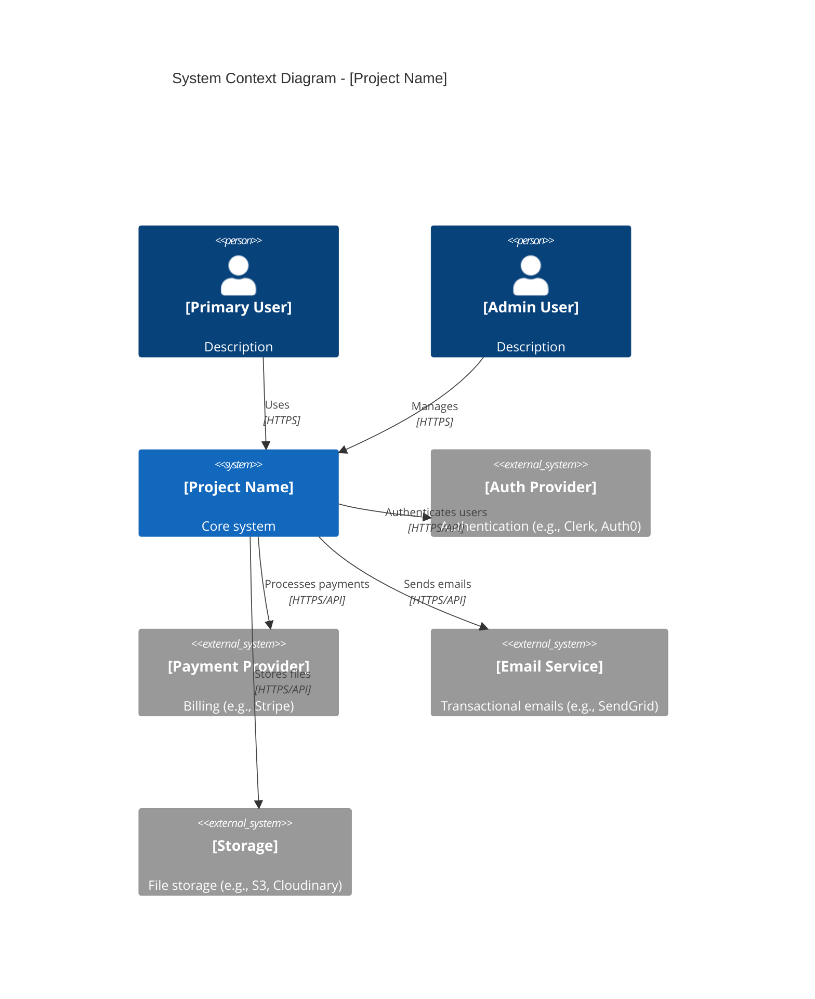
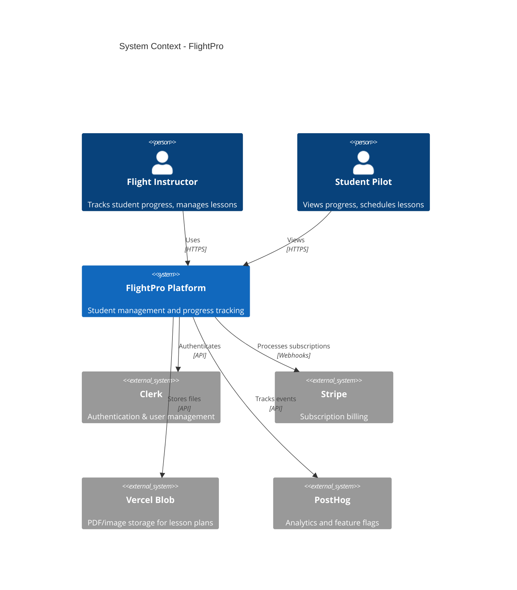
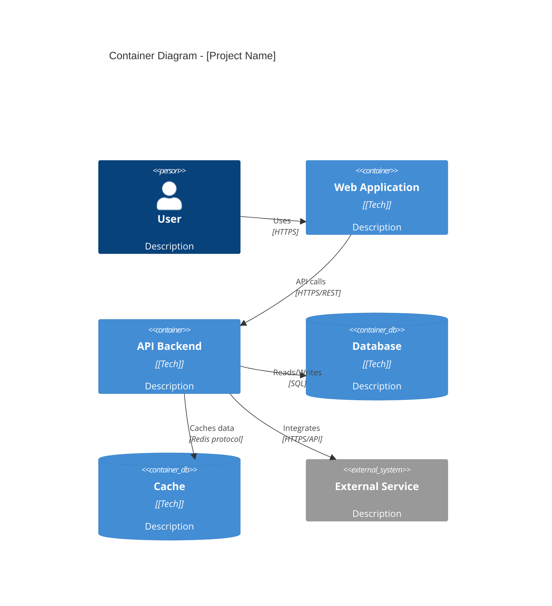
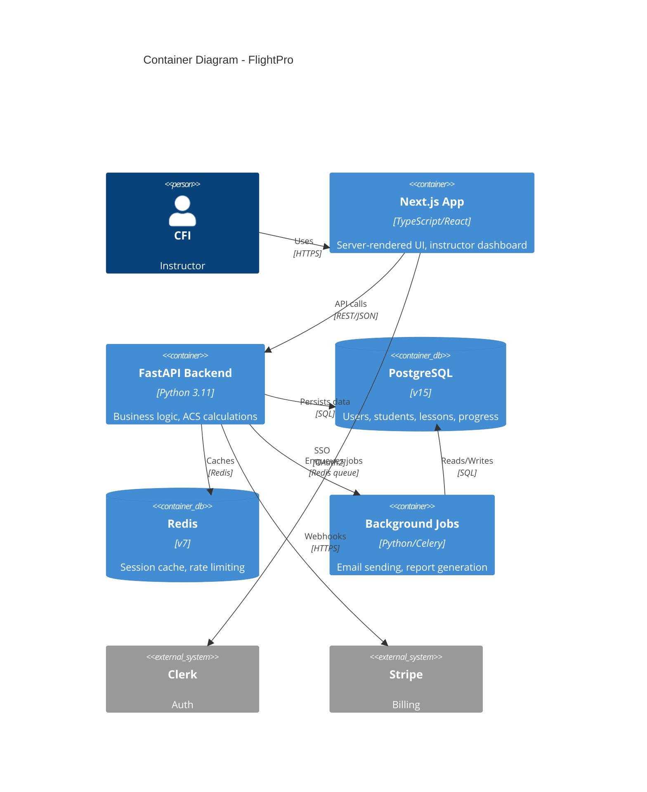
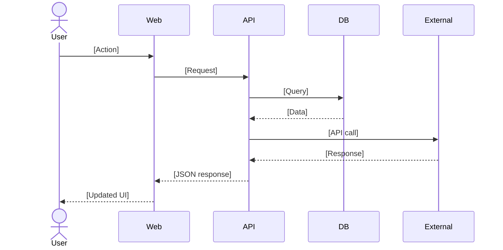
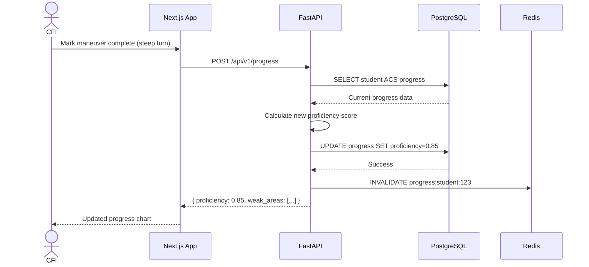
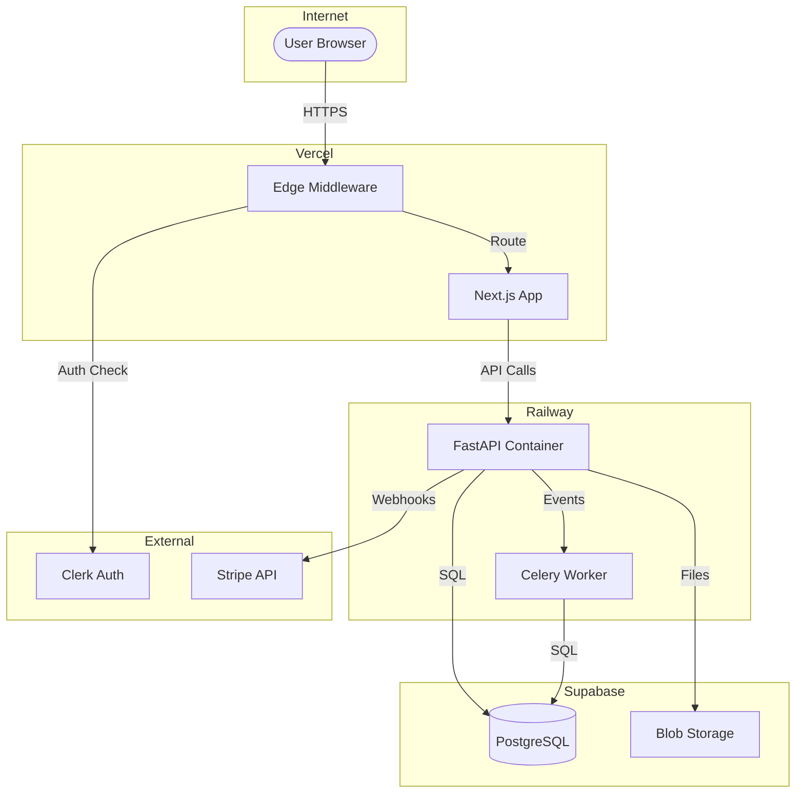
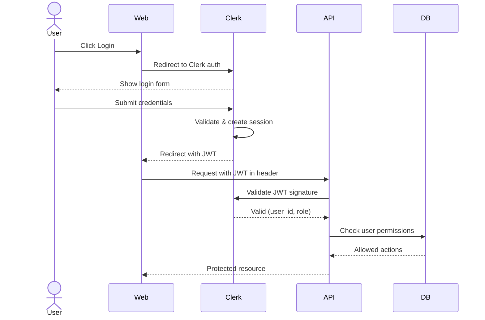

# System Architecture

**Last Updated**: [DATE]
**Architecture Style**: [Monolith | Microservices | Serverless | Hybrid]
**Related Docs**: See `tech-stack.md` for technology choices, `deployment-strategy.md` for infrastructure

## System Context (C4 Level 1)

**High-level view: How does our system fit in the wider world?**



**Example**:


---

## Container Diagram (C4 Level 2)

**Major components and how they communicate:**



**Example**:


---

## Component Architecture

### Frontend Components

**Structure**: [Describe component organization]

**Example**:
```
apps/
├── web/                    # Marketing site
│   ├── app/                # Next.js 14 App Router
│   ├── components/         # React components
│   └── lib/                # Utilities (SWR, formatting)
│
└── app/                    # Main application
    ├── app/(authed)/       # Authenticated routes
    ├── app/(public)/       # Public routes
    ├── components/         # Shared components
    └── lib/                # Client utilities
```

**Key Components**:
- [Component 1]: [Purpose, technology, interfaces]
- [Component 2]: [Purpose, technology, interfaces]

**Example**:
- **StudentProgressDashboard**: Displays ACS-mapped progress chart, uses SWR for data fetching
- **LessonPlanner**: Drag-and-drop lesson builder, integrates with calendar
- **ComplianceReportGenerator**: PDF generation client, calls API for data

### Backend Services

**Structure**: [Describe service organization]

**Example**:
```
api/
├── src/
│   ├── modules/            # Feature modules
│   │   ├── students/       # Student management
│   │   ├── lessons/        # Lesson planning
│   │   └── progress/       # ACS progress tracking
│   ├── services/           # Shared services
│   │   ├── acs_calculator/ # Core business logic
│   │   └── pdf_generator/  # Report generation
│   └── core/               # Infrastructure (DB, auth)
```

**Key Services**:
- [Service 1]: [Purpose, dependencies, API surface]
- [Service 2]: [Purpose, dependencies, API surface]

**Example**:
- **ACSCalculatorService**: Calculates student proficiency levels, depends on progress data
- **LessonService**: CRUD for lessons, enforces business rules (min duration, required fields)
- **ProgressTrackingService**: Maps lessons to ACS standards, updates student metrics

---

## Data Flow

### Primary User Journey: [Journey Name]



**Example - Student Progress Update**:


### Background Processes

**Job**: [Job name]
**Trigger**: [What triggers it]
**Frequency**: [How often]
**Process**: [What it does]

**Example**:
**Job**: Weekly compliance report generation
**Trigger**: Cron (every Sunday 6am UTC)
**Frequency**: Weekly
**Process**:
1. Query all students with checkrides in next 30 days
2. Calculate ACS coverage percentage
3. Generate PDF report per student
4. Email CFI with report + weak areas list
5. Log completion to DB

---

## Communication Patterns

### Frontend \u2194 Backend

**Protocol**: [REST | GraphQL | tRPC | WebSocket]
**Format**: [JSON | Protocol Buffers | etc.]
**Authentication**: [JWT | Session | API Key]

**Example**:
**Protocol**: REST over HTTPS
**Format**: JSON
**Authentication**: JWT (Bearer token from Clerk)
**Error Handling**: RFC 7807 Problem Details
**Versioning**: URL-based (/api/v1/, /api/v2/)

### Backend \u2194 External Services

**Pattern**: [Direct API calls | Webhooks | Message queue]

**Example**:
- **Stripe**: Webhook-based (receive payment events), sync API calls (create subscriptions)
- **PostHog**: Fire-and-forget event tracking (doesn't block requests)
- **Vercel Blob**: Direct upload with signed URLs (frontend uploads directly after getting URL from backend)

### Internal Services

**If microservices**: [How services communicate]

**Example** (if applicable):
**Pattern**: Event-driven via Redis Pub/Sub
**Events**:
- `student.progress.updated` → triggers weak area recalculation
- `lesson.completed` → updates student stats, sends notification
- `subscription.cancelled` → archives user data, sends offboarding email

---

## Infrastructure Diagram



---

## Security Architecture

### Authentication Flow



### Authorization Model

**Type**: [RBAC | ABAC | Custom]
**Roles**: [List roles]
**Enforcement**: [Where/how enforced]

**Example**:
**Type**: Role-Based Access Control (RBAC)
**Roles**:
- `instructor`: Can manage own students, lessons, progress
- `student`: Can view own progress (read-only)
- `admin`: Full system access

**Enforcement**:
- API level: Middleware checks JWT claims, enforces role-based permissions
- DB level: Row-Level Security (RLS) policies ensure users only see own data
- UI level: Components hidden/disabled based on role (not security boundary, just UX)

### Data Protection

**At Rest**:
- Database: [Encryption method]
- Files: [Encryption method]

**In Transit**:
- All connections: [TLS version]
- Cert management: [How managed]

**Example**:
**At Rest**:
- PostgreSQL: AES-256 encryption at rest (provider-managed)
- Blob storage: Encrypted by provider (Vercel)
- No local file storage

**In Transit**:
- TLS 1.3 minimum
- Certificates managed by Vercel/Railway (auto-renewal)

---

## Scalability Considerations

**Current Architecture**: [Optimized for what scale?]
**Bottlenecks**: [Known limitations]
**Scale Path**: [How to scale each component]

**Example**:
**Current Architecture**: Optimized for 100-1,000 users (micro to small)
**Bottlenecks**:
- **Database**: Single PostgreSQL instance, limited to ~1K concurrent connections
- **API**: Single Railway container, scales vertically (more RAM/CPU)
- **Background jobs**: Single Celery worker

**Scale Path**:
- **10K users**: Read replicas for PostgreSQL, horizontal API scaling (2-3 containers)
- **100K users**: Postgres sharding by instructor_id, Redis cluster, dedicated job queue service
- **1M+ users**: Microservices split (students, lessons, billing), CDN for static assets

---

## Monitoring & Observability

**Logging**: [Where logs go, format]
**Metrics**: [What metrics tracked, where]
**Tracing**: [Distributed tracing approach]
**Alerting**: [Alert conditions, channels]

**Example**:
**Logging**:
- Structured JSON logs (FastAPI → Railway logs)
- Frontend errors → PostHog
- Retention: 30 days

**Metrics**:
- API response times, error rates → Railway metrics
- User behavior → PostHog
- Business metrics → PostgreSQL queries

**Tracing**:
- Not implemented in MVP (defer to v2.0)

**Alerting**:
- Error rate >5% → PagerDuty
- API p95 >2s → Slack webhook
- Payment failures → Email

---

## Integration Points

### Third-Party Services

| Service | Purpose | Integration Type | Data Shared | Failure Mode |
|---------|---------|------------------|-------------|--------------|
| [Service] | [Why] | [How] | [What] | [Fallback] |

**Example**:

| Service | Purpose | Integration Type | Data Shared | Failure Mode |
|---------|---------|------------------|-------------|--------------|
| Clerk | Authentication | OAuth2, JWT verification | Email, user_id, role | Graceful degradation: cached JWTs valid for 1hr |
| Stripe | Billing | Webhooks + API calls | Subscription status, payment methods | Queue failed webhooks, retry; manual invoicing fallback |
| PostHog | Analytics | Client-side + server-side events | User actions, feature usage | Fire-and-forget: failures don't block user |
| Vercel Blob | File storage | Signed upload URLs | PDFs, images | S3 fallback (manual config switch) |

---

## Technology Choices Rationale

> See `tech-stack.md` for full details. This section explains *why* this architecture.

**Why [Monolith | Microservices | Serverless]?**

[Rationale based on team size, complexity, scale]

**Example**:
**Why Monolith?**:
- Team size: 1 developer (solo) → microservices overhead not justified
- Complexity: Low (CRUD + calculations) → single codebase easier to maintain
- Scale: 100-1K users (MVP) → monolith handles this easily
- **Migration path**: Modular structure allows extraction to microservices later if needed

**Why Next.js + FastAPI split?**:
- Next.js: Excellent SEO, server-side rendering, Vercel deployment simplicity
- FastAPI: Python better for ACS calculations (complex math), mature data ecosystem
- Split allows: Independent scaling (more API containers vs web), different deployment platforms

---

## Design Principles

1. **[Principle 1]**: [Description]
2. **[Principle 2]**: [Description]

**Example**:
1. **Simplicity over flexibility**: Choose boring, proven tech (PostgreSQL vs NoSQL) unless strong reason
2. **Optimize for developer experience**: Fast iteration > premature optimization
3. **Data integrity**: Use database constraints, not application logic, for invariants
4. **Fail loudly**: Errors should be obvious and trackable, not silent
5. **Modular from day one**: Even in monolith, clear boundaries enable future microservices if needed

---

## Migration Path

**From MVP → Next Scale**:

[What changes as system grows?]

**Example**:
**100 → 1,000 users**:
- Add read replica for PostgreSQL
- Enable Redis caching for frequent queries (student progress)
- Split background jobs to dedicated service
- Cost: +$50/mo

**1,000 → 10,000 users**:
- Horizontal API scaling (3-5 containers)
- PostgreSQL connection pooling (PgBouncer)
- CDN for static assets
- Cost: +$200/mo

**10,000 → 100,000 users**:
- Extract billing service (microservice)
- Postgres sharding by instructor_id
- Dedicated Redis cluster
- Cost: +$1,000/mo

---

## Decision Log

| Date | Decision | Rationale | Alternatives Rejected |
|------|----------|-----------|----------------------|
| [DATE] | [What] | [Why] | [Other options] |

**Example**:

| Date | Decision | Rationale | Alternatives Rejected |
|------|----------|-----------|----------------------|
| 2025-10-01 | Use Clerk for auth | Fast implementation, good DX, handles edge cases (MFA, social login) | Auth0 (expensive), Supabase Auth (less mature), roll-our-own (time sink) |
| 2025-09-20 | PostgreSQL over MongoDB | Relational data (students → lessons → progress), strong consistency needed | MongoDB (no strong relations), SQLite (can't scale past single server) |
| 2025-09-15 | Monolith over microservices | Team of 1, simpler deployment, faster iteration | Microservices (premature, overhead too high for MVP) |
