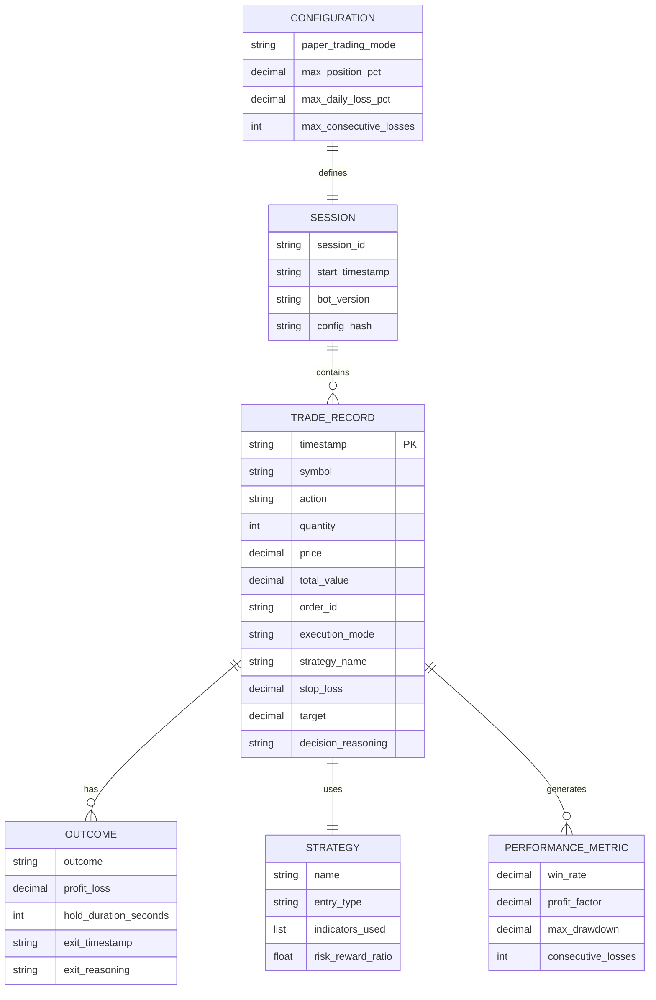

# Data Architecture

**Last Updated**: 2025-10-26
**Related Docs**: See `system-architecture.md` for how data flows, `tech-stack.md` for storage choices

## High-Level Domain Model

**Purpose**: Define major entities and their relationships (no traditional database, file-based storage)



**Note**: This is a logical model. Physical storage is file-based (JSONL), not relational database.

---

## Entities & Schemas

### Entity: TradeRecord

**Purpose**: Complete audit trail of every trade execution (27 fields per Constitution v1.0.0)

**Schema** (as Python dataclass in `src/trading_bot/logging/trade_record.py`):

| Field | Type | Constraints | Purpose |
|-------|------|-------------|---------|
| `timestamp` | str | ISO 8601 UTC, NOT NULL | Trade execution time |
| `symbol` | str | 1-5 chars uppercase, alphanumeric | Stock ticker (e.g., AAPL) |
| `action` | str | "BUY" or "SELL" | Trade direction |
| `quantity` | int | > 0, <= 10000 | Number of shares |
| `price` | Decimal | > 0 | Execution price |
| `total_value` | Decimal | quantity × price | Trade value |
| `order_id` | str | NOT NULL | Unique order identifier |
| `execution_mode` | str | "PAPER" or "LIVE" | Trading mode |
| `account_id` | str | Optional | Robinhood account ID |
| `strategy_name` | str | NOT NULL | e.g., "bull-flag-breakout" |
| `entry_type` | str | NOT NULL | "breakout", "pullback", etc. |
| `stop_loss` | Decimal | Optional | Stop loss price |
| `target` | Decimal | Optional | Profit target price |
| `decision_reasoning` | str | NOT NULL | Why trade was taken |
| `indicators_used` | list[str] | NOT NULL | e.g., ["VWAP", "EMA-9"] |
| `risk_reward_ratio` | float | Optional | Planned R:R (e.g., 2.0) |
| `outcome` | str | Optional | "win", "loss", "breakeven", "open" |
| `profit_loss` | Decimal | Optional | Realized P&L (if closed) |
| `hold_duration_seconds` | int | Optional | Time in trade |
| `exit_timestamp` | str | Optional | ISO 8601 UTC |
| `exit_reasoning` | str | Optional | Why position was exited |
| `slippage` | Decimal | Optional | Price vs expected |
| `commission` | Decimal | Optional | Trading fees ($0 for Robinhood) |
| `net_profit_loss` | Decimal | Optional | P&L - commission |
| `session_id` | str | UUID, NOT NULL | Links to trading session |
| `bot_version` | str | Semantic version | e.g., "1.0.0" |
| `config_hash` | str | MD5 hash | Config snapshot |

**Validation Rules** (enforced in `__post_init__`):
- `symbol`: Must be uppercase, 1-5 alphanumeric chars
- `quantity`: Must be positive, max 10,000 shares (position limit)
- `price`: Must be positive
- `timestamp`: Must be valid ISO 8601 format

**Indexes**: None (file-based, sequential scan for queries)

**Example Record** (JSON):
```json
{
  "timestamp": "2025-10-26T14:32:15.123Z",
  "symbol": "AAPL",
  "action": "BUY",
  "quantity": 50,
  "price": "150.25",
  "total_value": "7512.50",
  "order_id": "abc-123-def",
  "execution_mode": "PAPER",
  "account_id": null,
  "strategy_name": "bull-flag-breakout",
  "entry_type": "breakout",
  "stop_loss": "148.50",
  "target": "155.00",
  "decision_reasoning": "Bull flag breakout above $150 resistance, strong premarket volume (300% of avg)",
  "indicators_used": ["VWAP", "EMA-9", "Volume"],
  "risk_reward_ratio": 2.3,
  "outcome": "open",
  "profit_loss": null,
  "hold_duration_seconds": null,
  "exit_timestamp": null,
  "exit_reasoning": null,
  "slippage": "0.05",
  "commission": "0.00",
  "net_profit_loss": null,
  "session_id": "550e8400-e29b-41d4-a716-446655440000",
  "bot_version": "1.0.0",
  "config_hash": "5d41402abc4b2a76b9719d911017c592"
}
```

---

### Entity: PerformanceMetric

**Purpose**: Rolling window performance tracking (generated from TradeRecord aggregation)

**Schema** (stored in `logs/performance-alerts.jsonl`):

| Field | Type | Constraints | Purpose |
|-------|------|-------------|---------|
| `timestamp` | str | ISO 8601 UTC | When metric calculated |
| `window_size` | int | Default: 20 trades | Rolling window |
| `win_rate` | Decimal | 0.0 - 1.0 | % of winning trades |
| `profit_factor` | Decimal | >= 0.0 | Gross profit / gross loss |
| `max_drawdown_pct` | Decimal | <= 0.0 | Largest peak-to-trough % |
| `consecutive_losses` | int | >= 0 | Current losing streak |
| `total_trades` | int | >= 0 | Trades in window |
| `alert_triggered` | bool | | True if threshold breached |
| `alert_message` | str | Optional | Human-readable alert |

**Validation Rules**:
- `win_rate` must be between 0.0 and 1.0
- `profit_factor` cannot be negative
- `max_drawdown_pct` must be non-positive (e.g., -5.2%)

---

### Entity: RiskEvent

**Purpose**: Circuit breaker and risk limit events

**Schema** (stored in `logs/risk-management.jsonl`):

| Field | Type | Purpose |
|-------|------|---------|
| `timestamp` | str | Event time (ISO 8601 UTC) |
| `event_type` | str | "circuit_breaker_trip", "position_limit_exceeded", etc. |
| `severity` | str | "WARNING", "CRITICAL" |
| `daily_pnl` | Decimal | Current daily P&L |
| `daily_pnl_pct` | Decimal | P&L as % of portfolio |
| `consecutive_losses` | int | Current losing streak |
| `action_taken` | str | "trading_paused", "position_rejected", etc. |
| `config_snapshot` | dict | Relevant config values |

---

## Storage Strategy

### Primary Data Storage

**Type**: File-based (JSON Lines format)
**Technology**: Append-only text files (.jsonl extension)
**Rationale**:
- **Simplicity**: No database setup, no schema migrations
- **Durability**: Append-only writes, no corruption risk
- **Portability**: Plain text, grep/jq/cat for queries
- **Performance**: Sequential writes (1000+ trades/sec possible)
- **Audit**: Immutable log (meets regulatory requirements)

**Trade Logs**:
- **Location**: `logs/trades.jsonl`
- **Format**: One JSON object per line (JSONL)
- **Rotation**: Daily rotation (new file per day: `logs/YYYY-MM-DD.jsonl`)
- **Retention**: Last 90 days (configurable)
- **Size**: ~1KB per trade → 100 trades/day = ~100KB/day = ~3MB/month

**Performance Logs**:
- **Location**: `logs/performance-alerts.jsonl`
- **Format**: JSONL
- **Rotation**: No rotation (append-only, manually archive annually)

**Risk Management Logs**:
- **Location**: `logs/risk-management.jsonl`
- **Format**: JSONL
- **Rotation**: No rotation

**Application Logs**:
- **Location**: `logs/trading_bot.log`
- **Format**: Line-delimited text (Python logging)
- **Rotation**: Size-based (rotate at 10MB, keep last 3 files)

### Caching Layer

**Type**: In-memory cache (Redis)
**Technology**: Redis 7 (Docker container)
**What to Cache**:
- **LLM responses**: Pattern analysis results (1-hour TTL)
- **Market data**: Recent quotes (5-minute TTL)
- **Performance metrics**: Calculated metrics (10-minute TTL)

**Cache Keys**:
- `llm:pattern:{symbol}:{timestamp}` → LLM analysis result
- `quote:{symbol}` → Latest quote
- `perf:summary` → Performance summary

**Invalidation**: Time-based expiration (no manual invalidation)

### Session Storage

**Type**: Pickle file (Python serialization)
**Technology**: `.robinhood.pickle` file
**What to Store**:
- Robinhood session token
- Device token (for MFA)
- Session expiration timestamp

**Security**: File permissions 0600 (owner read/write only)

---

## Data Access Patterns

### Read Patterns

**Pattern: Get Recent Trades**
- **Query**: Read last 100 lines from `logs/trades.jsonl`
- **Frequency**: Every dashboard refresh (5 seconds)
- **Method**: `tail -n 100 logs/trades.jsonl | jq`
- **Optimization**: In-memory cache of last 100 trades (dashboard)

**Pattern: Calculate Win Rate (20-trade window)**
- **Query**: Read last 20 closed trades, count wins vs losses
- **Frequency**: After each trade close
- **Method**: Sequential scan with streaming parser
- **Optimization**: Cache result for 10 minutes

**Pattern: Find All Trades for Symbol**
- **Query**: Grep for symbol in trade logs
- **Frequency**: Ad-hoc (debugging, analysis)
- **Method**: `grep '"symbol":"AAPL"' logs/trades.jsonl`
- **Optimization**: None (infrequent query)

**Pattern: Daily Performance Report**
- **Query**: Sum P&L for all trades in today's log file
- **Frequency**: Market close (once per day)
- **Method**: Read `logs/YYYY-MM-DD.jsonl`, aggregate P&L
- **Optimization**: In-memory accumulation during trading day

### Write Patterns

**Pattern: Log Trade Execution**
- **Operation**: APPEND to `logs/trades.jsonl`
- **Frequency**: Per trade (10-50 trades/day)
- **Consistency**: File-system level (fsync after write)
- **Concurrency**: Single writer (no lock needed)
- **Example**:
  ```python
  with open("logs/trades.jsonl", "a") as f:
      f.write(trade_record.to_jsonl_line() + "\n")
      f.flush()  # Ensure written to disk
  ```

**Pattern: Update Trade Outcome (Exit)**
- **Operation**: Append NEW record (not update existing)
- **Rationale**: Immutable log, new record links to original via order_id
- **Method**: Write exit trade with `order_id` matching entry

---

## Data Lifecycle

### Retention Policy

| Data Type | Retention Period | Archive Strategy | Delete Strategy |
|-----------|------------------|------------------|----------------|
| Trade logs (recent) | 90 days | N/A | N/A |
| Trade logs (old) | 7 years | Compress to .gz, move to cold storage | After 7 years (regulatory) |
| Performance alerts | 1 year | Compress to .gz | After 1 year |
| Risk management logs | Indefinite | Compress after 1 year | Never (audit trail) |
| Application logs | 30 days | None | Auto-delete (log rotation) |
| Robinhood session | Until expired | None | Re-auth generates new session |

**Archival Process** (manual, planned for automation):
```bash
# Compress old trade logs
gzip logs/2024-*.jsonl
# Move to archive directory
mv logs/2024-*.jsonl.gz archive/trades/2024/
```

### Backup Strategy

**Frequency**: Daily (4:30 PM EST, after market close)
**Method**: rsync to S3-compatible storage (Hetzner Storage Box)
**Retention**: 7 daily, 4 weekly, 12 monthly
**RPO**: 24 hours (acceptable to lose 1 day of trades)
**RTO**: 1 hour (restore logs from backup, restart bot)

**Backup Script** (cron job):
```bash
#!/bin/bash
# Daily backup of trade logs
DATE=$(date +%Y-%m-%d)
tar -czf /tmp/trading-bot-backup-$DATE.tar.gz logs/ config.json .env
rsync -avz /tmp/trading-bot-backup-$DATE.tar.gz user@storage-box:/backups/
rm /tmp/trading-bot-backup-$DATE.tar.gz
```

---

## Privacy & Compliance

### Personal Identifiable Information (PII)

**What PII Stored**:
- Robinhood username/email (in `.env` only, never logged)
- Account ID (in trade logs, but no name/SSN)

**How Protected**:
- `.env` file permissions: 0600 (owner read/write only)
- `.env` excluded from git (in `.gitignore`)
- No PII in trade logs (only symbol, price, quantity)
- Session pickle encrypted by Robinhood library

**Access Controls**:
- Local file system permissions (single user)
- SSH access to VPS (key-based auth only)

### Regulatory Compliance

**Requirements**: No specific regulatory requirements (retail trader, not managing others' money)

**Best Practices** (optional, but implemented):
- **Audit trail**: Complete trade log (all 27 fields)
- **Data retention**: 7-year retention for tax purposes
- **Trade reporting**: Can generate CSV for tax filing
- **Data portability**: Plain text (easy to export)

---

## Multi-Tenancy Strategy

**Model**: Single-tenant (solo trader, single account)
**Isolation**: Not applicable (no multi-user support)
**Future**: If expanding to multiple accounts, use account_id field in logs

---

## Data Integrity

### Constraints

**Entity: TradeRecord**
**Constraints**:
- `symbol` uppercase validation (Python `__post_init__`)
- `quantity` > 0 and <= 10000 (Python `__post_init__`)
- `price` > 0 (Python `__post_init__`)
- `timestamp` ISO 8601 format (validated by logging module)

**Entity: PerformanceMetric**
**Constraints**:
- `win_rate` between 0.0 and 1.0
- `profit_factor` >= 0.0

**No database constraints**: Validation in application code (Pydantic/dataclass validation)

### Referential Integrity

**No foreign keys**: File-based storage, no enforced relationships
**Linking**: Manual linking via `order_id`, `session_id`, `symbol`

**Example**:
```python
# Find all trades for session
session_id = "550e8400-e29b-41d4-a716-446655440000"
trades = [
    record for record in read_trades()
    if record["session_id"] == session_id
]
```

---

## Migrations Strategy

**Tool**: None (no database, no schema migrations)
**Process**: Code changes handle schema evolution
**Backward Compatibility**: New fields added as optional (default values)

**Example Schema Evolution**:
```python
# v1.0.0 - Original TradeRecord (25 fields)
@dataclass
class TradeRecord:
    timestamp: str
    symbol: str
    # ... 23 other fields

# v1.1.0 - Add slippage tracking (2 new fields)
@dataclass
class TradeRecord:
    timestamp: str
    symbol: str
    # ... 23 other fields
    slippage: Decimal | None = None  # New field (optional)
    commission: Decimal | None = None  # New field (optional)
```

**Reading Old Data**:
```python
# Parser handles missing fields gracefully
try:
    slippage = record.get("slippage", Decimal("0"))
except KeyError:
    slippage = Decimal("0")  # Default for old records
```

---

## Scalability Considerations

### Current Capacity

**File I/O**:
- Sequential writes: 1000+ trades/sec (SSD)
- Sequential reads: 10K+ lines/sec (grep)
- Current load: 10-50 trades/day (well under capacity)

**Limitations**:
- **Complex queries**: No indexes, full table scan (slow for >100K records)
- **Concurrent writes**: Single writer (file locking issues with multiple processes)
- **Aggregations**: No SQL, manual aggregation in Python

### Scale Path

**100 → 1,000 trades/day** (Current → 20x):
- No changes needed (file-based handles this easily)

**1,000 → 10,000 trades/day** (20x → 200x):
- Migrate to SQLite (enables SQL queries, indexes)
- Partition by date (e.g., `trades_2025_10.db`)
- **Cost**: +0 (SQLite is free)

**10,000+ trades/day** (200x+):
- Migrate to PostgreSQL (multi-process writes, advanced queries)
- Separate analytics database (offload reporting queries)
- **Cost**: +$30/mo (managed PostgreSQL)

---

## Disaster Recovery

### Backup & Restore

**Backup Location**: Hetzner Storage Box (S3-compatible)
**Restore Process**:
1. SSH to VPS
2. Download latest backup: `rsync user@storage-box:/backups/latest.tar.gz /tmp/`
3. Extract: `tar -xzf /tmp/latest.tar.gz -C /opt/trading-bot/`
4. Restart bot: `docker-compose restart trading-bot`
5. Verify: Check dashboard for recent trades

**Last Tested**: 2025-10-15 (monthly test)

### Corruption Recovery

**Scenario**: Trade log file corrupted (partial write, disk error)
**Detection**: JSON parse error on read
**Recovery**:
1. Identify corrupted file (parse error logs)
2. Restore from backup (previous day's backup)
3. Manually re-add missing trades from Robinhood order history
4. Validate: Count trades in log vs Robinhood
5. Post-mortem: Add fsync() to ensure atomic writes

---

## Query Patterns & Optimization

### Slow Query Log

**Threshold**: > 1 second for file read
**Detection**: Log warning if grep takes > 1s
**Action**: Consider migrating to SQLite for indexing

### Search Optimization

**Current**: Sequential scan (grep)
**Future**: SQLite full-text search (FTS5)

**Example Query** (Current):
```bash
# Find all AAPL trades
grep '"symbol":"AAPL"' logs/trades.jsonl

# Calculate total P&L for AAPL
grep '"symbol":"AAPL"' logs/trades.jsonl | jq -s 'map(.profit_loss | tonumber) | add'
```

**Example Query** (Future, SQLite):
```sql
-- Find all AAPL trades
SELECT * FROM trades WHERE symbol = 'AAPL';

-- Calculate total P&L for AAPL
SELECT SUM(profit_loss) FROM trades WHERE symbol = 'AAPL' AND outcome = 'win';
```

---

## Data Quality

### Validation

**Level 1: Application** (strict validation)
- Pydantic/dataclass validation on all fields
- Type checking (mypy, Pyright)
- Business rules (quantity limits, price > 0)

**Level 2: File System** (append-only integrity)
- Atomic writes (write to temp file, rename)
- fsync() after write (ensure durability)

**Level 3: Manual Review** (audit trail)
- Weekly review of risk events
- Monthly review of performance metrics

**Example Validation**:
```python
# TradeRecord.__post_init__ validation
if not self.symbol.isupper():
    raise ValueError(f"Symbol must be uppercase: {self.symbol}")
if self.quantity <= 0 or self.quantity > 10000:
    raise ValueError(f"Invalid quantity: {self.quantity}")
```

---

## Change Log

| Date | Change | Reason | Impact |
|------|--------|--------|--------|
| 2025-10-26 | Initial data architecture | Document file-based storage approach | Foundation for project docs |
| 2025-10-01 | Added slippage, commission fields to TradeRecord | Track execution quality | 2 new fields (v1.1.0) |
| 2025-09-20 | Implemented daily log rotation | Prevent single file from growing unbounded | Improved query performance |
| 2025-09-15 | Added performance-alerts.jsonl | Track win rate, profit factor alerts | Better risk monitoring |
