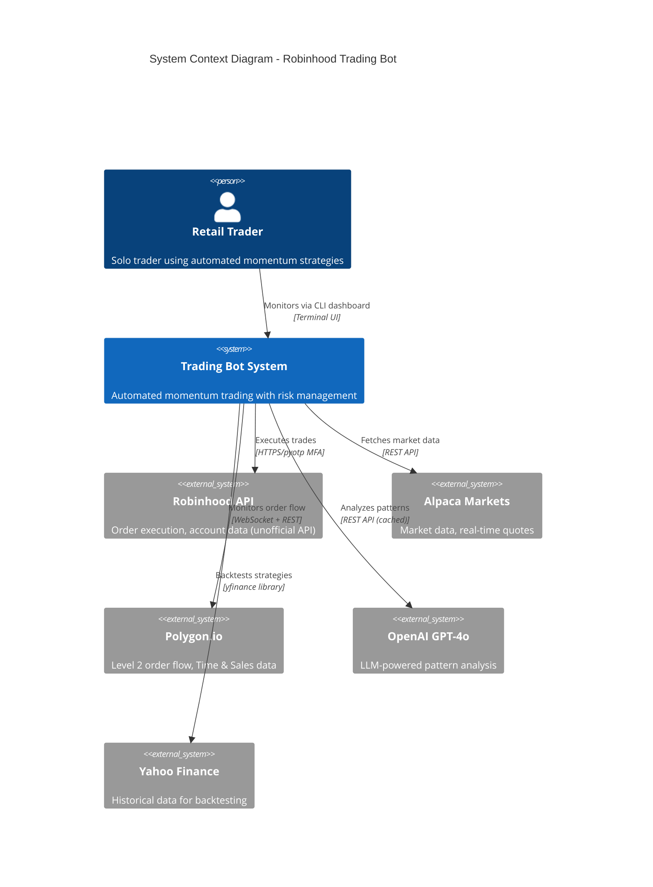
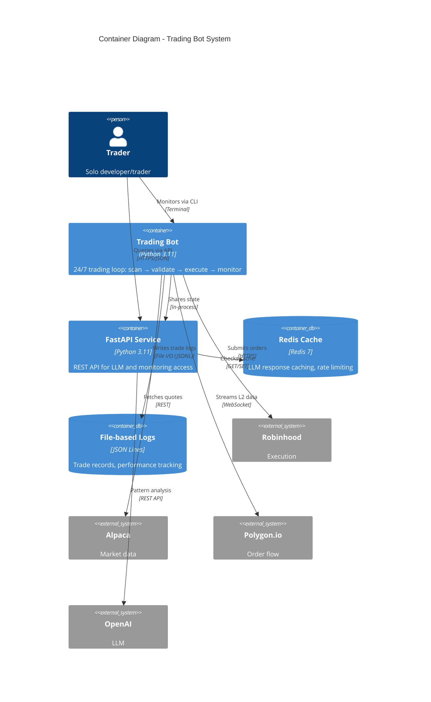
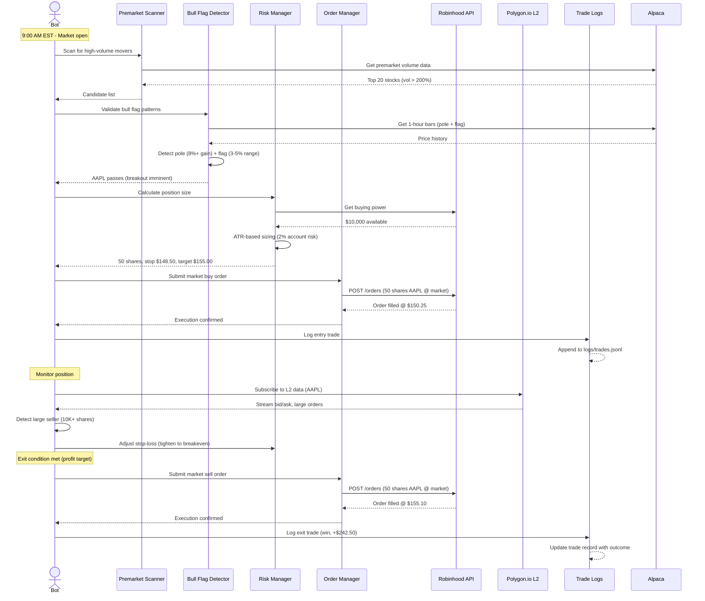
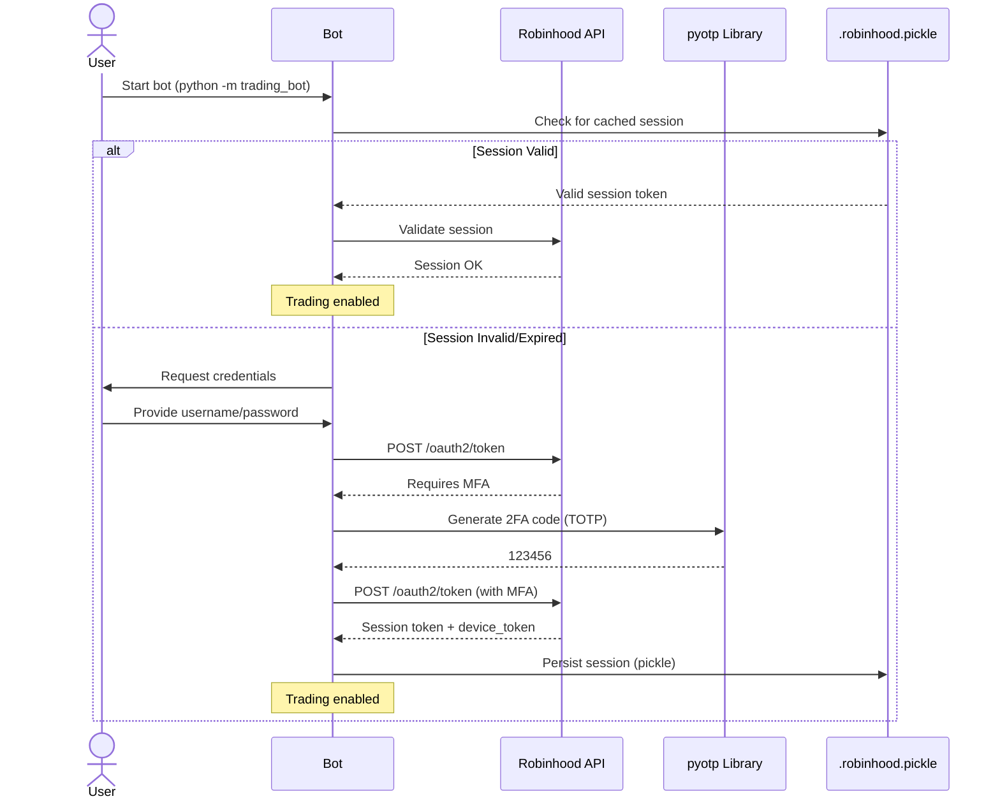

# System Architecture

**Last Updated**: 2025-10-26
**Architecture Style**: Monolith with service separation (Docker Compose multi-container)
**Related Docs**: See `tech-stack.md` for technology choices, `deployment-strategy.md` for infrastructure

## System Context (C4 Level 1)

**High-level view: How does our system fit in the wider world?**



---

## Container Diagram (C4 Level 2)

**Major components and how they communicate:**



**Note**: No traditional database. All data stored in:
- **Trade logs**: `logs/trades.jsonl` (append-only)
- **Performance tracking**: `logs/performance-alerts.jsonl`
- **Risk management**: `logs/risk-management.jsonl`
- **Session state**: `.robinhood.pickle` (Robinhood auth session)
- **Configuration**: `.env` + `config.json`

---

## Component Architecture

### Trading Bot Components

**Structure**: Modular monolith organized by domain

```
src/trading_bot/
├── momentum/               # Premarket scanning and momentum detection
│   ├── premarket_scanner.py   # Scans for high-volume movers
│   ├── momentum_ranker.py      # Ranks by momentum score
│   └── catalyst_detector.py    # Detects news catalysts
│
├── patterns/               # Technical pattern recognition
│   └── bull_flag.py           # Bull flag breakout detector
│
├── risk_management/        # Position sizing and risk control
│   ├── calculator.py          # Position size calculator (ATR-based)
│   ├── stop_adjuster.py       # Dynamic stop-loss adjustment
│   ├── pullback_analyzer.py   # Entry timing on pullbacks
│   └── target_monitor.py      # Profit target tracking
│
├── order_management/       # Order execution and validation
│   ├── manager.py             # Order lifecycle management
│   ├── gateways.py            # Robinhood API gateway
│   └── calculator.py          # Order quantity calculations
│
├── market_data/            # Market data abstraction
│   ├── market_data_service.py # Unified market data interface
│   └── data_models.py         # Quote, bar, tick models
│
├── error_handling/         # Resilience and recovery
│   ├── circuit_breaker.py     # Daily loss, consecutive loss limits
│   ├── retry.py               # Exponential backoff retry logic
│   └── policies.py            # Error handling policies
│
├── performance/            # Performance tracking
│   ├── tracker.py             # Win rate, profit factor, drawdown
│   ├── alerts.py              # Rolling window alerts
│   └── cache.py               # Performance data caching
│
├── dashboard/              # CLI monitoring interface
│   ├── dashboard.py           # Rich-based terminal UI
│   └── display_renderer.py    # Live metrics rendering
│
├── llm/                    # LLM integration (Feature 029)
│   └── [to be implemented]    # OpenAI pattern analysis
│
├── auth/                   # Authentication
│   └── robinhood_auth.py      # MFA/2FA via pyotp
│
├── logging/                # Structured logging
│   ├── trade_record.py        # TradeRecord dataclass (27 fields)
│   └── screener_logger.py     # Premarket scan logs
│
└── bot.py                  # Main bot orchestration
```

### FastAPI Service Components

```
api/
└── [FUTURE] - FastAPI endpoints for:
    - GET /api/v1/status      # Bot status, positions, P&L
    - GET /api/v1/trades      # Trade history
    - POST /api/v1/commands   # Send commands (pause, resume)
    - POST /api/v1/analysis   # LLM pattern analysis
```

**Current State**: API service stubbed in docker-compose but not yet implemented.

---

## Data Flow

### Primary User Journey: Automated Trade Execution



### Background Processes

**Process**: Daily performance summary
**Trigger**: Market close (4:00 PM EST)
**Frequency**: Daily
**Implementation**: Scheduled task in main loop
**Steps**:
1. Query all trade logs from today (`logs/YYYY-MM-DD.jsonl`)
2. Calculate: Win rate, profit factor, max drawdown
3. Check alert thresholds (win rate < 50%, drawdown > -5%)
4. Log summary to `logs/performance-alerts.jsonl`
5. Display in CLI dashboard

**Process**: Session health monitoring
**Trigger**: Every 5 minutes
**Frequency**: Continuous (while bot running)
**Steps**:
1. Check Robinhood session validity
2. Test Alpaca API connectivity
3. Verify Polygon.io WebSocket connection
4. Log health status to `logs/trading_bot.log`
5. Re-authenticate if session expired

---

## Communication Patterns

### Bot Internal Components

**Pattern**: Direct function calls (monolith, single process)
**Data Sharing**: In-memory Python objects
**Error Handling**: Exception propagation with typed exceptions

**Example**:
```python
# bot.py orchestrates components
scanner = PremarketScanner(market_data_service, config)
candidates = scanner.scan()  # Returns list of ScanResult objects

for candidate in candidates:
    pattern = bull_flag_detector.detect(candidate.symbol)
    if pattern.is_valid:
        position = risk_manager.calculate_position(
            symbol=candidate.symbol,
            entry_price=pattern.breakout_price,
            stop_loss=pattern.support_level
        )
        order_manager.submit_order(position)
```

### Bot → External Services

**Robinhood API**: Direct API calls with MFA
- **Authentication**: pyotp for 2FA code generation
- **Session**: Pickle-based session caching (avoid re-auth)
- **Rate Limiting**: 60 req/min limit (enforced by error handling)

**Alpaca Markets**: REST API + WebSocket
- **Market Data**: Real-time quotes via REST
- **Authentication**: API key + secret
- **Rate Limiting**: 200 req/min

**Polygon.io**: WebSocket for Level 2 data
- **Connection**: Persistent WebSocket (reconnect on disconnect)
- **Data**: Streaming bid/ask, large order alerts
- **Cost**: $99/mo (Starter plan)

**OpenAI**: REST API with Redis caching
- **Pattern Analysis**: GPT-4o-mini for pattern validation
- **Caching**: 1-hour TTL in Redis (reduce API costs)
- **Budget**: $100/mo limit (alert at 80%)

---

## Infrastructure Diagram

```mermaid
graph TB
    subgraph Local Development
        DevBot[Trading Bot]
        DevAPI[FastAPI Dev]
        DevRedis[Redis Local]
    end

    subgraph Hetzner VPS - Production
        VPS[CX11 VPS<br/>2GB RAM, 1 vCPU]

        subgraph Docker Compose
            Bot[Trading Bot Container]
            API[FastAPI Container]
            Redis[Redis Container]
        end

        Logs[/logs/ Volume<br/>Trade data, performance]
        Config[/.env File<br/>Credentials]
    end

    subgraph External APIs
        RH[Robinhood<br/>Unofficial API]
        Alpaca[Alpaca Markets<br/>Market Data]
        Polygon[Polygon.io<br/>Level 2]
        OpenAI[OpenAI API<br/>GPT-4o]
    end

    DevBot -->|Deploy| VPS
    VPS -->|docker-compose up| Bot
    VPS -->|docker-compose up| API
    VPS -->|docker-compose up| Redis

    Bot -->|Writes| Logs
    Bot -->|Reads| Config
    API -->|Cache| Redis

    Bot -->|HTTPS| RH
    Bot -->|REST| Alpaca
    Bot -->|WebSocket| Polygon
    API -->|REST| OpenAI

    style VPS fill:#f9f,stroke:#333,stroke-width:4px
```

**Deployment Model**: Manual deployment (git pull + docker-compose restart)
**Monitoring**: CLI dashboard + log files (no external monitoring yet)
**Backup**: Daily cron job copies logs to S3-compatible storage (planned)

---

## Security Architecture

### Authentication Flow



### Authorization Model

**Type**: Configuration-based access control
**Roles**: Single user (solo trader) - no RBAC needed
**Enforcement**:
- API token required for FastAPI endpoints (Bearer token)
- Robinhood credentials stored in `.env` (never logged)
- No multi-user support (single account)

**Environment Variable Protection**:
```bash
# .env (NOT committed to git)
ROBINHOOD_USERNAME=trader@example.com
ROBINHOOD_PASSWORD=<strong-password>
ROBINHOOD_MFA_SECRET=<base32-encoded-secret>  # For pyotp
DEVICE_TOKEN=<auto-populated>  # After first auth
```

### Data Protection

**At Rest**:
- **Credentials**: `.env` file (0600 permissions, not committed)
- **Session**: `.robinhood.pickle` (encrypted by Robinhood, local only)
- **Trade logs**: Plain text JSONL (no PII, only symbols/prices)
- **No database**: No encryption at rest needed (file-based)

**In Transit**:
- **All APIs**: TLS 1.2+ (HTTPS)
- **Robinhood**: Additional pyotp-based MFA
- **WebSocket**: WSS (TLS over WebSocket)

**Secrets Management**:
- `.env.example` template committed
- Actual `.env` in `.gitignore`
- Manual sync to VPS (scp or manual edit)
- No secrets in code or logs

---

## Scalability Considerations

**Current Architecture**: Optimized for single account, single bot instance
**Bottlenecks**:
- **Single account**: Robinhood API limited to 1 account (unofficial API)
- **Single process**: No horizontal scaling (stateful session)
- **File-based logs**: No query optimization (grep-based search)
- **No load balancing**: API service single instance

**Scale Path**:

**Phase 1 (1 account → 5 accounts)**:
- Multi-account configuration (config array)
- Process per account (systemd services or Docker containers)
- Shared Redis cache (LLM responses)
- Centralized logging (single log directory)
- **Cost**: +$50/mo (5x VPS or larger VPS)

**Phase 2 (5 → 20 accounts)**:
- SQLite database for trade logs (query optimization)
- Horizontal scaling (multiple VPS instances)
- Load balancer for API (Nginx)
- Prometheus/Grafana monitoring
- **Cost**: +$200/mo

**Phase 3 (20+ accounts)**:
- PostgreSQL for trade data (strong consistency)
- Message queue for order distribution (RabbitMQ)
- Microservices split (scanner, executor, monitor)
- Multi-region deployment (reduce latency)
- **Cost**: +$1,000/mo

**Current Constraint**: Robinhood unofficial API is single-account only. Multi-account requires multiple Robinhood logins.

---

## Monitoring & Observability

**Logging**:
- **Format**: Structured JSON (Python logging module)
- **Files**:
  - `logs/trading_bot.log` - Main bot logs (rotated at 10MB)
  - `logs/trades.jsonl` - Trade records (append-only)
  - `logs/performance-alerts.jsonl` - Alert tracking
  - `logs/risk-management.jsonl` - Circuit breaker events
- **Retention**: Last 3 files per log (30MB total)
- **Access**: CLI dashboard + grep/jq queries

**Metrics**:
- **Performance**: Win rate, profit factor, max drawdown
- **Risk**: Daily P&L, consecutive losses, circuit breaker status
- **System**: Bot uptime, API connectivity health
- **Location**: In-memory (dashboard) + logs (historical)

**Tracing**:
- Not implemented (single process, no distributed tracing needed)
- Future: OpenTelemetry if microservices architecture

**Alerting**:
- **Circuit breaker tripped**: Log CRITICAL + pause trading
- **Win rate < 50%**: Log WARNING (20-trade rolling window)
- **Drawdown > -5%**: Log WARNING
- **API errors**: Retry with exponential backoff
- **Channels**: Logs only (no email/SMS yet)

---

## Integration Points

### Third-Party Services

| Service | Purpose | Integration Type | Data Shared | Failure Mode |
|---------|---------|------------------|-------------|--------------|
| Robinhood | Order execution | Unofficial REST API (pyotp MFA) | Orders, positions, account balance | Graceful degradation: Queue orders, retry with backoff |
| Alpaca Markets | Market data | Official REST API | Symbol quotes, bars, volume | Fallback: Yahoo Finance (delayed data) |
| Polygon.io | Level 2 order flow | WebSocket + REST | Bid/ask, large orders, time & sales | Degrade: Continue without L2 data |
| OpenAI | Pattern analysis | REST API (cached) | Symbol, chart pattern description | Cache miss: Skip LLM validation |
| Yahoo Finance | Backtest data | yfinance library | Historical OHLCV bars | Backtest-only: No impact on live trading |

**Dependency Hierarchy**:
1. **Critical**: Robinhood (no trading without it)
2. **High**: Alpaca (no market data = no entries)
3. **Medium**: Polygon.io (improves exits, not required)
4. **Low**: OpenAI (optional validation, cached)

---

## Technology Choices Rationale

> See `tech-stack.md` for full details. This section explains *why* this architecture.

**Why Monolith?**:
- **Team size**: Solo developer → microservices overhead not justified
- **Complexity**: Medium (trading logic) → single codebase easier to debug
- **State**: Stateful (Robinhood session, open positions) → harder to distribute
- **Speed**: Fast iteration > premature optimization
- **Migration path**: Modular structure allows extraction later

**Why File-based Logs (No Database)?**:
- **Simplicity**: JSONL files easy to inspect (grep, jq, cat)
- **Durability**: Append-only writes, no corruption risk
- **Performance**: Sequential writes faster than DB inserts for time-series data
- **Query needs**: Low (mostly recent trades, no complex joins)
- **Future**: Can migrate to SQLite/Postgres if analytics needs grow

**Why Docker Compose (Not Kubernetes)?**:
- **Scale**: Single VPS sufficient (1 bot instance)
- **Complexity**: K8s overkill for 3 containers
- **Cost**: Free (vs K8s managed service)
- **Deploy**: Simple `docker-compose up -d`

**Why Python 3.11 (Not Rust/Go)?**:
- **Libraries**: Robust trading ecosystem (pandas, TA-Lib, yfinance)
- **Speed**: Good enough (not HFT, momentum strategies have seconds to execute)
- **Maintainability**: Easier to modify strategies (scripting language)

---

## Design Principles

1. **Safety first**: Circuit breakers, paper trading mode, validation before every trade
2. **Fail loudly**: Exceptions propagate, errors logged at CRITICAL, no silent failures
3. **Simplicity over flexibility**: File-based logs, monolith, manual deployment
4. **Data integrity**: TradeRecord validation (27 fields), append-only logs
5. **Offline-first**: Bot operates independently, no cloud dependencies (except APIs)

---

## Migration Path

**From Current → Multi-Account (5 accounts)**:
- Add account ID to config.json (array of accounts)
- Launch multiple bot processes (1 per account)
- Shared Redis for LLM cache
- Consolidated dashboard (show all accounts)
- **Cost**: +$50/mo (larger VPS or multiple VPS)

**Multi-Account → Analytics Platform (20+ accounts)**:
- Migrate logs to PostgreSQL (enable SQL queries)
- Build web dashboard (React + FastAPI)
- Add Prometheus metrics (scrape bot health)
- Grafana dashboards (P&L, win rate, positions)
- **Cost**: +$200/mo

**Analytics Platform → SaaS Product**:
- Multi-tenant architecture (PostgreSQL RLS)
- User authentication (Clerk/Auth0)
- Stripe billing integration
- API rate limiting per user
- **Cost**: Variable (depends on user count)

---

## Decision Log

| Date | Decision | Rationale | Alternatives Rejected |
|------|----------|-----------|----------------------|
| 2025-10-01 | Use file-based logs (JSONL) | Simplicity, grep-friendly, no DB overhead | PostgreSQL (premature), SQLite (no multi-process writes) |
| 2025-09-20 | Use unofficial Robinhood API | Only free option, no official API | Alpaca trading (complex tax forms), TD Ameritrade (API deprecated) |
| 2025-09-15 | Polygon.io for L2 data | Best price/quality ($99/mo), real-time L2 | Alpaca L2 ($9K/mo too expensive), no L2 (worse exits) |
| 2025-09-10 | Docker Compose deployment | Simple, single VPS, easy rollback | Kubernetes (overkill), systemd services (no container isolation) |
| 2025-08-25 | Python 3.11 | Rich ecosystem, fast iteration | Rust (slower development), Go (weaker trading libs) |
