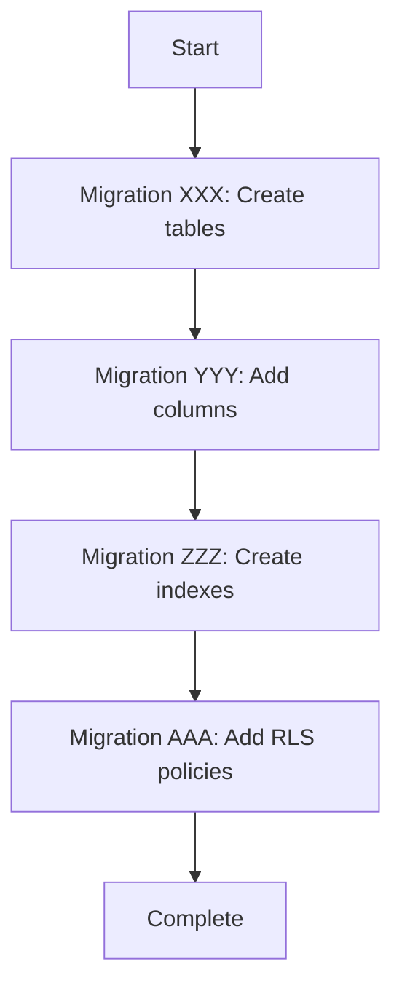

# Migration Plan: [FEATURE NAME]

**Branch**: `[###-feature-name]`
**Date**: [YYYY-MM-DD]
**Spec**: [specs/###-feature-name/spec.md]

## Summary

[Brief description of database schema changes required for this feature]

## Schema Changes

| Entity | Operation | Migration File | Status | Dependencies |
|--------|-----------|----------------|--------|--------------|
| [table_name] | CREATE TABLE | `XXX_create_[table].py` | ⏳ Pending | None |
| [table_name] | ADD COLUMN [col] | `YYY_add_[col].py` | ⏳ Pending | Migration XXX |
| [table_name] | CREATE INDEX | `ZZZ_index_[table]_[col].py` | ⏳ Pending | Migration XXX |
| [table_name] | ADD RLS POLICY | `AAA_rls_[table].py` | ⏳ Pending | Migration XXX |

**Status Legend:**
- ⏳ Pending - Not yet created
- 🚧 In Progress - Implementation started
- ✅ Complete - Migration created and tested
- 🧪 Testing - Migration created, tests running
- 🚀 Applied - Migration applied to database

## Migration Details

### Migration XXX: [Name]
**File**: `api/alembic/versions/XXX_[name].py`
**Purpose**: [What this migration does]

**Upgrade Operations:**
- CREATE TABLE [table_name]
- ADD COLUMN [column_name]
- CREATE INDEX [index_name]
- [other operations]

**Downgrade Operations:**
- DROP INDEX [index_name]
- DROP COLUMN [column_name]
- DROP TABLE [table_name]

**Validation:**
- [ ] Migration has upgrade() function
- [ ] Migration has downgrade() function
- [ ] No destructive operations without backfill
- [ ] All constraints documented
- [ ] RLS policies included (if applicable)

**Test Coverage:**
- [ ] Constraint tests written
- [ ] RLS policy tests (allow/deny paths)
- [ ] Performance validated (EXPLAIN ANALYZE)

---

### Migration YYY: [Name]
[Repeat structure above for each migration]

---

## Migration Sequence



**Execution Order:**
1. XXX_create_[table].py
2. YYY_add_[column].py
3. ZZZ_index_[table]_[col].py
4. AAA_rls_[table].py

## Quality Checklist

### Zero-Downtime Requirements
- [ ] All migrations are backwards-compatible
- [ ] No breaking changes to existing queries
- [ ] New columns have defaults or are nullable
- [ ] Indexes created CONCURRENTLY (if large table)

### Security Requirements
- [ ] RLS enabled on all new tables
- [ ] Policies for anon, authenticated, service roles
- [ ] No sensitive data in migration files
- [ ] PII fields documented

### Performance Requirements
- [ ] Indexes planned for expected query patterns
- [ ] EXPLAIN ANALYZE run on target queries
- [ ] Migration execution time estimated
- [ ] Rollback plan tested

### Testing Requirements
- [ ] Constraint tests for FK, UNIQUE, CHECK, NOT NULL
- [ ] RLS policy tests (allow/deny scenarios)
- [ ] Migration upgrade/downgrade cycle tested
- [ ] Data integrity validated post-migration

## Seed Data

**Required seed scripts:**
- [ ] `seeds/[feature]/seed_[table].sql` - Initial data
- [ ] `seeds/dev/dev_[table].sql` - Development fixtures

**Idempotency:**
- All seed scripts use INSERT ... ON CONFLICT DO NOTHING
- Or DELETE + INSERT pattern for reference data

## Delegation

**Assigned to**: cfipros-database-architect agent

**Context to provide:**
- specs/###-feature-name/spec.md (requirements)
- specs/###-feature-name/data-model.md (ERD and schema)
- specs/###-feature-name/plan.md (architecture decisions)
- Existing migrations: api/alembic/versions/001_*.py (pattern reference)

**Expected deliverables:**
1. Migration files with upgrade/downgrade paths
2. SQL policy files for RLS
3. Idempotent seed scripts
4. Passing test suite (constraints + RLS)
5. Migration runbook with commands

## Verification Commands

### Check Current Migration State
```bash
cd api
uv run alembic current
```

### Apply Migrations
```bash
cd api
uv run alembic upgrade head
```

### Rollback Last Migration
```bash
cd api
uv run alembic downgrade -1
```

### Verify Schema
```bash
cd api
uv run python -c "from app.models import Base; print([t.name for t in Base.metadata.sorted_tables])"
```

### Run Migration Tests
```bash
cd api
uv run pytest tests/migrations/ -v
```

## Rollback Plan

### If Migration Fails
1. Check error in alembic output
2. Run: `uv run alembic downgrade -1`
3. Fix migration file
4. Re-run: `uv run alembic upgrade head`

### If Data Corruption
1. Restore from backup (if production)
2. Run: `uv run alembic downgrade [revision]`
3. Investigate data integrity issues
4. Fix and re-apply

### Emergency Rollback
```bash
# Rollback to specific revision
cd api
uv run alembic downgrade [revision_id]

# Rollback all migrations (destructive)
cd api
uv run alembic downgrade base
```

## Notes

[Any additional context, gotchas, or considerations for migrations]

## References

- [Alembic Documentation](https://alembic.sqlalchemy.org/)
- [PostgreSQL Zero-Downtime Migrations](https://www.braintreepayments.com/blog/safe-operations-for-high-volume-postgresql/)
- [RLS Best Practices](https://supabase.com/docs/guides/auth/row-level-security)
- cfipros-database-architect.md (agent instructions)
