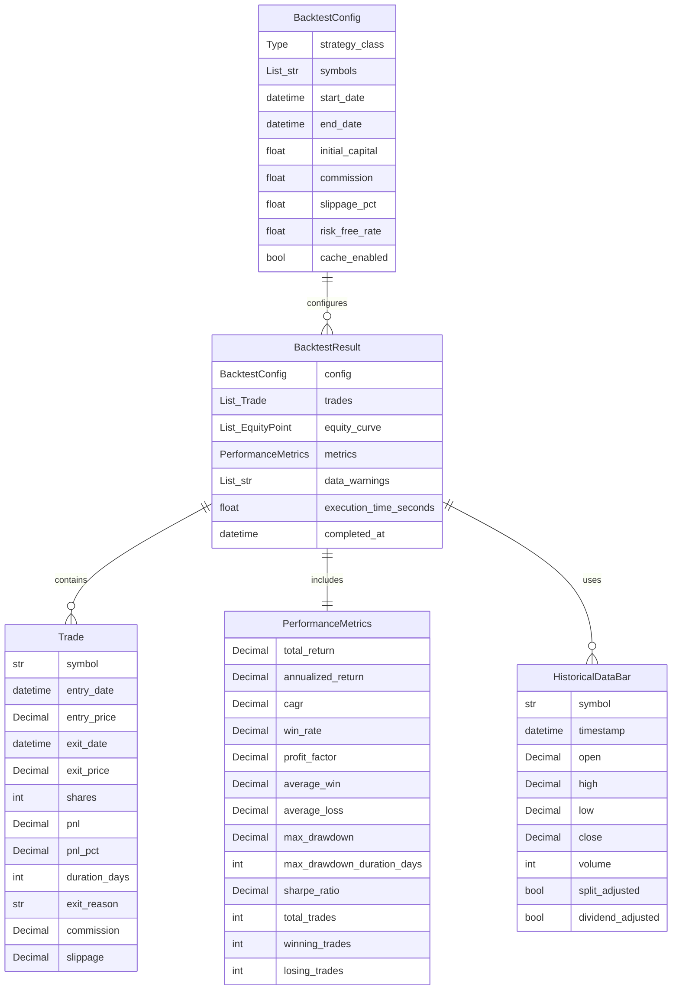

# Data Model: backtesting-engine

## Entities

### BacktestConfig
**Purpose**: Configuration parameters for a backtest run

**Fields**:
- `strategy_class`: Type - Strategy class to instantiate and test
- `symbols`: List[str] - Stock symbols to backtest
- `start_date`: datetime - Start of historical data range
- `end_date`: datetime - End of historical data range
- `initial_capital`: float - Starting portfolio value (default: 100000.0)
- `commission`: float - Commission per trade in dollars (default: 0.0 for Robinhood)
- `slippage_pct`: float - Slippage as percentage (default: 0.001 for 0.1%)
- `risk_free_rate`: float - Annual risk-free rate for Sharpe ratio (default: 0.02)
- `cache_enabled`: bool - Whether to cache historical data (default: True)

**Validation Rules**:
- `symbols`: Non-empty list (from requirement FR-001)
- `start_date < end_date`: Valid date range (from requirement FR-002)
- `initial_capital > 0`: Positive capital (from requirement FR-008)
- `commission >= 0`: Non-negative commission (from requirement US5)
- `slippage_pct >= 0 and slippage_pct < 1`: Valid slippage range

**State Transitions**:
- Created → Validated (on validation pass)
- Validated → Running (when backtest starts)
- Running → Completed (when backtest finishes)

---

### HistoricalDataBar
**Purpose**: OHLCV data for single time period (daily bar for MVP)

**Fields**:
- `symbol`: str - Stock ticker symbol
- `timestamp`: datetime - Bar timestamp in UTC
- `open`: Decimal - Opening price
- `high`: Decimal - Highest price during period
- `low`: Decimal - Lowest price during period
- `close`: Decimal - Closing price
- `volume`: int - Trading volume
- `split_adjusted`: bool - Whether prices are split-adjusted (default: True)
- `dividend_adjusted`: bool - Whether prices are dividend-adjusted (default: True)

**Relationships**:
- Belongs to: Symbol (many bars per symbol)
- Part of: BacktestResult (bars used in backtest)

**Validation Rules**:
- `timestamp`: Must be in UTC (from NFR-005)
- `high >= open, close, low`: High is highest price (from FR-002)
- `low <= open, close, high`: Low is lowest price (from FR-002)
- `volume >= 0`: Non-negative volume (from FR-002)
- `open, high, low, close > 0`: Positive prices (from FR-002)

---

### Trade
**Purpose**: Individual simulated trade record

**Fields**:
- `symbol`: str - Stock ticker
- `entry_date`: datetime - When position opened (UTC)
- `entry_price`: Decimal - Fill price for entry
- `exit_date`: datetime - When position closed (UTC)
- `exit_price`: Decimal - Fill price for exit
- `shares`: int - Number of shares traded
- `pnl`: Decimal - Profit/loss in dollars
- `pnl_pct`: Decimal - Return percentage
- `duration_days`: int - Holding period in days
- `exit_reason`: str - Why position closed (stop_loss, take_profit, strategy_signal, end_of_data)
- `commission`: Decimal - Total commission paid (entry + exit)
- `slippage`: Decimal - Total slippage cost in dollars

**Relationships**:
- Belongs to: BacktestResult (many trades per backtest)

**Validation Rules**:
- `exit_date > entry_date`: Valid trade duration (from FR-009)
- `shares > 0`: Positive position size (from FR-008)
- `pnl = (exit_price - entry_price) * shares - commission - slippage`: Correct P&L calculation (from FR-009)
- `pnl_pct = pnl / (entry_price * shares)`: Correct percentage return (from FR-009)
- `duration_days = (exit_date - entry_date).days`: Correct duration (from FR-009)

---

### PerformanceMetrics
**Purpose**: Aggregated statistics from backtest results

**Fields**:
- `total_return`: Decimal - Total percentage return
- `annualized_return`: Decimal - Annualized percentage return
- `cagr`: Decimal - Compound annual growth rate
- `win_rate`: Decimal - Percentage of profitable trades (0-1)
- `profit_factor`: Decimal - Gross profit / gross loss
- `average_win`: Decimal - Average profit on winning trades
- `average_loss`: Decimal - Average loss on losing trades
- `max_drawdown`: Decimal - Maximum peak-to-trough decline (0-1)
- `max_drawdown_duration_days`: int - Longest drawdown period in days
- `sharpe_ratio`: Decimal - Risk-adjusted return metric
- `total_trades`: int - Number of completed trades
- `winning_trades`: int - Number of profitable trades
- `losing_trades`: int - Number of unprofitable trades

**Relationships**:
- Belongs to: BacktestResult (one metrics object per backtest)

**Validation Rules**:
- `total_trades = winning_trades + losing_trades`: Correct trade count (from FR-011)
- `win_rate = winning_trades / total_trades`: Correct win rate (from FR-011)
- `profit_factor = sum(winning_pnl) / abs(sum(losing_pnl))`: Correct profit factor (from FR-011)
- `max_drawdown >= 0 and max_drawdown <= 1`: Valid drawdown range (from FR-012)
- `sharpe_ratio = (annualized_return - risk_free_rate) / std_dev_returns`: Correct Sharpe calculation (from FR-013)

---

### BacktestResult
**Purpose**: Complete output of backtest run with all data and metrics

**Fields**:
- `config`: BacktestConfig - Configuration used for this run
- `trades`: List[Trade] - All simulated trades (chronological order)
- `equity_curve`: List[Tuple[datetime, Decimal]] - Portfolio value over time
- `metrics`: PerformanceMetrics - Calculated performance statistics
- `data_warnings`: List[str] - Data quality issues encountered during backtest
- `execution_time_seconds`: float - Time taken to run backtest
- `completed_at`: datetime - Timestamp when backtest finished (UTC)

**Relationships**:
- Has one: BacktestConfig (configuration)
- Has many: Trade (all trades)
- Has one: PerformanceMetrics (aggregated metrics)

**Validation Rules**:
- `trades`: Sorted by entry_date (chronological) (from NFR-010)
- `equity_curve`: Sorted by timestamp (chronological) (from FR-014)
- `data_warnings`: Contains all data quality issues (from FR-016)
- `execution_time_seconds > 0`: Positive execution time (from NFR-001)

**State Transitions**:
- Initialized → Running (backtest starts)
- Running → Completed (backtest finishes successfully)
- Running → Failed (backtest encounters fatal error)

---

## Database Schema (Mermaid)



---

## API Schemas

**Strategy Protocol Interface**:
```python
from typing import Protocol
from trading_bot.backtest.models import HistoricalDataBar, Position

class IStrategy(Protocol):
    """Protocol defining strategy interface for backtesting."""

    def should_enter(self, symbol: str, bar: HistoricalDataBar, cash: Decimal) -> bool:
        """
        Determine if strategy should enter position.

        Args:
            symbol: Stock ticker
            bar: Current OHLCV bar
            cash: Available cash in portfolio

        Returns:
            True if should enter position, False otherwise
        """
        ...

    def should_exit(self, position: Position, bar: HistoricalDataBar) -> bool:
        """
        Determine if strategy should exit open position.

        Args:
            position: Current open position
            bar: Current OHLCV bar

        Returns:
            True if should exit position, False otherwise
        """
        ...
```

**State Shape** (in-memory during backtest):
```python
@dataclass
class BacktestState:
    """Internal state during backtest execution."""
    current_date: datetime
    cash: Decimal
    positions: Dict[str, Position]  # symbol -> Position
    equity_history: List[Tuple[datetime, Decimal]]
    trades: List[Trade]
    warnings: List[str]
```
