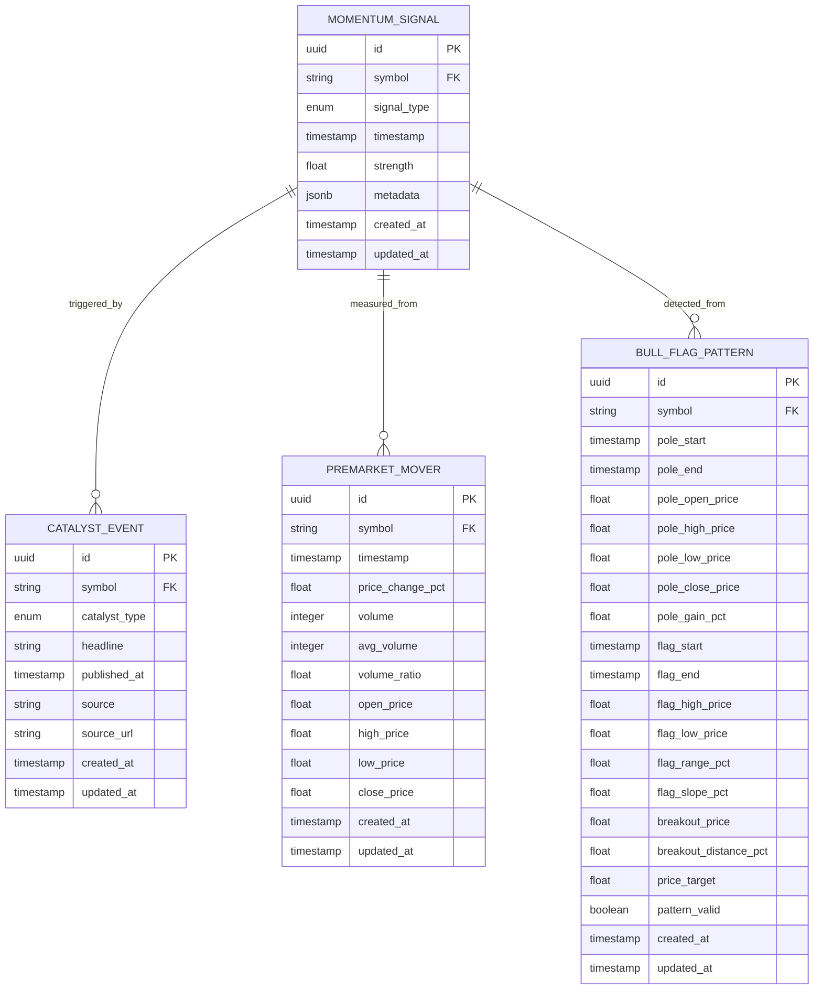

# Data Model: 002-momentum-detection

## Entities

### MomentumSignal
**Purpose**: Core entity representing a detected trading opportunity with multi-dimensional signal strength

**Fields**:
- `id`: UUID (PK) - Unique signal identifier
- `symbol`: str - Stock ticker symbol (e.g., "AAPL")
- `signal_type`: enum - Type of signal detected (CATALYST, PREMARKET_MOVER, BULL_FLAG)
- `timestamp`: datetime - When signal was detected (UTC ISO 8601)
- `strength`: float - Composite score 0-100 indicating signal quality
- `metadata`: dict - Type-specific data:
  - **For CATALYST**: `{"headline": str, "catalyst_type": str, "source": str, "published_at": str}`
  - **For PREMARKET_MOVER**: `{"price_change_pct": float, "volume_ratio": float, "avg_volume": int}`
  - **For BULL_FLAG**: `{"pole_gain_pct": float, "breakout_price": float, "price_target": float}`
- `created_at`: datetime - When logged (UTC)
- `updated_at`: datetime - Last modified (UTC)

**Validation Rules**:
- `symbol`: Non-null, uppercase, 1-5 characters (from spec FR-001-FR-007)
- `strength`: Range 0-100, rounded to 1 decimal (from spec US4)
- `timestamp`: UTC only, cannot be in future (from spec NFR-004, NFR-005)
- `metadata`: Required fields per signal_type, validated before storage

**State Transitions**:
- Created → Logged (initial state when detected)
- Logged → Acknowledged (when trader reviews signal)
- Acknowledged → Traded (if trader acts on signal)
- Any → Archived (after 30 days or trader request)

**Relationships**:
- Has many: Signal history entries (audit trail)
- References: HistoricalPerformance (for backtesting validation)

---

### CatalystEvent
**Purpose**: Represents a news-driven catalyst that triggered signal detection

**Fields**:
- `id`: UUID (PK) - Unique catalyst identifier
- `symbol`: str - Stock ticker
- `catalyst_type`: enum - NEWS_CATALYST, EARNINGS, FDA_APPROVAL, MERGER, PRODUCT_LAUNCH, ANALYST_UPGRADE, ANALYST_DOWNGRADE
- `headline`: str - News headline (max 500 chars)
- `published_at`: datetime - When news was published (UTC)
- `source`: str - News source name (e.g., "Alpaca News", "Finnhub")
- `source_url`: str - Link to original news (optional)
- `created_at`: datetime - When logged
- `updated_at`: datetime - Last modified

**Validation Rules**:
- `catalyst_type`: Must be valid enum value (from spec FR-002)
- `published_at`: Must be within last 24 hours for active signals (from spec FR-001)
- `headline`: Non-null, non-empty string
- `source`: Must be registered news provider

**Relationships**:
- Triggers: One or more MomentumSignal records
- References: Historical accuracy for backtesting

---

### PreMarketMover
**Purpose**: Tracks pre-market price and volume activity during 4:00-9:30 AM EST window

**Fields**:
- `id`: UUID (PK)
- `symbol`: str - Stock ticker
- `timestamp`: datetime - Measurement time (UTC, within pre-market window EST)
- `price_change_pct`: float - Percentage change from previous close
- `volume`: int - Current pre-market volume (shares)
- `avg_volume`: int - 10-day average pre-market volume baseline
- `volume_ratio`: float - Current volume / avg volume (calculated, stored for performance)
- `open_price`: float - Pre-market open price
- `high_price`: float - Pre-market high
- `low_price`: float - Pre-market low
- `close_price`: float - Latest pre-market price
- `created_at`: datetime
- `updated_at`: datetime

**Validation Rules**:
- `price_change_pct`: Range -100% to +500%, float precision 0.01%
- `volume`: Must be >= 0
- `volume_ratio`: Must be >= 0, calculated as current/average
- `timestamp`: Must be within pre-market hours 4:00-9:30 AM EST (converted to UTC for storage)
- `price fields`: Must be >= 0

**Relationships**:
- Triggers: MomentumSignal (PREMARKET_MOVER type) when thresholds met
- Time series: Historical data retained for analysis

---

### BullFlagPattern
**Purpose**: Technical analysis data for detected bull flag consolidation patterns

**Fields**:
- `id`: UUID (PK)
- `symbol`: str - Stock ticker
- `pole_start`: datetime - Start of upward move (UTC)
- `pole_end`: datetime - End of upward move
- `pole_open_price`: float - Opening price of pole
- `pole_high_price`: float - Highest price during pole
- `pole_low_price`: float - Lowest price during pole
- `pole_close_price`: float - Closing price at pole end
- `pole_gain_pct`: float - Percentage gain during pole (calculated from high-low)
- `flag_start`: datetime - Start of consolidation
- `flag_end`: datetime - End of consolidation (or null if ongoing)
- `flag_high_price`: float - Highest price during flag
- `flag_low_price`: float - Lowest price during flag
- `flag_range_pct`: float - Price range during flag (high-low)/low
- `flag_slope_pct`: float - Trend during consolidation (positive=upward, negative=downward)
- `breakout_price`: float - Price level for breakout confirmation (top of flag range)
- `breakout_distance_pct`: float - Distance from current to breakout price
- `price_target`: float - Projected price target if breakout occurs (pole height projected from breakout)
- `pattern_valid`: bool - Whether pattern currently meets all criteria
- `created_at`: datetime
- `updated_at`: datetime

**Validation Rules**:
- `pole_gain_pct`: Must be >= 8% (from spec FR-006)
- `flag_range_pct`: Must be 3-5% (from spec FR-006)
- `flag_slope_pct`: Must be <= 0 (downward or flat, not upward)
- `breakout_price`: Must be >= flag_high_price
- `price_target`: Must be >= breakout_price
- Duration validations:
  - Pole duration: 1-3 days
  - Flag duration: 2-5 days (ongoing flags still tracked)
- All date fields: Must be in UTC, pole_start < pole_end < flag_start

**Relationships**:
- Triggers: MomentumSignal (BULL_FLAG type) when pattern_valid=true
- Time series: Historical patterns retained for performance analysis

---

## Database Schema (Mermaid)



---

## API Schemas

### MomentumSignal Response Schema

```python
from dataclasses import dataclass
from enum import Enum
from typing import Dict, Any
from datetime import datetime

class SignalType(str, Enum):
    CATALYST = "catalyst"
    PREMARKET_MOVER = "premarket_mover"
    BULL_FLAG = "bull_flag"

@dataclass
class MomentumSignal:
    id: str                      # UUID
    symbol: str                  # e.g., "AAPL"
    signal_type: SignalType      # CATALYST | PREMARKET_MOVER | BULL_FLAG
    timestamp: str               # ISO 8601 UTC
    strength: float              # 0-100
    metadata: Dict[str, Any]     # Type-specific data
    created_at: str              # ISO 8601 UTC
    updated_at: str              # ISO 8601 UTC
```

### Query Parameters

```python
@dataclass
class MomentumQuery:
    # Filtering
    symbols: Optional[List[str]] = None          # Filter to specific tickers
    signal_types: Optional[List[SignalType]] = None  # Filter by signal type
    min_strength: float = 0                      # Only signals >= this strength
    max_strength: float = 100                    # Only signals <= this strength

    # Time range
    start_time: Optional[str] = None             # ISO 8601 UTC, default: last 24h
    end_time: Optional[str] = None               # ISO 8601 UTC, default: now

    # Sorting & Pagination
    sort_by: str = "strength"                    # strength | timestamp | symbol
    sort_order: str = "desc"                     # asc | desc
    limit: int = 100                             # Max 1000
    offset: int = 0
```

### API Endpoints (OpenAPI 3.0)

```yaml
get /api/v1/momentum/signals:
  summary: List detected momentum signals
  parameters:
    - name: symbols
      in: query
      schema: {type: string}
      example: "AAPL,GOOGL"
    - name: signal_type
      in: query
      schema: {enum: [catalyst, premarket_mover, bull_flag]}
    - name: min_strength
      in: query
      schema: {type: number, minimum: 0, maximum: 100}
  responses:
    200:
      description: List of momentum signals
      content:
        application/json:
          schema:
            type: object
            properties:
              signals: {type: array, items: MomentumSignal}
              total: {type: integer}
              count: {type: integer}
              has_more: {type: boolean}

get /api/v1/momentum/signals/{id}:
  summary: Get specific signal by ID
  parameters:
    - name: id
      in: path
      required: true
      schema: {type: string, format: uuid}
  responses:
    200:
      description: Signal details
      content:
        application/json:
          schema: MomentumSignal
    404:
      description: Signal not found

post /api/v1/momentum/scan:
  summary: Trigger momentum scan (async)
  requestBody:
    required: true
    content:
      application/json:
        schema:
          type: object
          properties:
            symbols: {type: array, items: string}
            scan_types: {type: array, items: {enum: [catalyst, premarket, bull_flag]}}
  responses:
    202:
      description: Scan started
      content:
        application/json:
          schema:
            type: object
            properties:
              scan_id: {type: string, format: uuid}
              status: {type: string, enum: [queued, running]}
              estimated_completion: {type: string, format: date-time}
```

---

## Logging & Audit Trail

All signals logged to persistent JSONL for:
- Backtesting and performance analysis
- Debugging and error investigation
- Compliance and audit trails

**JSONL Entry Schema**:
```json
{
  "timestamp": "2025-10-16T14:30:00Z",
  "event_type": "signal_detected",
  "signal_id": "550e8400-e29b-41d4-a716-446655440000",
  "symbol": "AAPL",
  "signal_type": "bull_flag",
  "strength": 85.5,
  "metadata": {
    "pole_gain_pct": 12.3,
    "breakout_price": 195.50,
    "price_target": 210.00
  },
  "detection_time_ms": 245
}
```

---

## State Shape (Frontend)

```typescript
interface MomentumState {
  signals: MomentumSignal[] | null
  loading: boolean
  error: Error | null
  filters: {
    symbols: string[]
    signal_types: SignalType[]
    min_strength: number
    time_range: { start: Date; end: Date }
  }
  sort: {
    by: "strength" | "timestamp" | "symbol"
    order: "asc" | "desc"
  }
  pagination: {
    limit: number
    offset: number
    total: number
    has_more: boolean
  }
}
```

---

## Database Implementation Notes

**Storage**:
- Local: JSONL files in `logs/momentum/` (YYYY-MM-DD.jsonl)
- Optional: PostgreSQL table for structured queries (Phase 2 enhancement)

**Indexing Strategy**:
- symbol, signal_type (filter queries)
- timestamp (time range queries)
- strength DESC (ranking queries)

**Retention Policy**:
- JSONL logs: Keep indefinitely for backtesting
- Database records: Keep 90 days active, archive older records

**Backup**:
- JSONL files: Include in git repo backups
- Database: Use existing backup infrastructure
