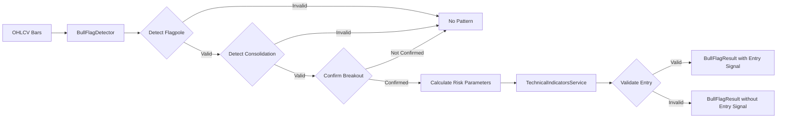

# Data Model: 003-entry-logic-bull-flag

## Entities

### BullFlagResult
**Purpose**: Encapsulates complete bull flag pattern detection results including pattern metadata, risk parameters, and signal validation

**Fields**:
- `symbol`: str - Stock ticker symbol
- `timestamp`: datetime - Detection timestamp
- `pattern_detected`: bool - Whether valid pattern found
- `quality_score`: Decimal - Pattern quality (0-100)
- `flagpole`: FlagpoleData - Flagpole phase metadata
- `consolidation`: ConsolidationData - Consolidation phase metadata
- `breakout_price`: Optional[Decimal] - Breakout confirmation price (None if no breakout)
- `entry_price`: Optional[Decimal] - Recommended entry price
- `stop_loss`: Optional[Decimal] - Calculated stop-loss price
- `target_price`: Optional[Decimal] - Calculated target price
- `risk_reward_ratio`: Optional[Decimal] - Risk/reward ratio
- `indicators`: dict - VWAP, MACD, EMA values at breakout

**Relationships**:
- Has one: FlagpoleData (composition)
- Has one: ConsolidationData (composition)

**Validation Rules**:
- `quality_score`: 0 <= score <= 100 (from requirement FR-006)
- `risk_reward_ratio`: >= 2.0 if entry signal generated (from requirement FR-005)
- `stop_loss`: < entry_price if provided
- `target_price`: > entry_price if provided

---

### FlagpoleData
**Purpose**: Captures flagpole phase characteristics (initial upward movement)

**Fields**:
- `start_bar`: int - Starting bar index
- `end_bar`: int - Ending bar index
- `duration_bars`: int - Number of bars in flagpole
- `gain_percent`: Decimal - Percentage gain from start to end
- `avg_volume`: Decimal - Average volume during flagpole
- `start_price`: Decimal - Price at flagpole start
- `end_price`: Decimal - Price at flagpole end

**Validation Rules**:
- `duration_bars`: 3 <= bars <= 15 (from requirement FR-001)
- `gain_percent`: >= 5.0 (from requirement FR-001)
- `avg_volume`: > 0

---

### ConsolidationData
**Purpose**: Captures consolidation phase characteristics (flag formation)

**Fields**:
- `start_bar`: int - Starting bar index
- `end_bar`: int - Ending bar index
- `duration_bars`: int - Number of bars in consolidation
- `retracement_percent`: Decimal - Retracement of flagpole gain
- `upper_boundary`: Decimal - Resistance level
- `lower_boundary`: Decimal - Support level
- `avg_volume`: Decimal - Average volume during consolidation
- `volume_decrease_percent`: Decimal - Volume decrease vs flagpole

**Validation Rules**:
- `duration_bars`: 3 <= bars <= 10 (from requirement FR-002)
- `retracement_percent`: 20.0 <= pct <= 50.0 (from requirement FR-002)
- `volume_decrease_percent`: >= 20.0 (from requirement FR-002)
- `upper_boundary`: > lower_boundary

---

### BullFlagConfig
**Purpose**: Configuration parameters for pattern detection thresholds

**Fields**:
- `flagpole_min_gain_pct`: Decimal - Minimum flagpole gain (default: 5.0)
- `flagpole_min_bars`: int - Minimum flagpole duration (default: 3)
- `flagpole_max_bars`: int - Maximum flagpole duration (default: 15)
- `consolidation_min_bars`: int - Minimum consolidation duration (default: 3)
- `consolidation_max_bars`: int - Maximum consolidation duration (default: 10)
- `consolidation_min_retracement_pct`: Decimal - Minimum retracement (default: 20.0)
- `consolidation_max_retracement_pct`: Decimal - Maximum retracement (default: 50.0)
- `volume_decrease_threshold_pct`: Decimal - Required volume decrease (default: 20.0)
- `breakout_volume_increase_pct`: Decimal - Required volume increase for breakout (default: 30.0)
- `breakout_price_move_pct`: Decimal - Required price move above resistance (default: 1.0)
- `min_risk_reward_ratio`: Decimal - Minimum acceptable risk/reward (default: 2.0)
- `quality_score_threshold`: Decimal - Minimum quality score for valid signal (default: 60.0)
- `stop_loss_buffer_pct`: Decimal - Buffer below flag low for stop-loss (default: 0.5)

**Validation Rules** (__post_init__):
- All percentage values >= 0
- All bar count values > 0
- `flagpole_min_bars` <= `flagpole_max_bars`
- `consolidation_min_bars` <= `consolidation_max_bars`
- `consolidation_min_retracement_pct` <= `consolidation_max_retracement_pct`
- `min_risk_reward_ratio` >= 1.0

---

## Data Flow



---

## State Transitions

**Pattern Detection State Machine**:
- Initial → Scanning (searching for flagpole)
- Scanning → Flagpole Detected (flagpole criteria met)
- Flagpole Detected → Consolidation Detected (consolidation criteria met)
- Consolidation Detected → Breakout Confirmed (breakout criteria met)
- Breakout Confirmed → Entry Validated (indicator validation passed)
- Entry Validated → Signal Generated (risk/reward >= 2:1)

**Invalid Transitions** (return to Initial):
- Scanning → Invalid (flagpole criteria not met)
- Flagpole Detected → Invalid (consolidation criteria not met)
- Consolidation Detected → Invalid (breakout criteria not met)
- Breakout Confirmed → Invalid (indicator validation failed)
- Entry Validated → Invalid (risk/reward < 2:1)

---

## API Schemas

**Request/Response Schemas**: See contracts/api.yaml

**Internal Data Structures**:

```python
# Input format (matches existing TechnicalIndicatorsService)
bars: List[dict] = [
    {
        "open": "180.50",
        "high": "182.00",
        "low": "180.00",
        "close": "181.75",
        "volume": "1500000",
        "timestamp": "2025-10-17T09:30:00Z"
    },
    # ... minimum 30 bars
]

# Output format
result: BullFlagResult = BullFlagResult(
    symbol="AAPL",
    timestamp=datetime.now(),
    pattern_detected=True,
    quality_score=Decimal("85.5"),
    flagpole=FlagpoleData(
        start_bar=0,
        end_bar=8,
        duration_bars=8,
        gain_percent=Decimal("8.5"),
        avg_volume=Decimal("2000000"),
        start_price=Decimal("175.00"),
        end_price=Decimal("189.88")
    ),
    consolidation=ConsolidationData(
        start_bar=9,
        end_bar=15,
        duration_bars=7,
        retracement_percent=Decimal("35.0"),
        upper_boundary=Decimal("187.50"),
        lower_boundary=Decimal("183.25"),
        avg_volume=Decimal("1200000"),
        volume_decrease_percent=Decimal("40.0")
    ),
    breakout_price=Decimal("188.00"),
    entry_price=Decimal("188.00"),
    stop_loss=Decimal("182.33"),
    target_price=Decimal("202.88"),
    risk_reward_ratio=Decimal("2.6"),
    indicators={
        "vwap": Decimal("185.50"),
        "macd": Decimal("0.45"),
        "ema_9": Decimal("186.20")
    }
)
```
