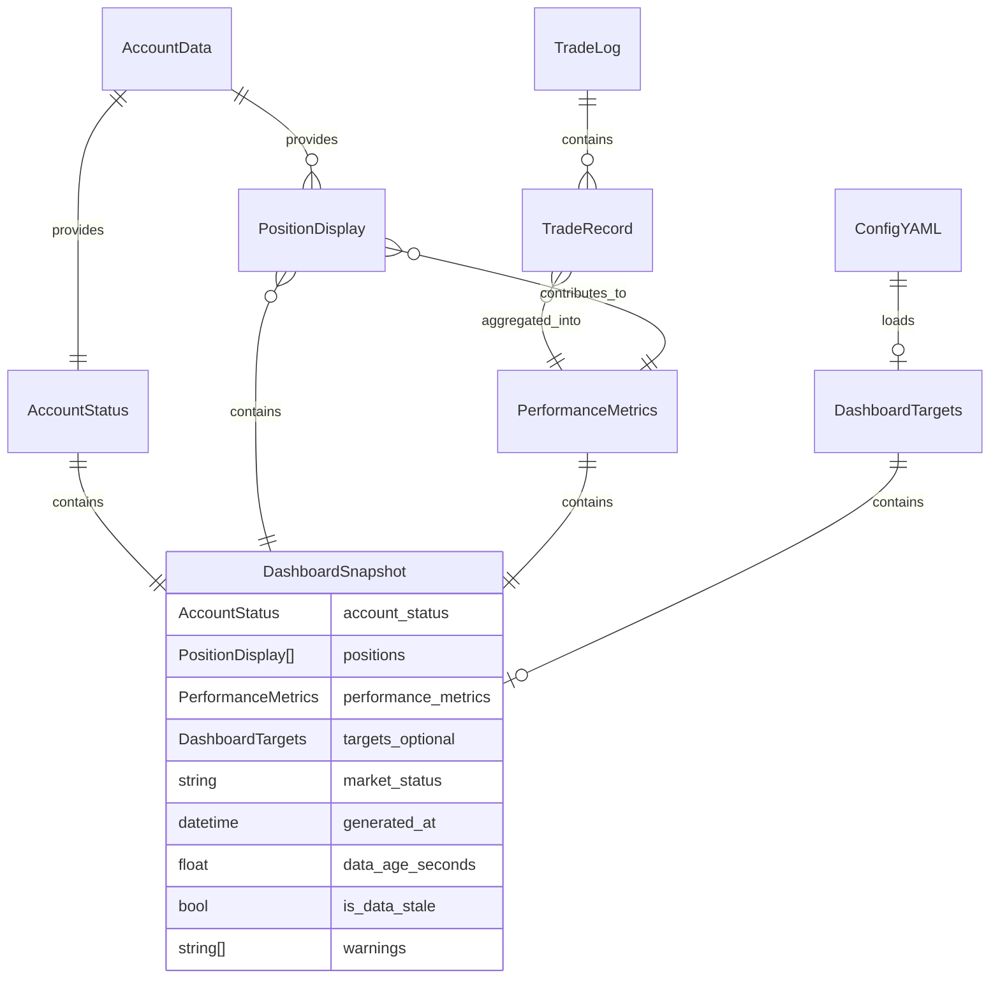

# Data Model: 019-status-dashboard

## Entities

### AccountStatus
**Purpose**: Current account snapshot for display in dashboard header

**Fields**:
- `buying_power`: Decimal - Available capital for new positions
- `account_balance`: Decimal - Total equity (cash + positions)
- `cash_balance`: Decimal - Uninvested cash
- `day_trade_count`: int - Number of day trades in rolling 5-day window
- `last_updated`: datetime (UTC) - Timestamp of account data fetch

**Relationships**:
- Fetched from: AccountData service (account-data-module)
- Used by: DashboardSnapshot for header rendering

**Validation Rules**:
- `buying_power` ≥ 0 (from requirement FR-001)
- `account_balance` ≥ 0 (from requirement FR-001)
- `day_trade_count` ≥ 0 and ≤ 3 for non-PDT accounts (from requirement FR-001)
- `last_updated` must be timezone-aware UTC (from NFR-004)

**State Transitions**: None (read-only snapshot)

---

### PositionDisplay
**Purpose**: Open position with calculated P&L for dashboard table

**Fields**:
- `symbol`: str - Stock ticker symbol
- `quantity`: int - Number of shares held
- `entry_price`: Decimal - Average cost basis per share
- `current_price`: Decimal - Latest market price
- `unrealized_pl`: Decimal - Dollar profit/loss (current_price - entry_price) × quantity
- `unrealized_pl_pct`: Decimal - Percentage return (unrealized_pl / (entry_price × quantity)) × 100
- `last_updated`: datetime (UTC) - Timestamp of price update

**Relationships**:
- Derived from: AccountData.get_positions() (account-data-module)
- Used by: DashboardSnapshot for positions table rendering
- Sorted by: unrealized_pl descending (FR-002)

**Validation Rules**:
- `symbol` matches /^[A-Z]{1,5}$/ (valid ticker format) (from requirement FR-002)
- `quantity` > 0 (positions with 0 quantity are closed) (from requirement FR-002)
- `entry_price` > 0 (from requirement FR-002)
- `current_price` > 0 (from requirement FR-002)
- `last_updated` must be timezone-aware UTC (from NFR-004)

**State Transitions**: None (read-only snapshot)

**Color Coding** (FR-008):
- `unrealized_pl` > 0 → Green
- `unrealized_pl` < 0 → Red
- `unrealized_pl` = 0 → Yellow

---

### PerformanceMetrics
**Purpose**: Aggregated trading performance statistics

**Fields**:
- `win_rate`: float - Percentage of winning trades (0.0-100.0)
- `avg_risk_reward`: float - Average R:R ratio across trades with targets/stops
- `total_realized_pl`: Decimal - Sum of net P&L from closed trades
- `total_unrealized_pl`: Decimal - Sum of P&L from open positions
- `total_pl`: Decimal - Combined realized + unrealized P&L
- `current_streak`: int - Count of consecutive wins or losses
- `streak_type`: Literal["WIN", "LOSS", "NONE"] - Type of current streak
- `trades_today`: int - Number of trades executed today
- `session_count`: int - Total number of trading sessions
- `max_drawdown`: Decimal - Largest peak-to-trough decline in cumulative P&L

**Relationships**:
- Calculated from: TradeRecord list (trade-logging module)
- Calculated from: Position list (account-data-module)
- Calculated by: MetricsCalculator service
- Used by: DashboardSnapshot for metrics panel rendering

**Validation Rules**:
- `win_rate` ≥ 0 and ≤ 100 (from requirement FR-011)
- `avg_risk_reward` ≥ 0 (from requirement FR-012)
- `current_streak` ≥ 0 (from requirement FR-014)
- `trades_today` ≥ 0 (from requirement FR-003)
- `session_count` ≥ 0 (from requirement FR-003)
- `max_drawdown` ≤ 0 (drawdown is negative value) (from NFR-001)

**State Transitions**: None (recalculated on each refresh)

**Calculation Formulas** (from spec.md requirements):
- `win_rate` = (winning trades / total closed trades) × 100 (FR-011)
- `avg_risk_reward` = average of (target - entry) / (entry - stop_loss) for trades with risk parameters (FR-012)
- `total_pl` = sum(realized P&L) + sum(unrealized P&L) (FR-013)
- `current_streak` = consecutive wins/losses from most recent closed trades (FR-014)

---

### DashboardTargets
**Purpose**: Performance targets for comparison and goal tracking

**Fields**:
- `win_rate_target`: float - Target win rate percentage (e.g., 60.0)
- `daily_pl_target`: Decimal - Target daily profit/loss in dollars
- `trades_per_day_target`: int - Target number of trades per day
- `max_drawdown_target`: Decimal - Maximum acceptable drawdown (negative value)
- `avg_risk_reward_target`: float | None - Optional target R:R ratio

**Relationships**:
- Loaded from: config/dashboard-targets.yaml (YAML configuration file)
- Used by: DashboardSnapshot for target comparison rendering

**Validation Rules**:
- `win_rate_target` ≥ 0 and ≤ 100 (from requirement FR-005)
- `daily_pl_target` can be positive or negative (from requirement FR-005)
- `trades_per_day_target` > 0 (from requirement FR-005)
- `max_drawdown_target` < 0 (drawdown is negative value) (from requirement FR-005)
- `avg_risk_reward_target` ≥ 0 if set (from requirement FR-005)

**State Transitions**: None (loaded once at dashboard startup)

**File Format** (config/dashboard-targets.yaml):
```yaml
win_rate_target: 60.0
daily_pl_target: 200.00
trades_per_day_target: 5
max_drawdown_target: -100.00
avg_risk_reward_target: 2.0  # Optional
```

---

### DashboardSnapshot
**Purpose**: Reusable aggregated dashboard payload (FR-017 mentions future TUI)

**Fields**:
- `account_status`: AccountStatus - Account summary
- `positions`: list[PositionDisplay] - Open positions sorted by P&L descending
- `performance_metrics`: PerformanceMetrics - Trading statistics
- `targets`: DashboardTargets | None - Optional performance targets
- `market_status`: Literal["OPEN", "CLOSED"] - Current market status
- `generated_at`: datetime (UTC) - Snapshot creation timestamp
- `data_age_seconds`: float - Seconds since account data last updated
- `is_data_stale`: bool - True if data_age_seconds > 60 (NFR-001 staleness TTL)
- `warnings`: list[str] - Operator warnings (missing logs, stale data, errors)

**Relationships**:
- Aggregates: AccountStatus, PositionDisplay list, PerformanceMetrics, DashboardTargets
- Generated by: DashboardDataProvider.get_snapshot()
- Consumed by: DisplayRenderer (CLI), ExportGenerator (JSON/MD), future TUI (FR-017)

**Validation Rules**:
- `data_age_seconds` ≥ 0 (from requirement FR-010)
- `is_data_stale` = True if `data_age_seconds` > 60 (from requirement FR-010)
- `generated_at` must be timezone-aware UTC (from NFR-004)
- `warnings` contains user-friendly messages (from requirements FR-015, FR-016)

**State Transitions**: None (immutable snapshot, regenerated on each refresh)

---

## Database Schema (Mermaid)

**Note**: This feature does NOT use a database. All data is ephemeral and sourced from:
- Account data: AccountData service (in-memory cache)
- Trade logs: JSONL files (logs/YYYY-MM-DD.jsonl)
- Targets: YAML config file (config/dashboard-targets.yaml)



---

## Data Flow

**Refresh Cycle** (every 5 seconds):
1. DashboardDataProvider.get_snapshot() invoked
2. AccountData service fetched → AccountStatus
3. AccountData.get_positions() → list[PositionDisplay]
4. TradeQueryHelper.query_by_date_range() → list[TradeRecord]
5. MetricsCalculator.aggregate_metrics() → PerformanceMetrics
6. is_market_open() → market_status
7. All components bundled → DashboardSnapshot
8. DisplayRenderer.render_full_dashboard(snapshot) → Rich layout
9. Live.update(layout) → Terminal display refreshed

**Export Flow** (E key pressed):
1. Current DashboardSnapshot captured
2. ExportGenerator.generate_exports(snapshot)
3. JSON file written: logs/dashboard-export-YYYY-MM-DD-HHmmss.json
4. Markdown file written: logs/dashboard-export-YYYY-MM-DD-HHmmss.md
5. Paths logged via log_dashboard_event() (NFR-007 audit requirement)

---

## Type Definitions

**Python Type Hints** (NFR-005 requirement):

```python
from dataclasses import dataclass
from datetime import datetime
from decimal import Decimal
from typing import Literal

@dataclass
class AccountStatus:
    buying_power: Decimal
    account_balance: Decimal
    cash_balance: Decimal
    day_trade_count: int
    last_updated: datetime

@dataclass
class PositionDisplay:
    symbol: str
    quantity: int
    entry_price: Decimal
    current_price: Decimal
    unrealized_pl: Decimal
    unrealized_pl_pct: Decimal
    last_updated: datetime

@dataclass
class PerformanceMetrics:
    win_rate: float
    avg_risk_reward: float
    total_realized_pl: Decimal
    total_unrealized_pl: Decimal
    total_pl: Decimal
    current_streak: int
    streak_type: Literal["WIN", "LOSS", "NONE"]
    trades_today: int
    session_count: int
    max_drawdown: Decimal

@dataclass
class DashboardTargets:
    win_rate_target: float
    daily_pl_target: Decimal
    trades_per_day_target: int
    max_drawdown_target: Decimal
    avg_risk_reward_target: float | None = None

@dataclass
class DashboardSnapshot:
    account_status: AccountStatus
    positions: list[PositionDisplay]
    performance_metrics: PerformanceMetrics
    targets: DashboardTargets | None
    market_status: Literal["OPEN", "CLOSED"]
    generated_at: datetime
    data_age_seconds: float
    is_data_stale: bool
    warnings: list[str] = field(default_factory=list)
```

---

## Edge Case Handling

### No Open Positions (Edge case from spec.md)
- `positions` list is empty []
- DisplayRenderer shows "No open positions" message
- `total_unrealized_pl` = Decimal("0")

### No Trades Today (Edge case from spec.md)
- `trades_today` = 0
- Display cumulative stats from historical trades
- `win_rate` and `avg_risk_reward` calculated from all closed trades

### Missing Trade Log (Edge case from spec.md)
- `warnings` contains "Trade log not found, performance metrics unavailable"
- PerformanceMetrics returns default values (0.0, Decimal("0"), etc.)
- Dashboard remains functional (FR-015)

### Stale Account Data (Edge case from spec.md)
- `is_data_stale` = True when `data_age_seconds` > 60
- `warnings` contains "⚠️ Data may be stale: last updated XXs ago"
- Display shows cached data with prominent warning (FR-010)

### Missing Targets File (Edge case from spec.md)
- `targets` = None
- Metrics displayed without target comparison
- Warning logged (not added to `warnings` list to avoid cluttering UI) (FR-016)

### API Call Failure (Edge case from spec.md)
- Exception caught in dashboard.py refresh() function
- Error message displayed via Console.print()
- Previous DashboardSnapshot retained (cached data)
- `is_data_stale` flag set to True on subsequent refresh
