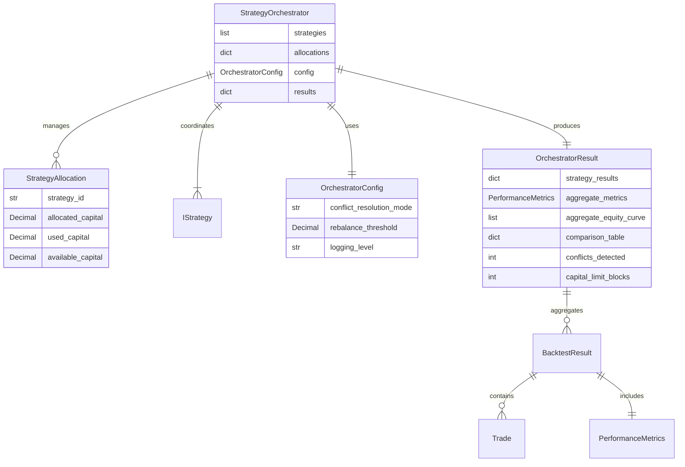

# Data Model: strategy-orchestrato

## Entities

### StrategyOrchestrator
**Purpose**: Coordinate execution of multiple trading strategies with capital allocation and performance tracking

**Fields**:
- `strategies`: list[tuple[IStrategy, Decimal]] - Strategy instances with allocation weights
- `allocations`: dict[str, StrategyAllocation] - Capital tracking per strategy
- `config`: OrchestratorConfig - Orchestrator behavior configuration
- `results`: dict[str, BacktestResult] - Per-strategy backtest results
- `aggregate_state`: BacktestState - Combined portfolio state (cash + positions across all strategies)

**Relationships**:
- Composes: BacktestEngine (for bar iteration and trade execution logic)
- Aggregates: Multiple IStrategy instances
- Produces: OrchestratorResult (contains all strategy results)

**Validation Rules**:
- Sum of strategy weights ≤ 1.0 (from FR-002)
- Each strategy weight > 0 (from FR-003)
- Strategy list non-empty (from FR-001)
- Strategy IDs unique (derived from strategy class name + index)

**State Transitions**:
- Initial → Running (on orchestrator.run() call)
- Running → Completed (on successful backtest finish)
- Running → Failed (on error, logged to error-log.md)

---

### StrategyAllocation
**Purpose**: Track capital allocation and usage for a single strategy

**Fields**:
- `strategy_id`: str - Unique identifier (e.g., "MomentumStrategy_0")
- `allocated_capital`: Decimal - Total capital allocated to strategy (from FR-003)
- `used_capital`: Decimal - Capital currently tied up in open positions
- `available_capital`: Decimal - Remaining capital for new positions (allocated - used)

**Relationships**:
- Belongs to: StrategyOrchestrator (one allocation per strategy)

**Validation Rules**:
- allocated_capital > 0 (from FR-003)
- used_capital >= 0 (cannot use negative capital)
- available_capital = allocated_capital - used_capital (computed property)
- used_capital ≤ allocated_capital (enforced by FR-007)

**State Transitions**:
- available_capital decreases on position entry (from FR-007)
- available_capital increases on position exit (from FR-008)
- Blocks new entries when available_capital < required (from FR-007)

---

### OrchestratorConfig
**Purpose**: Configuration for orchestrator behavior (MVP: minimal, P2: conflict resolution)

**Fields**:
- `conflict_resolution_mode`: str - "NET_SIGNAL" | "FIRST_WINS" | "CANCEL_BOTH" (P2, default: "FIRST_WINS" for MVP)
- `rebalance_threshold`: Decimal - Allocation drift % to trigger rebalance (P2, default: 0.10)
- `logging_level`: str - "DEBUG" | "INFO" | "WARNING" (default: "INFO")

**Relationships**:
- Passed to: StrategyOrchestrator at initialization

**Validation Rules**:
- conflict_resolution_mode in allowed values
- rebalance_threshold in [0, 1] range
- logging_level valid Python logging level

**MVP Scope**:
- Only logging_level used in P1 MVP
- conflict_resolution_mode and rebalance_threshold implemented in P2 (US4, US5)

---

### OrchestratorResult
**Purpose**: Extended backtest result containing per-strategy performance and portfolio aggregation

**Fields**:
- `config`: OrchestratorConfig - Configuration used for run
- `strategy_results`: dict[str, BacktestResult] - Individual strategy results (from FR-005, FR-009)
- `aggregate_metrics`: PerformanceMetrics - Portfolio-level performance (from FR-010)
- `aggregate_equity_curve`: list[tuple[datetime, Decimal]] - Combined equity curve
- `comparison_table`: dict[str, dict[str, Decimal]] - Strategy comparison matrix (from FR-013)
- `conflicts_detected`: int - Count of signal conflicts (from FR-011)
- `capital_limit_blocks`: int - Count of trades blocked by capital limits (from FR-007)
- `execution_time_seconds`: Decimal - Total runtime
- `completed_at`: datetime - Timestamp of completion

**Relationships**:
- Contains: Multiple BacktestResult objects (one per strategy)
- Extends: BacktestResult pattern (maintains API consistency)

**Validation Rules**:
- strategy_results non-empty (at least one strategy ran)
- All BacktestResult objects valid (inherit BacktestResult validation)
- comparison_table keys match strategy_results keys

**Computed Fields**:
- comparison_table generated from strategy_results metrics
- aggregate_metrics computed by summing equity curves

---

## Database Schema (Mermaid)



---

## API Schemas

**Request/Response Schemas**: See contracts/api.yaml (none for MVP - local library only)

**State Shape** (orchestrator internal state):
```python
@dataclass
class OrchestratorState:
    """Internal state tracking during backtest execution."""
    current_bar: HistoricalDataBar
    allocations: dict[str, StrategyAllocation]
    strategy_states: dict[str, BacktestState]  # Per-strategy state
    aggregate_state: BacktestState  # Portfolio-level state
    pending_signals: dict[str, list[Signal]]  # Signals by symbol (for conflict detection)
```

**Configuration API**:
```python
# Pattern 1: Explicit strategy list with weights
orchestrator = StrategyOrchestrator(
    strategies=[
        (BuyAndHoldStrategy(), Decimal("0.33")),
        (MomentumStrategy(), Decimal("0.33")),
        (RSIStrategy(), Decimal("0.34"))
    ],
    config=OrchestratorConfig(logging_level="INFO")
)

# Pattern 2: Equal weights (default)
orchestrator = StrategyOrchestrator(
    strategies=[BuyAndHoldStrategy(), MomentumStrategy()],
    equal_weights=True  # Each gets 0.5
)

result = orchestrator.run(
    historical_data={"AAPL": bars, "TSLA": bars},
    initial_capital=Decimal("100000.0")
)
```

**Result Access**:
```python
# Per-strategy metrics
for strategy_id, result in orchestrator_result.strategy_results.items():
    print(f"{strategy_id}: {result.metrics.total_return:.2%}")

# Portfolio metrics
print(f"Portfolio Return: {orchestrator_result.aggregate_metrics.total_return:.2%}")
print(f"Portfolio Sharpe: {orchestrator_result.aggregate_metrics.sharpe_ratio:.2f}")

# Comparison table
comparison = orchestrator_result.comparison_table
# Returns: {"MomentumStrategy_0": {"total_return": 0.15, "sharpe": 1.2, ...}, ...}
```
