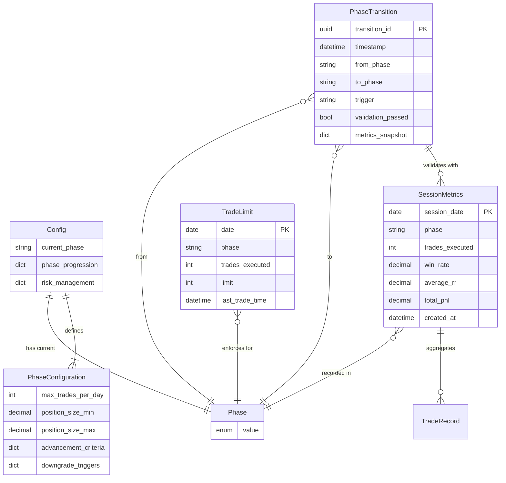

# Data Model: Position Scaling & Phase Progression

## Entities

### Phase (Enum)
**Purpose**: Represents trading progression phases with increasing position sizes and requirements

**Values**:
- `EXPERIENCE` - Paper trading only, unlimited trades, simulated positions
- `PROOF_OF_CONCEPT` - Real money, 1 trade/day max, $100 position size
- `REAL_MONEY_TRIAL` - Real money, no trade limit, $200 position size
- `SCALING` - Real money, no trade limit, $200-$2,000 graduated positions

**Storage**: `config.json` under `phase_progression.current_phase`

**Validation Rules**:
- Must be one of: `"experience"`, `"proof"`, `"trial"`, `"scaling"` (from FR-001)
- Transitions must be unidirectional (Experience → PoC → Trial → Scaling)
- Manual rollbacks require administrator override

**State Transitions**:
- Experience → ProofOfConcept: Triggered by 20+ profitable sessions, 60% win rate, R:R ≥1.5 (FR-002)
- ProofOfConcept → RealMoneyTrial: 30 days, 50 trades, 65% win rate, R:R ≥1.8 (FR-002)
- RealMoneyTrial → Scaling: 60 days, 100 trades, 70% win rate, R:R ≥2.0 (FR-002)
- Any → Previous: Automatic downgrade on 3 consecutive losses OR win rate <55% OR daily loss >5% (FR-006)

---

### SessionMetrics (Dataclass)
**Purpose**: Captures profitability metrics for a single trading session (day)

**Fields**:
- `session_date`: date - Trading session date (YYYY-MM-DD)
- `phase`: Phase - Current phase during this session
- `trades_executed`: int - Number of trades placed
- `total_wins`: int - Number of winning trades
- `total_losses`: int - Number of losing trades
- `win_rate`: Decimal - Percentage of winning trades (0.00-1.00)
- `average_rr`: Decimal - Average risk-reward ratio across trades
- `total_pnl`: Decimal - Total profit/loss for session (USD)
- `position_sizes`: List[Decimal] - Position sizes used (for position scaling tracking)
- `circuit_breaker_trips`: int - Number of circuit breaker activations
- `created_at`: datetime - Timestamp when session metrics calculated (UTC)

**Relationships**:
- Aggregated from: Trade records in `logs/trades-YYYY-MM-DD.jsonl`
- Used by: PhaseManager for transition validation, PerformanceTracker for summaries

**Validation Rules**:
- `session_date`: Must be valid date, cannot be future date (from NFR-002)
- `win_rate`: Must be 0.00-1.00 (from FR-004)
- `average_rr`: Must be ≥0 (from FR-004)
- `total_pnl`: Decimal precision (no float rounding) (from NFR-002)
- `created_at`: UTC with timezone awareness (from NFR-002)

**Derivation Logic**:
```python
# Calculated from PerformanceTracker.get_summary()
session = SessionMetrics(
    session_date=date.today(),
    phase=config.current_phase,
    trades_executed=summary.total_trades,
    total_wins=summary.total_wins,
    total_losses=summary.total_losses,
    win_rate=summary.win_rate,
    average_rr=summary.avg_risk_reward_ratio,
    total_pnl=summary.realized_pnl,
    position_sizes=[...],  # Extract from trade logs
    circuit_breaker_trips=0,  # Track separately
    created_at=datetime.now(UTC)
)
```

---

### PhaseTransition (Dataclass)
**Purpose**: Records phase transition events for audit trail and compliance

**Fields**:
- `transition_id`: str - Unique identifier (UUID)
- `timestamp`: datetime - When transition occurred (UTC)
- `from_phase`: Phase - Previous phase
- `to_phase`: Phase - New phase
- `trigger`: str - Transition trigger (`"auto"` or `"manual"`)
- `validation_passed`: bool - Whether profitability criteria met
- `metrics_snapshot`: Dict[str, Any] - Metrics at time of transition
  - `session_count`: int - Number of sessions analyzed
  - `win_rate`: Decimal - Win rate over validation window
  - `avg_rr`: Decimal - Average R:R over validation window
  - `total_pnl`: Decimal - Total P&L over validation window
  - `consecutive_wins`: int - Current win streak
  - `consecutive_losses`: int - Current loss streak
- `failure_reasons`: List[str] | None - Criteria failures if validation_passed=False
- `operator_id`: str | None - Operator who triggered manual transition
- `override_password_used`: bool - Whether override password was required

**Relationships**:
- Logs to: `logs/phase/phase-history.jsonl`
- References: SessionMetrics for metrics_snapshot

**Validation Rules**:
- `from_phase` and `to_phase`: Must be valid Phase enum values (from FR-001)
- `trigger`: Must be `"auto"` or `"manual"` (from FR-006, FR-007)
- `timestamp`: UTC timezone aware (from NFR-002)
- `validation_passed`: Must be True for automatic transitions (from FR-002)
- `failure_reasons`: Required if validation_passed=False (from NFR-004)

**State Transitions**:
- Append-only: Once written to JSONL, never modified (from NFR-002)
- Atomic: Transition and log write must succeed together (from NFR-002)

---

### TradeLimit (Dataclass)
**Purpose**: Tracks daily trade count and enforces phase-specific limits

**Fields**:
- `date`: date - Trading day (resets at market open)
- `phase`: Phase - Current phase
- `trades_executed`: int - Number of trades executed today
- `limit`: int - Maximum trades allowed (999 for most phases, 1 for PoC)
- `last_trade_time`: datetime | None - Timestamp of most recent trade (UTC)
- `next_allowed_trade`: datetime | None - When next trade permitted (PoC only)

**Relationships**:
- Resets: Daily at Config.trading_start_time (7:00 AM EST default)
- Enforced by: PhaseManager before trade execution

**Validation Rules**:
- `trades_executed`: Must be ≥0, ≤limit (from FR-003)
- `limit`: Must match phase requirements (PoC=1, others=999) (from FR-003)
- `next_allowed_trade`: Required for PoC phase when limit hit (from FR-003)

**Business Logic**:
```python
# Proof of Concept phase: 1 trade/day
if phase == Phase.PROOF_OF_CONCEPT:
    if trades_executed >= 1:
        # Block additional trades
        next_allowed = next_market_open(trading_start_time)
        raise TradeLimitExceeded(f"Daily limit reached. Next trade at {next_allowed}")
```

---

### PhaseConfiguration (Dataclass)
**Purpose**: Phase-specific settings for trade limits, position sizes, profitability criteria

**Fields**:
- `phase`: Phase - Phase this configuration applies to
- `max_trades_per_day`: int - Daily trade limit
- `position_size_min`: Decimal - Minimum position size (USD)
- `position_size_max`: Decimal - Maximum position size (USD)
- `advancement_criteria`: Dict[str, Any] - Requirements for phase advancement
  - `min_sessions`: int - Minimum trading days required
  - `min_trades`: int - Minimum total trades required
  - `min_win_rate`: Decimal - Minimum win rate (0.00-1.00)
  - `min_avg_rr`: Decimal - Minimum average risk-reward ratio
  - `max_drawdown_pct`: Decimal | None - Maximum drawdown percentage
- `downgrade_triggers`: Dict[str, Any] - Conditions causing downgrade
  - `consecutive_losses`: int - Max consecutive losses before downgrade
  - `rolling_win_rate_min`: Decimal - Min win rate over 20 trades
  - `max_daily_loss_pct`: Decimal - Max daily loss before downgrade

**Storage**: `config.json` under `phase_progression.<phase_name>`

**Validation Rules**:
- All Decimal fields: Positive values (from NFR-002)
- `min_win_rate`: 0.00-1.00 range (from FR-002)
- `min_avg_rr`: ≥1.0 (from FR-002)
- Defaults provided for all phases (from research.md)

**Default Configurations**:
```json
{
  "experience": {
    "max_trades_per_day": 999,
    "position_size_min": 0,
    "position_size_max": 0,
    "advancement_criteria": {
      "min_sessions": 20,
      "min_trades": 20,
      "min_win_rate": 0.60,
      "min_avg_rr": 1.5
    }
  },
  "proof": {
    "max_trades_per_day": 1,
    "position_size_min": 100,
    "position_size_max": 100,
    "advancement_criteria": {
      "min_sessions": 30,
      "min_trades": 50,
      "min_win_rate": 0.65,
      "min_avg_rr": 1.8
    },
    "downgrade_triggers": {
      "consecutive_losses": 3,
      "rolling_win_rate_min": 0.55,
      "max_daily_loss_pct": 5.0
    }
  }
}
```

---

## Database Schema

**Note**: This feature uses JSONL files for persistence, not a relational database. Schema shown for conceptual clarity.



---

## File Storage Schema

### Config File: `config.json`
```json
{
  "trading": {
    "mode": "paper"
  },
  "phase_progression": {
    "current_phase": "experience",
    "experience": {
      "max_trades_per_day": 999,
      "advancement_criteria": {
        "min_sessions": 20,
        "min_win_rate": 0.60,
        "min_avg_rr": 1.5
      }
    },
    "proof": {
      "max_trades_per_day": 1,
      "position_size": 100,
      "advancement_criteria": {
        "min_sessions": 30,
        "min_trades": 50,
        "min_win_rate": 0.65,
        "min_avg_rr": 1.8
      },
      "downgrade_triggers": {
        "consecutive_losses": 3,
        "rolling_win_rate_min": 0.55,
        "max_daily_loss_pct": 5.0
      }
    }
  }
}
```

### Phase History Log: `logs/phase/phase-history.jsonl`
```jsonl
{"transition_id": "550e8400-e29b-41d4-a716-446655440000", "timestamp": "2025-10-21T14:30:00Z", "from_phase": "experience", "to_phase": "proof", "trigger": "auto", "validation_passed": true, "metrics_snapshot": {"session_count": 25, "win_rate": "0.64", "avg_rr": "1.6", "total_pnl": "450.00"}}
{"transition_id": "6ba7b810-9dad-11d1-80b4-00c04fd430c8", "timestamp": "2025-11-15T09:15:00Z", "from_phase": "proof", "to_phase": "trial", "trigger": "auto", "validation_passed": true, "metrics_snapshot": {"session_count": 35, "win_rate": "0.67", "avg_rr": "1.9", "total_pnl": "1200.50"}}
```

### Override Log: `logs/phase/phase-overrides.jsonl`
```jsonl
{"timestamp": "2025-10-21T16:45:00Z", "phase": "experience", "action": "attempted_advance", "blocked": true, "reason": "Win rate 0.58 < required 0.60", "operator_id": null}
{"timestamp": "2025-10-22T08:00:00Z", "phase": "experience", "action": "manual_advance", "blocked": false, "reason": "Administrator override", "operator_id": "admin", "override_password_used": true}
```

---

## State Shape (Python)

**Phase Manager State**:
```python
from dataclasses import dataclass
from decimal import Decimal
from datetime import datetime, date
from typing import List, Dict, Any, Optional

@dataclass
class PhaseState:
    """Current phase system state."""
    current_phase: Phase
    trade_limit_today: TradeLimit
    last_session_metrics: Optional[SessionMetrics]
    pending_transition: Optional[PhaseTransition]
    downgrade_watch: bool  # True if approaching downgrade triggers
```

**Validation Result**:
```python
@dataclass
class PhaseValidationResult:
    """Result of phase transition validation."""
    can_advance: bool
    criteria_met: Dict[str, bool]
    missing_requirements: List[str]
    metrics_summary: Dict[str, Any]
```
