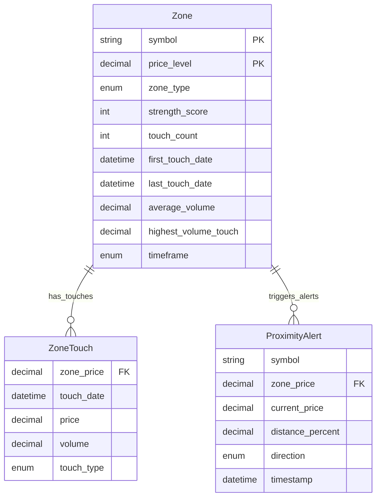

# Data Model: 023-support-resistance-mapping

## Entities

### Zone
**Purpose**: Represents a support or resistance price level identified from historical price action

**Fields**:
- `symbol`: str - Stock ticker (e.g., "AAPL")
- `price_level`: Decimal - Exact price of the zone
- `zone_type`: Enum[SUPPORT, RESISTANCE] - Classification
- `strength_score`: int - Touch count + volume bonus
- `touch_count`: int - Number of times price interacted with zone
- `first_touch_date`: datetime (UTC) - When zone was first established
- `last_touch_date`: datetime (UTC) - Most recent interaction
- `average_volume`: Decimal - Mean volume across all touches
- `highest_volume_touch`: Decimal - Peak volume at any touch
- `timeframe`: Enum[DAILY, FOUR_HOUR] - Analysis timeframe

**Relationships**:
- Has many: ZoneTouch (one per price interaction)
- Belongs to: Symbol (string, not persisted entity)

**Validation Rules**:
- `price_level`: Must be > 0 (from FR-002, FR-001)
- `touch_count`: Must be >= 3 for daily, >= 2 for 4-hour (from FR-001, US4)
- `strength_score`: Must be >= touch_count (from FR-004)
- `first_touch_date` <= `last_touch_date` (temporal consistency)
- All timestamps in UTC (from §Data_Integrity)

**State Transitions** (if applicable):
- Initial → Active (on creation with 3+ touches)
- Active → Invalidated (if price breaks through and doesn't return within 10 bars)
- Resistance → Support (on breakout flip per US5)

---

### ZoneTouch
**Purpose**: Records a single price interaction with a support/resistance zone

**Fields**:
- `zone_price`: Decimal - Zone level being touched
- `touch_date`: datetime (UTC) - When interaction occurred
- `price`: Decimal - Actual bar high/low that touched zone
- `volume`: Decimal - Volume during this bar
- `touch_type`: Enum[BOUNCE, REJECTION, BREAKOUT] - Nature of interaction

**Relationships**:
- Belongs to: Zone (via zone_price + symbol matching)

**Validation Rules**:
- `price`: Must be within 1.5% of zone_price (from FR-001, FR-002)
- `volume`: Must be > 0 (data integrity)
- `touch_date`: Must be in UTC (from §Data_Integrity)
- `touch_type`: BREAKOUT only if price closes >1% beyond zone (from US5)

---

### ProximityAlert
**Purpose**: Flags when current price is near a support/resistance zone

**Fields**:
- `symbol`: str - Stock ticker
- `zone_price`: Decimal - Price level of the zone
- `current_price`: Decimal - Live market price
- `distance_percent`: Decimal - Percentage gap (current → zone)
- `direction`: Enum[APPROACHING_SUPPORT, APPROACHING_RESISTANCE] - Price movement direction
- `timestamp`: datetime (UTC) - When alert generated

**Relationships**:
- References: Zone (via zone_price matching)

**Validation Rules**:
- `distance_percent`: Must be <= 2.0 (from FR-005)
- `distance_percent`: Must be > 0 (not touching yet)
- `direction`: APPROACHING_SUPPORT if current_price > zone_price (above support)
- `direction`: APPROACHING_RESISTANCE if current_price < zone_price (below resistance)
- `timestamp`: Must be in UTC (from §Data_Integrity)

---

## Database Schema (Mermaid)



**Note**: For MVP, no database persistence - zones calculated on-demand and logged to JSONL files. Entities exist as dataclasses in memory.

---

## API Schemas

**Request/Response Schemas**: N/A (no REST API for MVP - internal service only)

**State Shape** (in-memory):
```python
from dataclasses import dataclass
from datetime import datetime
from decimal import Decimal
from enum import Enum

class ZoneType(Enum):
    SUPPORT = "support"
    RESISTANCE = "resistance"

class Timeframe(Enum):
    DAILY = "daily"
    FOUR_HOUR = "4h"

@dataclass
class Zone:
    symbol: str
    price_level: Decimal
    zone_type: ZoneType
    strength_score: int
    touch_count: int
    first_touch_date: datetime
    last_touch_date: datetime
    average_volume: Decimal
    highest_volume_touch: Decimal
    timeframe: Timeframe

    def to_dict(self) -> dict:
        """Serialize for JSONL logging"""
        return {
            "symbol": self.symbol,
            "price_level": str(self.price_level),  # Decimal → string for JSON
            "zone_type": self.zone_type.value,
            "strength_score": self.strength_score,
            "touch_count": self.touch_count,
            "first_touch_date": self.first_touch_date.isoformat(),
            "last_touch_date": self.last_touch_date.isoformat(),
            "average_volume": str(self.average_volume),
            "highest_volume_touch": str(self.highest_volume_touch),
            "timeframe": self.timeframe.value
        }
```
