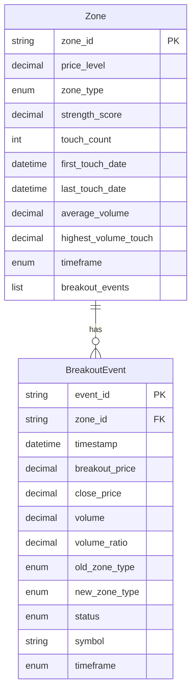

# Data Model: zone-breakout-detection

## Entities

### BreakoutEvent
**Purpose**: Records a single breakout or breakdown event when price breaches a zone with volume confirmation

**Fields**:
- `event_id`: str (UUID) - Unique identifier for this breakout event
- `zone_id`: str - Reference to the zone that was broken (format: "resistance_155.50_daily")
- `timestamp`: datetime (UTC) - When the breakout was detected
- `breakout_price`: Decimal - Price at which breakout occurred (must be > zone_price * 1.01 for resistance)
- `close_price`: Decimal - Closing price that confirmed the breakout
- `volume`: Decimal - Trading volume at breakout
- `volume_ratio`: Decimal - Ratio vs 20-bar average volume (must be > 1.3)
- `old_zone_type`: ZoneType - Zone type before flip (RESISTANCE or SUPPORT)
- `new_zone_type`: ZoneType - Zone type after flip (SUPPORT or RESISTANCE)
- `status`: BreakoutStatus - PENDING (within 5-bar window), CONFIRMED (sustained >5 bars), WHIPSAW (failed within 5 bars)
- `symbol`: str - Stock symbol (e.g., "AAPL")
- `timeframe`: Timeframe - DAILY or FOUR_HOUR

**Relationships**:
- Belongs to: Zone (via zone_id)
- Referenced by: Zone.breakout_events list (US4)

**Validation Rules** (from spec.md requirements):
- `breakout_price`: Must be > 0 (FR-010 Decimal precision)
- `volume_ratio`: Must be >= 1.3 for confirmation (FR-002)
- `timestamp`: Must be UTC (NFR-003, Constitution §Data_Integrity)
- `close_price`: For resistance breakout: close_price > zone_price * 1.01 (FR-001)
- `close_price`: For support breakdown: close_price < zone_price * 0.99 (US6)

**State Transitions**:
- Initial → PENDING (on breakout detection)
- PENDING → CONFIRMED (after 5 bars without reversal, US5)
- PENDING → WHIPSAW (if price returns below zone within 5 bars, US5)
- Note: CONFIRMED and WHIPSAW are terminal states (no further transitions)

**Serialization**:
- to_dict(): Returns dict with all fields (ISO 8601 timestamps, string Decimals)
- to_jsonl_line(): Returns single-line JSON string for logging (FR-006)

---

### Zone (Extended)
**Purpose**: Support/resistance price level - EXTENDED with breakout tracking

**New Fields** (extending existing Zone from src/trading_bot/support_resistance/models.py):
- `breakout_events`: list[BreakoutEvent] - Chronological history of all breakouts (US4)
- `breakout_count`: int (property) - Computed as len(breakout_events) (US4)
- `is_flipped`: bool (property) - True if zone has ever been flipped via breakout
- `last_flip_date`: datetime | None - Timestamp of most recent flip (for analysis)

**Existing Fields** (reused from parent feature):
- `price_level`: Decimal - Central price of the zone
- `zone_type`: ZoneType - SUPPORT or RESISTANCE
- `strength_score`: Decimal - Touch count + volume bonus **+ breakout bonus (+2 per US2)**
- `touch_count`: int - Number of times price touched zone
- `first_touch_date`: datetime (UTC)
- `last_touch_date`: datetime (UTC)
- `average_volume`: Decimal
- `highest_volume_touch`: Decimal
- `timeframe`: Timeframe - DAILY or FOUR_HOUR
- `zone_id`: str - Auto-generated (e.g., "resistance_155.50_daily")

**Relationships**:
- Has many: BreakoutEvent (one-to-many)
- Note: Zone immutability preserved - flip creates new Zone instance (Decision 3)

**Validation Rules**:
- All existing Zone validation rules apply (from src/trading_bot/support_resistance/models.py:70-92)
- `breakout_events`: Must be sorted chronologically (US4)
- `strength_score`: Increased by +2 for each volume-confirmed breakout (US2, FR-005)

---

### BreakoutStatus (Enum)
**Purpose**: Tracks validation state of breakout events

**Values**:
- `PENDING`: Breakout detected, within 5-bar validation window (US5)
- `CONFIRMED`: Breakout sustained for >5 bars without reversal (US5)
- `WHIPSAW`: Price returned below zone within 5 bars, breakout failed (US5)

**Usage**:
```python
from enum import Enum

class BreakoutStatus(Enum):
    PENDING = "pending"
    CONFIRMED = "confirmed"
    WHIPSAW = "whipsaw"
```

---

## Database Schema

**Note**: This feature does not require database persistence (local-only feature per project type: remote-direct). All data stored in JSONL logs for backtesting analysis.

**JSONL File Structure**:
- `logs/zones/breakouts-YYYY-MM-DD.jsonl`: One BreakoutEvent per line

**Schema Diagram** (Conceptual - In-Memory Only):



---

## API Schemas

**No REST API** (internal library only). Public interface via Python API:

### BreakoutDetector.detect_breakout()

**Input**:
```python
zone: Zone  # From ZoneDetector.detect_zones()
current_price: Decimal  # From MarketDataService.get_quote()
current_volume: Decimal  # From MarketDataService.get_quote()
historical_volumes: list[Decimal]  # From MarketDataService.get_historical_data()
```

**Output**:
```python
BreakoutSignal | None  # None if no breakout detected
```

**BreakoutSignal** (internal model):
```python
@dataclass
class BreakoutSignal:
    zone: Zone  # Original zone that was broken
    event: BreakoutEvent  # Breakout event details
    flipped_zone: Zone  # New zone with flipped type and updated strength
```

### BreakoutDetector.flip_zone()

**Input**:
```python
zone: Zone  # Original zone to flip
breakout_event: BreakoutEvent  # Triggering breakout event
```

**Output**:
```python
Zone  # New Zone instance with:
      # - zone_type flipped (RESISTANCE → SUPPORT or vice versa)
      # - strength_score += 2 (breakout bonus per US2)
      # - breakout_events list appended with new event
      # - All other metadata preserved
```

---

## State Shape (In-Memory)

**BreakoutDetector State** (stateless service):
```python
class BreakoutDetector:
    config: BreakoutConfig  # Immutable configuration
    market_data: MarketDataService  # Dependency-injected
    logger: ZoneLogger  # Dependency-injected
    # No mutable state - pure functions
```

**Configuration State**:
```python
@dataclass(frozen=True)
class BreakoutConfig:
    price_threshold_pct: Decimal = Decimal("1.0")  # FR-001: >1% required
    volume_threshold: Decimal = Decimal("1.3")  # FR-002: >1.3x average
    validation_bars: int = 5  # US5: 5-bar whipsaw window
    strength_bonus: Decimal = Decimal("2.0")  # US2: +2 on breakout
```

---

## Measurement Queries

**Query breakout success rate** (HEART metric: >60% target):
```bash
# Count confirmed vs whipsaw breakouts
grep '"status":"confirmed"' logs/zones/breakouts-*.jsonl | wc -l  # Numerator
grep '"status":"whipsaw"' logs/zones/breakouts-*.jsonl | wc -l   # Denominator (failures)

# Calculate success rate
python -c "
import json
import glob

confirmed = sum(1 for line in open(f, 'r') for f in glob.glob('logs/zones/breakouts-*.jsonl')
                if json.loads(line).get('status') == 'confirmed')
whipsaw = sum(1 for line in open(f, 'r') for f in glob.glob('logs/zones/breakouts-*.jsonl')
              if json.loads(line).get('status') == 'whipsaw')
total = confirmed + whipsaw
print(f'Success Rate: {confirmed/total*100:.1f}% ({confirmed}/{total})')
"
```

**Query zone flip accuracy** (HEART metric: >85% target):
```bash
# Manual validation: Compare 20 random flips against chart analysis
jq -s '.[] | select(.event=="breakout_detected") | .zone_id' logs/zones/breakouts-*.jsonl | \
    shuf | head -20 | \
    xargs -I {} echo "Review zone {} on TradingView"
```

**Query integration rate** (HEART metric: >20% of zone-based entries use flipped zones):
```bash
# Requires integration with trade logging (future enhancement)
# Count trades with zone_context.flipped_zone = true
grep '"zone_context":.*"flipped_zone":true' logs/trades/*.jsonl | wc -l
```
