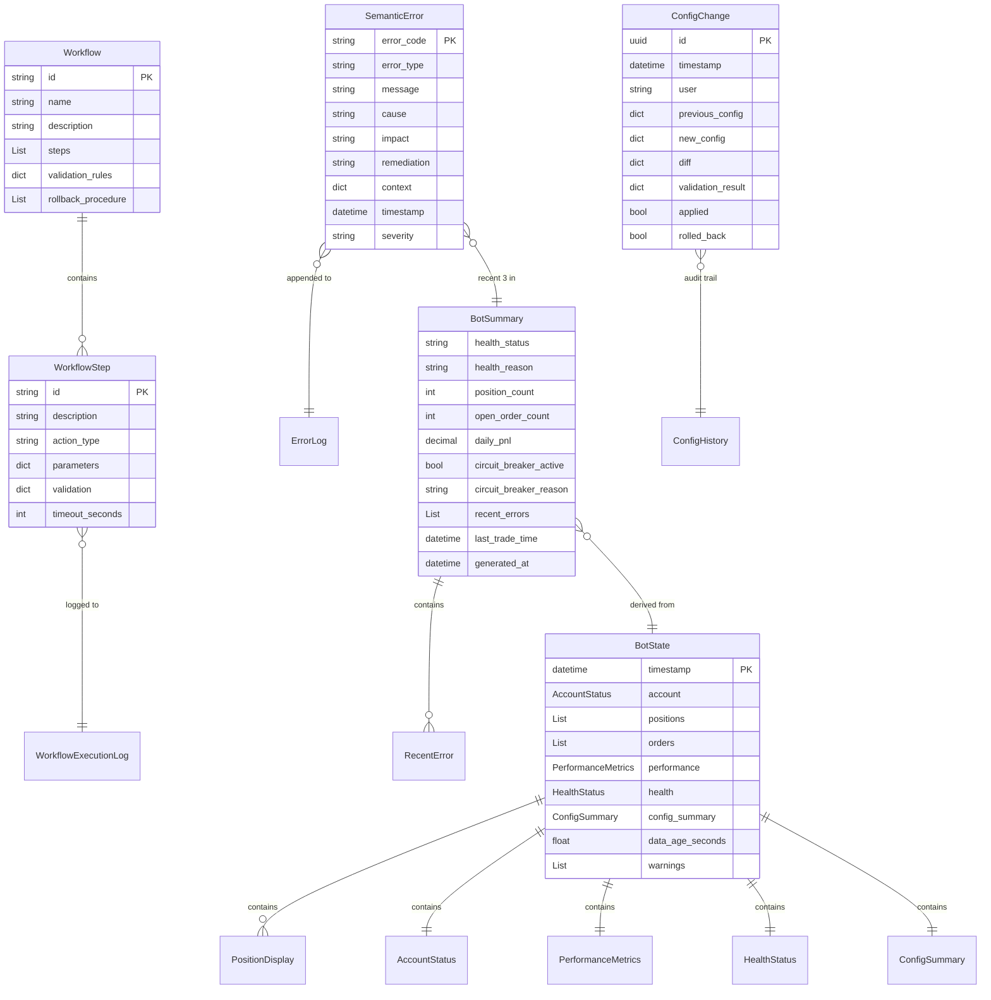

# Data Model: llm-friendly-bot-operations

## Entities

### BotState
**Purpose**: Complete bot operational state for comprehensive LLM analysis

**Fields**:
- `account`: AccountStatus - Current account snapshot (buying power, balance, day trades)
- `positions`: List[PositionDisplay] - All open positions with live P&L
- `orders`: List[OrderInfo] - Pending and recent orders
- `performance`: PerformanceMetrics - Trading performance aggregates
- `health`: HealthStatus - Bot health indicators
- `config_summary`: ConfigSummary - Active configuration highlights
- `timestamp`: datetime - State snapshot time (UTC)
- `data_age_seconds`: float - Staleness indicator
- `warnings`: List[str] - Operator warnings

**Relationships**:
- Contains: AccountStatus, PositionDisplay, OrderInfo, PerformanceMetrics, HealthStatus, ConfigSummary
- Source: Aggregates from dashboard, performance tracker, health monitor

**Validation Rules**:
- `timestamp`: Must be UTC timezone (from FR-002)
- `data_age_seconds`: <60 for fresh data, warnings if >300 (from NFR-002)
- `positions`: Each must have valid symbol, non-zero quantity
- `warnings`: Auto-populated based on circuit breaker, day trade limits, stale data

**State Transitions**: N/A (snapshot, not stateful entity)

---

### BotSummary
**Purpose**: Compressed state for LLM context window optimization (<10KB/<2500 tokens)

**Fields**:
- `health_status`: Literal["healthy", "degraded", "offline"] - Bot operational status
- `health_reason`: str | None - Human-readable health explanation
- `position_count`: int - Number of open positions
- `open_order_count`: int - Number of pending orders
- `daily_pnl`: Decimal - Today's realized + unrealized P&L
- `circuit_breaker_active`: bool - Circuit breaker trip status
- `circuit_breaker_reason`: str | None - Why circuit breaker tripped
- `recent_errors`: List[RecentError] - Last 3 errors with semantic context (max)
- `last_trade_time`: datetime | None - Most recent trade execution
- `generated_at`: datetime - Summary generation time

**Relationships**:
- Derived from: BotState (compressed representation)
- Contains: RecentError (max 3 items)

**Validation Rules**:
- `recent_errors`: Max 3 items to stay under 10KB budget (from FR-030)
- Serialized JSON: Must be <10,240 bytes (from FR-029)
- `health_status`: Must match health monitor actual status
- `daily_pnl`: Calculated from trade logs, not cached

**State Transitions**: N/A (snapshot)

---

### SemanticError
**Purpose**: LLM-consumable error representation with actionable context

**Fields**:
- `error_code`: str - Machine-readable code (e.g., "BOT_001", "API_429", "CFG_INVALID")
- `error_type`: str - Category (e.g., "TradingError", "ValidationError", "NetworkError")
- `message`: str - Human-readable error description
- `cause`: str - Root cause explanation
- `impact`: str - What consequences this error has
- `remediation`: str - Specific steps to resolve
- `context`: dict - Relevant identifiers (trade_id, symbol, order_id, etc.)
- `timestamp`: datetime - Error occurrence time (UTC)
- `severity`: Literal["low", "medium", "high", "critical"] - Impact level

**Relationships**:
- Logged to: error_log.jsonl (JSONL file persistence)
- Returned in: HTTP error responses (API errors)
- Referenced in: BotSummary.recent_errors (last 3 only)

**Validation Rules**:
- `error_code`: Must follow format {CATEGORY}_{NUMBER} (from FR-018)
- `remediation`: Must contain actionable steps, not generic "contact support" (from FR-006, FR-019)
- `context`: Must include relevant IDs for correlation (from FR-005)
- `timestamp`: UTC only (from NFR-007)

**State Transitions**: N/A (immutable log entry)

---

### Workflow
**Purpose**: Automated maintenance task definition

**Fields**:
- `id`: str - Workflow identifier (e.g., "restart-bot", "update-targets")
- `name`: str - Human-readable workflow name
- `description`: str - What this workflow does
- `steps`: List[WorkflowStep] - Sequential execution steps
- `validation_rules`: dict - Pre-execution validation (e.g., bot must be stopped)
- `rollback_procedure`: List[str] - Steps to undo workflow if failure

**Relationships**:
- Contains: WorkflowStep (ordered list)
- Defined in: config/workflows/*.yaml (YAML file source)

**Validation Rules**:
- `id`: Must be kebab-case, unique across workflows (from FR-020)
- `steps`: Must have at least 1 step, max 20 steps (MVP linear workflows)
- `validation_rules`: Checked before execution starts
- Loaded from: YAML schema validation (from FR-028)

**State Transitions**:
- NOT_STARTED → IN_PROGRESS (on POST /api/v1/workflows/{id}/execute)
- IN_PROGRESS → COMPLETED (all steps succeed)
- IN_PROGRESS → FAILED (any step fails, triggers rollback)

---

### WorkflowStep
**Purpose**: Single action in workflow execution

**Fields**:
- `id`: str - Step identifier within workflow (e.g., "stop-bot", "backup-config")
- `description`: str - What this step does
- `action_type`: Literal["command", "api_call", "validation", "wait"] - Step category
- `parameters`: dict - Step-specific parameters (e.g., command to run, API endpoint)
- `validation`: dict - Success criteria for this step
- `timeout_seconds`: int - Max execution time

**Relationships**:
- Part of: Workflow (parent workflow)
- Execution logged to: workflow_execution_log.jsonl

**Validation Rules**:
- `timeout_seconds`: Default 300s, max 1800s (from NFR-001 performance bounds)
- `validation`: Must define success criteria (exit code, response code, etc.)
- `action_type`: Validated against allowed types (from FR-020, FR-022)

**State Transitions**:
- PENDING → RUNNING → SUCCEEDED
- PENDING → RUNNING → FAILED (triggers workflow rollback)
- RUNNING → TIMEOUT (if exceeds timeout_seconds)

---

### ConfigChange
**Purpose**: Track configuration changes for audit and rollback

**Fields**:
- `id`: UUID - Change record identifier
- `timestamp`: datetime - When change was applied
- `user`: str - Who made the change (API token identifier)
- `previous_config`: dict - Configuration before change
- `new_config`: dict - Configuration after change
- `diff`: dict - Field-level changes (for /api/v1/config/diff)
- `validation_result`: dict - Schema validation output
- `applied`: bool - Whether change was actually applied
- `rolled_back`: bool - Whether change was later reverted

**Relationships**:
- Persisted to: config/config_history.jsonl (audit trail)
- Referenced by: Rollback API (GET /api/v1/config/history)

**Validation Rules**:
- `new_config`: Must pass JSON schema validation (from FR-028)
- `diff`: Must show only changed fields (from FR-026)
- `validation_result`: Must be success before `applied=true`
- All changes logged: Audit trail per Constitution v1.0.0 §Audit_Everything

**State Transitions**: N/A (immutable audit record)

---

## Database Schema (Mermaid)



---

## API Schemas

**Request/Response Schemas**: See contracts/api.yaml

**State Shape** (API responses):

```python
# BotState response (detailed endpoint)
{
  "account": {
    "buying_power": "50000.00",
    "account_balance": "52345.67",
    "cash_balance": "1234.56",
    "day_trade_count": 2,
    "last_updated": "2025-10-24T14:32:00Z"
  },
  "positions": [
    {
      "symbol": "AAPL",
      "quantity": 100,
      "entry_price": "150.25",
      "current_price": "152.30",
      "unrealized_pl": "205.00",
      "unrealized_pl_pct": "1.36",
      "last_updated": "2025-10-24T14:31:55Z"
    }
  ],
  "orders": [],
  "performance": {
    "win_rate": 0.65,
    "avg_risk_reward": 1.8,
    "total_realized_pl": "1234.56",
    "total_unrealized_pl": "205.00",
    "total_pl": "1439.56",
    "current_streak": 3,
    "streak_type": "WIN",
    "trades_today": 5,
    "session_count": 2,
    "max_drawdown": "-145.32"
  },
  "health": {
    "status": "healthy",
    "circuit_breaker_active": false,
    "last_heartbeat": "2025-10-24T14:31:58Z"
  },
  "config_summary": {
    "mode": "LIVE",
    "max_position_size_pct": 5.0,
    "daily_loss_limit": "-500.00"
  },
  "timestamp": "2025-10-24T14:32:00Z",
  "data_age_seconds": 2.1,
  "warnings": []
}

# BotSummary response (compressed endpoint <10KB)
{
  "health_status": "healthy",
  "health_reason": null,
  "position_count": 1,
  "open_order_count": 0,
  "daily_pnl": "345.67",
  "circuit_breaker_active": false,
  "circuit_breaker_reason": null,
  "recent_errors": [
    {
      "error_code": "API_429",
      "message": "Rate limit exceeded",
      "cause": "Too many API calls in 1-minute window",
      "impact": "Data refresh delayed by 60 seconds",
      "remediation": "Reduce refresh rate or implement request batching",
      "timestamp": "2025-10-24T14:28:15Z"
    }
  ],
  "last_trade_time": "2025-10-24T13:45:32Z",
  "generated_at": "2025-10-24T14:32:00Z"
}

# SemanticError response (API errors)
{
  "error_code": "CFG_001",
  "error_type": "ValidationError",
  "message": "Invalid configuration: max_position_size_pct must be between 1 and 10",
  "cause": "Attempted to set max_position_size_pct to 25",
  "impact": "Configuration change rejected, using previous value (5.0)",
  "remediation": "Set max_position_size_pct to value between 1 and 10",
  "context": {
    "field": "max_position_size_pct",
    "attempted_value": 25,
    "valid_range": "1-10",
    "current_value": 5.0
  },
  "timestamp": "2025-10-24T14:32:00Z",
  "severity": "medium"
}
```
