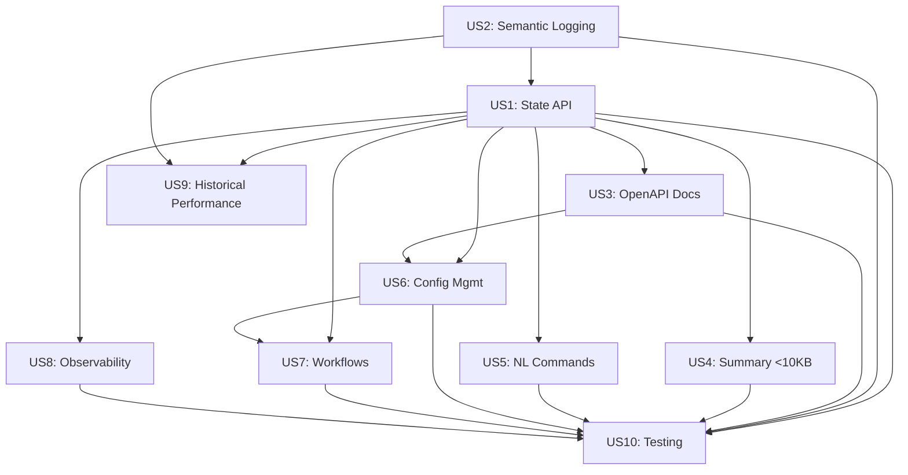

# Implementation Plan: LLM-Friendly Bot Operations and Monitoring

## [RESEARCH DECISIONS]

See: research.md for full research findings

**Summary**:
- Stack: FastAPI + Pydantic + WebSocket (existing api/ pattern)
- Reuse: Dashboard models, structured logging, performance tracking, error handling
- New: API routes, state aggregator, workflow executor, semantic error formatter
- Components to reuse: 9
- New components needed: 11

---

## [ARCHITECTURE DECISIONS]

**Stack**:
- Backend: FastAPI 0.104+ (existing api/app/ pattern)
- API Server: Uvicorn ASGI server (separate process from bot)
- Schemas: Pydantic v2 for request/response validation
- Real-time: WebSocket for streaming updates
- Documentation: Auto-generated OpenAPI 3.0 spec
- Workflows: YAML-based definitions with Python executor
- State Management: In-memory caching with 60s TTL, fallback to stale data
- Logging: Extend existing JSONL structured logger with semantic fields
- Authentication: API key via X-API-Key header (token-based)

**Patterns**:
- **Repository Pattern**: Reuse existing pattern from api/app/repositories/ for data access abstraction
- **Service Layer**: Business logic in api/app/services/ (state aggregator, workflow executor, config validator)
- **Dependency Injection**: FastAPI Depends() for database sessions, auth, services
- **Error Handling**: Global exception handler converts all errors to SemanticError format
- **Caching**: State aggregation cached for 60s to reduce bot query load
- **Event-Driven**: WebSocket broadcasts updates to connected clients every 5s

**Dependencies** (new packages required):
- `fastapi==0.104.1`: REST API framework (may already be in uv.lock)
- `uvicorn[standard]==0.24.0`: ASGI server with WebSocket support
- `pydantic==2.5.0`: Data validation (v2 for performance)
- `websockets==12.0`: WebSocket protocol support
- `pyyaml==6.0.1`: Already installed (workflow YAML parsing)
- `jsonschema==4.20.0`: JSON schema validation for config

---

## [STRUCTURE]

**Directory Layout** (follows existing api/app/ pattern):

```
api/
├── app/
│   ├── main.py                        # [MODIFY] Add LLM routes to existing FastAPI app
│   ├── core/
│   │   ├── auth.py                    # [MODIFY] Extend with API key validation
│   │   ├── database.py                # [REUSE] Existing DB session management
│   │   ├── events.py                  # [REUSE] Existing event bus
│   │   └── websocket.py               # [NEW] WebSocket connection manager
│   ├── routes/
│   │   ├── orders.py                  # [REUSE] Existing order endpoints
│   │   ├── state.py                   # [NEW] GET /api/v1/state, /summary
│   │   ├── metrics.py                 # [NEW] GET /api/v1/metrics, WebSocket /stream
│   │   ├── config.py                  # [NEW] Configuration management endpoints
│   │   └── workflows.py               # [NEW] Workflow execution endpoints
│   ├── schemas/
│   │   ├── order.py                   # [REUSE] Existing order schemas
│   │   ├── state.py                   # [NEW] BotState, BotSummary, HealthStatus
│   │   ├── errors.py                  # [NEW] SemanticError schema
│   │   ├── config.py                  # [NEW] Config validation schemas
│   │   └── workflows.py               # [NEW] Workflow execution schemas
│   ├── services/
│   │   ├── order_executor.py          # [REUSE] Existing
│   │   ├── state_aggregator.py        # [NEW] Combine dashboard + performance + health
│   │   ├── workflow_executor.py       # [NEW] YAML workflow parser and runner
│   │   └── config_validator.py        # [NEW] JSON schema validation
│   ├── middleware/
│   │   └── semantic_error_handler.py  # [NEW] Global exception → SemanticError converter
│   └── models/
│       ├── order.py                   # [REUSE] Existing
│       └── workflow.py                # [NEW] Workflow execution state (if DB persistence needed)
│
src/trading_bot/
├── logging/
│   ├── structured_logger.py          # [MODIFY] Add semantic_fields parameter
│   ├── semantic_error.py             # [NEW] SemanticError dataclass
│   └── error_formatter.py            # [NEW] Format exceptions → semantic JSONL
├── dashboard/
│   ├── models.py                      # [REUSE] DashboardSnapshot, AccountStatus, etc.
│   └── data_provider.py              # [REUSE] Data collection from bot
└── error_handling/
    └── exceptions.py                  # [MODIFY] Add semantic context to exception classes

config/
└── workflows/                         # [NEW] YAML workflow definitions
    ├── restart-bot.yaml
    ├── update-targets.yaml
    ├── export-logs.yaml
    └── check-health.yaml
```

**Module Organization**:
- **api/app/routes/state.py**: Endpoints for querying bot state (full and summary)
- **api/app/routes/metrics.py**: Observability endpoints (metrics snapshot, WebSocket stream)
- **api/app/routes/config.py**: Configuration CRUD with validation and rollback
- **api/app/routes/workflows.py**: Workflow execution and status tracking
- **api/app/services/state_aggregator.py**: Aggregates data from dashboard, performance, health modules
- **api/app/services/workflow_executor.py**: Parses YAML workflows and executes steps
- **api/app/services/config_validator.py**: Validates config against JSON schema
- **api/app/core/websocket.py**: Manages WebSocket connections and broadcasts
- **api/app/middleware/semantic_error_handler.py**: Catches all exceptions and formats as SemanticError
- **src/trading_bot/logging/semantic_error.py**: Dataclass for semantic error structure
- **src/trading_bot/logging/error_formatter.py**: Formats Python exceptions into semantic JSONL

---

## [DATA MODEL]

See: data-model.md for complete entity definitions

**Summary**:
- Entities: 6 (BotState, BotSummary, SemanticError, Workflow, WorkflowStep, ConfigChange)
- Relationships: BotState aggregates dashboard data; BotSummary compresses for context optimization
- Migrations required: No (file-based storage for workflows and config history)

**Key Entities**:
- **BotState**: Complete bot operational state (account, positions, orders, performance, health, config)
- **BotSummary**: Compressed state <10KB for LLM context windows
- **SemanticError**: LLM-consumable error with cause, impact, remediation fields
- **Workflow**: YAML-based maintenance task definition
- **ConfigChange**: Audit trail for configuration changes

---

## [PERFORMANCE TARGETS]

**From spec.md NFRs**:
- NFR-001: API response time <100ms P95 latency (10 concurrent requests)
- FR-029: Summary endpoint response <10KB (<2500 tokens)
- FR-031: Cache-Control headers for efficient caching (60s TTL)

**Lighthouse Targets**: N/A (API-only, no UI)

**API Performance Budgets**:
- GET /api/v1/state: <200ms P95 (aggregates multiple data sources)
- GET /api/v1/summary: <100ms P95 (optimized query)
- GET /api/v1/metrics: <50ms P95 (snapshot only)
- WebSocket /api/v1/stream: <10ms push latency, 5s broadcast interval
- POST /api/v1/workflows/{id}/execute: <5s total (depends on workflow steps)

**Optimization Strategies**:
- State caching: 60s TTL to reduce bot query frequency
- Summary endpoint: Selective field inclusion, max 3 recent errors
- WebSocket: Broadcast to all clients from single state query
- Async handlers: All FastAPI routes use async def for concurrency

---

## [SECURITY]

**Authentication Strategy**:
- API key authentication via X-API-Key header
- Token validation in api/app/core/auth.py middleware
- Invalid/missing token → 401 with SemanticError response

**Authorization Model**:
- Single-operator model: No RBAC needed in MVP
- All authenticated requests have full access
- Future: Add role-based permissions if multi-user

**Input Validation**:
- Request schemas: Pydantic models with field validators
- Config validation: JSON schema validation before applying changes
- Workflow parameters: Validated against YAML schema
- Rate limiting: Basic protection (100 req/min per token)
- CORS: Configurable allowed origins via BOT_API_CORS_ORIGINS env var

**Data Protection**:
- PII handling: No PII in logs beyond trade symbols
- API token: Stored in environment variable BOT_API_AUTH_TOKEN
- Config changes: Audit trail in config/config_history.jsonl
- Error context: Scrub sensitive data from error responses

**Security Risks & Mitigations**:
- Risk: API token exposure → Mitigation: Document secure token storage, rotate tokens regularly
- Risk: Workflow command injection → Mitigation: Whitelist allowed workflow IDs, validate parameters
- Risk: Config tampering → Mitigation: Schema validation, rollback capability, audit log

---

## [EXISTING INFRASTRUCTURE - REUSE] (9 components)

**Data Models**:
- src/trading_bot/dashboard/models.py - DashboardSnapshot, AccountStatus, PositionDisplay, PerformanceMetrics (complete state aggregation)
- src/trading_bot/performance/models.py - PerformanceSummary, AlertEvent (performance tracking)

**Services/Modules**:
- src/trading_bot/dashboard/data_provider.py - Collect account, positions, performance data from bot
- src/trading_bot/dashboard/metrics_calculator.py - Calculate win rate, avg R:R, streak, drawdown
- src/trading_bot/performance/tracker.py - Track and aggregate performance metrics
- src/trading_bot/logging/structured_logger.py - Thread-safe JSONL logging with daily rotation
- src/trading_bot/logging/trade_record.py - TradeRecord model for trade logging
- src/trading_bot/error_handling/exceptions.py - RetriableError, NonRetriableError, CircuitBreakerTripped hierarchy

**API Infrastructure**:
- api/app/main.py - FastAPI application setup (CORS, health endpoints, error handlers)
- api/app/core/auth.py - JWT authentication pattern (adapt for API key)
- api/app/core/database.py - Database session management
- api/app/core/events.py - Event bus for publishing updates
- api/app/routes/orders.py - REST endpoint pattern (request/response schemas, error handling)
- api/app/schemas/order.py - Pydantic schema pattern (validation, examples)

---

## [NEW INFRASTRUCTURE - CREATE] (11 components)

**Backend Routes**:
- api/app/routes/state.py - State API endpoints (GET /api/v1/state returns BotState, GET /api/v1/summary returns BotSummary <10KB)
- api/app/routes/metrics.py - Observability endpoints (GET /api/v1/metrics snapshot, WebSocket /api/v1/stream for 5s push updates)
- api/app/routes/config.py - Configuration management (GET current, POST validate, GET diff, PUT apply, PUT rollback)
- api/app/routes/workflows.py - Workflow endpoints (GET list, POST /{id}/execute, GET /{id}/status)

**Backend Services**:
- api/app/services/state_aggregator.py - Aggregates dashboard.DashboardSnapshot + performance.PerformanceSummary + health status → BotState
- api/app/services/workflow_executor.py - Parses YAML workflows, executes steps sequentially, validates success criteria, handles rollback
- api/app/services/config_validator.py - Validates config against config.schema.json, generates diff, applies changes with audit trail

**Backend Schemas**:
- api/app/schemas/state.py - BotStateResponse, BotSummaryResponse, HealthStatus, ConfigSummary (Pydantic models for API responses)
- api/app/schemas/errors.py - SemanticErrorResponse with error_code, cause, impact, remediation fields
- api/app/schemas/config.py - BotConfigRequest, ValidationResult, ConfigDiff, ConfigChangeResult
- api/app/schemas/workflows.py - WorkflowListResponse, WorkflowExecutionRequest, WorkflowStatusResponse

**Backend Core**:
- api/app/core/websocket.py - WebSocket connection manager (ConnectionManager class with connect/disconnect/broadcast methods)
- api/app/middleware/semantic_error_handler.py - Global FastAPI exception handler that converts all exceptions → SemanticErrorResponse

**Bot Extensions**:
- src/trading_bot/logging/semantic_error.py - SemanticError dataclass with error_code, cause, impact, remediation, context fields
- src/trading_bot/logging/error_formatter.py - Utility to format Python exceptions → semantic JSONL format

**Configuration**:
- config/workflows/*.yaml - YAML workflow definitions (restart-bot, update-targets, export-logs, check-health)
- config/config.schema.json - JSON schema for bot configuration validation

**Documentation**:
- No new documentation needed - OpenAPI spec auto-generated from FastAPI routes

---

## [CI/CD IMPACT]

**From spec.md deployment considerations:**
- Platform: Separate API service process (not embedded in bot)
- Deployment model: API service runs alongside bot (both must be running)
- Breaking changes: No (additive feature only)
- Migration: No database migrations (file-based storage)

**Build Commands**:
- No changes to existing build (API service uses existing api/ codebase)

**Environment Variables** (update .env.example and deployment configs):
- **New required**:
  - `BOT_API_PORT` (default: 8000) - Port for LLM API service
  - `BOT_API_AUTH_TOKEN` (required) - Authentication token for API access
- **New optional**:
  - `BOT_API_CORS_ORIGINS` (default: "*") - Comma-separated allowed CORS origins
  - `BOT_STATE_CACHE_TTL` (default: 60) - State cache TTL in seconds

**Startup Process**:
1. Start bot process (existing: `python -m src.trading_bot.main`)
2. Start API service (new: `uvicorn api.app.main:app --host 0.0.0.0 --port 8000`)
3. Verify both services healthy via health check endpoints

**Database Migrations**:
- No migrations required (file-based storage for workflows and config history)

**Smoke Tests**:
- Route: GET /api/v1/health/healthz
- Expected: 200, {"status": "healthy", "timestamp": "..."}
- Route: GET /api/v1/summary (with valid X-API-Key header)
- Expected: 200, JSON response <10KB

**Platform Coupling**:
- No platform-specific dependencies
- Runs on any system supporting Python 3.11+ and FastAPI
- WebSocket support: Requires uvicorn[standard] with websockets package

---

## [DEPLOYMENT ACCEPTANCE]

**Production Invariants**:
- API service must not affect bot trading performance (separate process isolation verified)
- Bot continues trading if API service crashes (independence verified)
- API token must be different in staging vs production (env var separation enforced)
- State cache must not serve data older than 5 minutes without staleness warning

**Staging Smoke Tests** (Given/When/Then):
```gherkin
Given bot is running and API service is started
When operator queries GET /api/v1/summary with valid API key
Then response is 200 OK
  And response JSON is <10KB
  And health_status is one of [healthy, degraded, offline]
  And daily_pnl is present and numeric
  And response time is <100ms

Given bot has open positions
When operator queries GET /api/v1/state with valid API key
Then response includes positions array
  And each position has symbol, quantity, unrealized_pl
  And account section shows current buying_power
  And response time is <200ms

Given operator provides invalid API key
When operator queries any endpoint without X-API-Key header
Then response is 401 Unauthorized
  And response body is SemanticError format
  And error_code is "AUTH_001"
  And remediation field provides actionable fix

Given bot is not running
When operator queries GET /api/v1/summary
Then response is 200 OK (cached state)
  And health_status is "offline"
  And data_age_seconds indicates staleness
  And warnings array includes "Bot offline" message

Given operator executes workflow restart-bot
When POST /api/v1/workflows/restart-bot/execute
Then response is 202 Accepted
  And workflow execution status is trackable via GET /api/v1/workflows/restart-bot/status
  And each step completion is logged
```

**Rollback Plan**:
- Stop API service: Kill uvicorn process (bot continues trading unaffected)
- Revert code: Git checkout previous commit
- Config rollback: Use PUT /api/v1/config/rollback endpoint
- No data migration needed: YAML workflows and JSONL logs are backward compatible
- Special considerations: None (API is additive, no breaking changes to bot core)

**Artifact Strategy**:
- API service: Runs from same codebase as bot (api/app/)
- No separate build artifacts needed
- Deployment: Install dependencies via `pip install -r requirements.txt` or `uv sync`
- FastAPI dependencies: Add fastapi, uvicorn, websockets to requirements.txt

---

## [INTEGRATION SCENARIOS]

See: quickstart.md for complete integration scenarios

**Summary**:
- Initial setup: Install dependencies, configure API token, start API service
- Validation workflow: Test endpoints, validate response schemas, check performance
- Manual testing steps: Query state, execute workflow, test error handling
- LLM integration: Examples of curl commands and expected responses

---

## [IMPLEMENTATION SEQUENCE]

**Phase 1: Core State API (US1, US2, US3, US4 - MVP)**
1. Extend structured logger with semantic error fields
2. Create semantic error schema and formatter
3. Implement state aggregator service (reuse dashboard models)
4. Create state API routes (GET /state, GET /summary)
5. Add OpenAPI documentation
6. Implement global semantic error handler middleware
7. Add API key authentication
8. Unit tests for state aggregation and error formatting

**Phase 2: Configuration Management (US6)**
1. Create config validator service with JSON schema
2. Implement config API routes (GET/POST validate, GET diff, PUT apply/rollback)
3. Add config change audit logging
4. Integration tests for config validation and rollback

**Phase 3: Observability & Streaming (US8)**
1. Implement WebSocket connection manager
2. Create metrics API route (GET /metrics, WebSocket /stream)
3. Add 5-second broadcast loop for WebSocket updates
4. Test WebSocket connection handling and reconnection

**Phase 4: Workflows (US7)**
1. Define YAML workflow schemas
2. Implement workflow executor service
3. Create workflow API routes (GET list, POST execute, GET status)
4. Add workflow execution logging
5. Create example workflows (restart-bot, update-targets, export-logs, check-health)
6. Integration tests for workflow execution and rollback

**Phase 5: Testing & Optimization (US10)**
1. Performance benchmarking (<100ms P95)
2. Summary endpoint size validation (<10KB)
3. Smoke tests for all endpoints
4. Load testing (10 concurrent requests)
5. WebSocket stress testing

**Phase 6: Natural Language CLI (US5 - Enhancement)**
1. Intent extraction from natural language queries
2. CLI command routing to API endpoints
3. Response formatting for human readability
4. Ambiguity detection and clarification prompts

---

## [DEPENDENCIES GRAPH]



**Critical Path**: US2 (Semantic Logging) → US1 (State API) → US3 (OpenAPI) → US4 (Summary) → US6/US7/US8 (Enhancements)

---

## [RISKS & MITIGATIONS]

**Risk 1**: API service crashes and takes down bot
- **Likelihood**: Low
- **Impact**: Critical
- **Mitigation**: Run API as separate process, bot continues if API fails, add process monitoring

**Risk 2**: State aggregation query load impacts trading performance
- **Likelihood**: Medium
- **Impact**: High
- **Mitigation**: 60s cache TTL, async queries, monitor bot latency metrics

**Risk 3**: WebSocket connections accumulate and leak memory
- **Likelihood**: Medium
- **Impact**: Medium
- **Mitigation**: Connection timeout, max connection limit, heartbeat disconnection

**Risk 4**: Workflow execution fails mid-process without rollback
- **Likelihood**: Medium
- **Impact**: Medium
- **Mitigation**: Rollback procedure in YAML, step validation before execution, audit logging

**Risk 5**: Summary endpoint exceeds 10KB due to error verbosity
- **Likelihood**: Low
- **Impact**: Low
- **Mitigation**: Hard limit to 3 recent errors, truncate error messages if needed, unit test for size

**Risk 6**: API token leaked in logs or error messages
- **Likelihood**: Low
- **Impact**: High
- **Mitigation**: Scrub tokens from error context, use environment variables only, document secure practices

---

## [ACCEPTANCE CRITERIA]

**Must Have (MVP - US1-US4)**:
- ✅ GET /api/v1/state returns complete bot state with all required fields (FR-001)
- ✅ GET /api/v1/summary returns <10KB JSON (<2500 tokens) (FR-002, FR-029)
- ✅ All errors logged in JSONL with semantic fields (FR-004, FR-005, FR-006)
- ✅ OpenAPI spec served at /api/docs with all endpoints documented (FR-011, FR-012, FR-013)
- ✅ API key authentication required for all endpoints (NFR-003)
- ✅ API responses <100ms P95 latency (NFR-001)

**Should Have (Enhancement - US5-US8)**:
- ✅ Natural language command processing with intent extraction (FR-007, FR-008, FR-009, FR-010)
- ✅ Configuration management with validation and rollback (FR-024, FR-025, FR-026, FR-027, FR-028)
- ✅ Workflow execution with progress tracking (FR-020, FR-021, FR-022, FR-023)
- ✅ WebSocket streaming with 5s push interval (FR-015)

**Nice to Have (Future - US9-US10)**:
- ⏭️  Historical performance query API (US9)
- ⏭️  Automated testing validation with 80%+ coverage (US10)

---

## [SUCCESS METRICS]

**Operational Efficiency**:
- Error diagnosis time: <5 minutes (from 15 minutes baseline) - 67% improvement
- LLM task coverage: 90% of common maintenance tasks (from 30% baseline) - 200% improvement
- API response time: <100ms P95 (NFR-001)
- Context window usage: <2500 tokens per query (FR-029)

**Reliability**:
- API uptime: >99.9% (independent of bot uptime)
- State cache hit rate: >80% (reduces bot query load)
- WebSocket connection stability: >95% (clients stay connected)

**Usability**:
- API documentation completeness: 100% endpoints documented (FR-011)
- Configuration change safety: 0 breaking changes from invalid configs (FR-028)
- Workflow success rate: >95% (FR-022)

---

## [OPEN QUESTIONS]

None - all technical questions resolved during research phase. See research.md for decisions.
