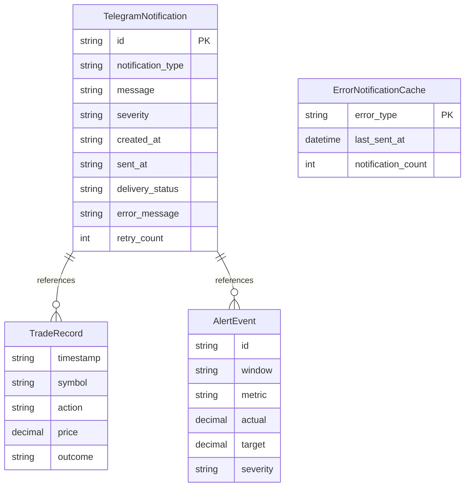

# Data Model: telegram-notificatio

## Entities

### TelegramNotification
**Purpose**: Represents a notification to be sent via Telegram with delivery tracking

**Fields**:
- `id`: str (UUID) - Unique notification identifier
- `notification_type`: str - Type of notification ("position_entry" | "position_exit" | "risk_alert" | "system_error" | "performance_summary")
- `message`: str - Formatted Telegram message (Markdown or HTML)
- `severity`: str - Urgency level ("INFO" | "WARN" | "CRITICAL")
- `created_at`: str - ISO 8601 UTC timestamp when notification created
- `sent_at`: str | None - ISO 8601 UTC timestamp when sent to Telegram (None if pending/failed)
- `delivery_status`: str - Status ("pending" | "sent" | "failed" | "rate_limited")
- `error_message`: str | None - Error details if delivery failed
- `retry_count`: int - Number of send attempts (default: 0)

**Relationships**:
- References: TradeRecord (via trade_id for position notifications)
- References: AlertEvent (via alert_id for risk alert notifications)

**Validation Rules**:
- `notification_type`: Must be one of 5 valid types (from FR-003, FR-004, FR-005)
- `message`: Max 4096 characters (Telegram API limit from FR-010)
- `severity`: Must match ["INFO", "WARN", "CRITICAL"]
- `delivery_status`: Must match ["pending", "sent", "failed", "rate_limited"]
- `retry_count`: Max 3 retries (exponential backoff pattern)

**State Transitions**:
- Initial → pending (on creation)
- pending → sent (on successful delivery)
- pending → failed (on max retries exceeded)
- pending → rate_limited (on rate limit breach for error notifications)

---

### ErrorNotificationCache
**Purpose**: In-memory cache for error notification rate limiting (NFR-004)

**Fields**:
- `error_type`: str - Category of error (e.g., "robinhood_auth_failure", "alpaca_connection_loss")
- `last_sent_at`: datetime - UTC timestamp of last notification sent for this error type
- `notification_count`: int - Number of notifications sent in current hour

**Relationships**:
- None (ephemeral in-memory structure, not persisted)

**Validation Rules**:
- `error_type`: Non-empty string
- `last_sent_at`: UTC timezone-aware datetime
- `notification_count`: Resets to 0 after TELEGRAM_ERROR_RATE_LIMIT_MINUTES elapsed

**State Transitions**:
- Created on first error notification of type
- Updated on each subsequent notification attempt
- Expires after rate limit window (default: 60 minutes from NFR-004)

---

## Database Schema (Mermaid)

**Note**: No traditional database - using file-based JSONL logs



---

## Log Schema (JSONL)

**File**: `logs/telegram-notifications.jsonl`

**Schema** (matches TelegramNotification entity):
```json
{
  "id": "notif-550e8400-e29b-41d4-a716-446655440000",
  "notification_type": "position_entry",
  "message": "📈 **Position Opened**\\n\\n**Symbol**: AAPL\\n**Entry**: $150.25\\n...",
  "severity": "INFO",
  "created_at": "2025-10-27T14:32:15.123Z",
  "sent_at": "2025-10-27T14:32:16.456Z",
  "delivery_status": "sent",
  "error_message": null,
  "retry_count": 0,
  "trade_id": "trade-123",
  "alert_id": null
}
```

**Indexing Strategy**: Append-only writes, grep by `notification_type` or `delivery_status` for queries

---

## Message Schemas

### Position Entry Notification

```python
from pydantic import BaseModel
from decimal import Decimal

class PositionEntryMessage(BaseModel):
    symbol: str              # Ticker (e.g., "AAPL")
    entry_price: Decimal     # Execution price
    quantity: int            # Number of shares
    position_size: Decimal   # Total dollar value (quantity * price)
    stop_loss: Decimal | None  # Stop loss price
    target: Decimal | None     # Profit target
    mode: str                # "PAPER" | "LIVE"

    def to_telegram_markdown(self) -> str:
        """
        Format as Telegram Markdown message.

        Example output:
        📈 **Position Opened [PAPER]**

        **Symbol**: AAPL
        **Entry**: $150.25
        **Shares**: 50
        **Position Size**: $7,512.50
        **Stop Loss**: $148.50
        **Target**: $155.00
        """
        mode_prefix = "[PAPER]" if self.mode == "PAPER" else ""
        emoji = "📈"

        return f"""
{emoji} **Position Opened {mode_prefix}**

**Symbol**: {self.symbol}
**Entry**: ${self.entry_price:.2f}
**Shares**: {self.quantity}
**Position Size**: ${self.position_size:,.2f}
**Stop Loss**: ${self.stop_loss:.2f if self.stop_loss else 'N/A'}
**Target**: ${self.target:.2f if self.target else 'N/A'}
        """.strip()
```

### Position Exit Notification

```python
class PositionExitMessage(BaseModel):
    symbol: str
    exit_price: Decimal
    exit_reason: str          # "Stop Loss" | "Take Profit" | "Manual Close" | "Circuit Breaker"
    profit_loss: Decimal      # Realized P&L
    profit_loss_pct: Decimal  # P&L percentage
    duration: int             # Hold time in seconds
    mode: str

    def to_telegram_markdown(self) -> str:
        """
        Format as Telegram Markdown message.

        Example output:
        ✅ **Position Closed [PAPER] - Win**

        **Symbol**: AAPL
        **Exit**: $155.10
        **Reason**: Take Profit
        **P&L**: +$242.50 (+3.21%)
        **Duration**: 45m 32s
        """
        is_win = self.profit_loss > 0
        emoji = "✅" if is_win else "❌"
        outcome = "Win" if is_win else "Loss"
        mode_prefix = "[PAPER]" if self.mode == "PAPER" else ""

        # Format duration
        minutes = self.duration // 60
        seconds = self.duration % 60
        duration_str = f"{minutes}m {seconds}s"

        # Format P&L with + or - sign
        pl_sign = "+" if self.profit_loss > 0 else ""

        return f"""
{emoji} **Position Closed {mode_prefix} - {outcome}**

**Symbol**: {self.symbol}
**Exit**: ${self.exit_price:.2f}
**Reason**: {self.exit_reason}
**P&L**: {pl_sign}${self.profit_loss:.2f} ({pl_sign}{self.profit_loss_pct:.2f}%)
**Duration**: {duration_str}
        """.strip()
```

### Risk Alert Notification

```python
class RiskAlertMessage(BaseModel):
    breach_type: str          # "max_daily_loss" | "consecutive_losses" | "position_limit"
    current_value: Decimal    # Current value of metric
    threshold: Decimal        # Configured threshold
    timestamp: str            # ISO 8601 UTC

    def to_telegram_markdown(self) -> str:
        """
        Format as urgent Telegram Markdown message.

        Example output:
        🚨 **CIRCUIT BREAKER TRIGGERED**

        **Type**: Max Daily Loss Exceeded
        **Current Loss**: -$523.75
        **Threshold**: -$500.00
        **Time**: 2025-10-27 14:32 UTC

        Trading has been halted automatically.
        """
        emoji = "🚨"

        # Map breach type to readable name
        type_map = {
            "max_daily_loss": "Max Daily Loss Exceeded",
            "consecutive_losses": "Consecutive Losses Limit",
            "position_limit": "Position Size Limit Exceeded"
        }
        breach_name = type_map.get(self.breach_type, self.breach_type)

        return f"""
{emoji} **CIRCUIT BREAKER TRIGGERED**

**Type**: {breach_name}
**Current**: {self.current_value}
**Threshold**: {self.threshold}
**Time**: {self.timestamp}

Trading has been halted automatically.
        """.strip()
```

---

## API Contracts

**Telegram Bot API Integration**:

See `contracts/telegram-api.yaml` for OpenAPI specification of Telegram Bot API sendMessage endpoint.

**Internal Service Interface**:

```python
class NotificationService:
    """
    Telegram notification orchestration service.

    Public API for sending notifications with delivery tracking.
    """

    async def send_position_entry(
        self,
        trade_record: TradeRecord
    ) -> TelegramNotification:
        """
        Send position entry notification.

        Args:
            trade_record: Trade execution record with entry details

        Returns:
            TelegramNotification with delivery status

        Raises:
            ConfigurationError: If TELEGRAM_ENABLED=false or credentials missing
        """
        pass

    async def send_position_exit(
        self,
        trade_record: TradeRecord
    ) -> TelegramNotification:
        """Send position exit notification with P&L."""
        pass

    async def send_risk_alert(
        self,
        alert_event: AlertEvent
    ) -> TelegramNotification:
        """Send urgent risk circuit breaker alert."""
        pass
```

---

## State Shape (Runtime)

**In-Memory State** (NotificationService class):

```python
from dataclasses import dataclass
from datetime import datetime

@dataclass
class NotificationServiceState:
    """Runtime state for notification service."""

    enabled: bool                    # TELEGRAM_ENABLED flag
    bot_token: str | None           # API token
    chat_id: str | None             # Target chat ID
    error_cache: dict[str, datetime] # Error type → last sent timestamp
    total_sent: int                  # Counter for metrics
    total_failed: int                # Counter for metrics
```

