# Data Model: telegram-command-handlers

## Overview

This feature is **stateless** - no new database entities are required. All state is ephemeral (in-memory) for rate limiting and authentication checks. Audit trail is captured via structured logging (no persistent storage).

---

## Ephemeral State (In-Memory Only)

### CommandRateLimitState
**Purpose**: Track last command timestamp per user to enforce cooldown

**Storage**: Python dict in TelegramCommandHandler instance
**Lifetime**: Process lifetime (reset on bot restart)
**Persistence**: None (intentional - rate limits reset on restart)

**Fields**:
- `user_id`: int - Telegram user ID (primary key in dict)
- `last_command_timestamp`: float - Unix timestamp of last command execution
- `command_name`: str - Last command executed (for debugging)

**Example**:
```python
rate_limit_state = {
    123456789: {
        "last_command_timestamp": 1698765432.123,
        "command_name": "status"
    },
    987654321: {
        "last_command_timestamp": 1698765400.456,
        "command_name": "positions"
    }
}
```

**Validation Rules**:
- `user_id` must be positive integer (from Telegram API)
- `last_command_timestamp` updated atomically (no race conditions)
- Cooldown check: `(now - last_command_timestamp) >= TELEGRAM_COMMAND_COOLDOWN_SECONDS`

---

### AuthorizedUserSet
**Purpose**: Cache of authorized user IDs for fast authentication

**Storage**: Python set in TelegramCommandHandler instance
**Lifetime**: Process lifetime (loaded from env on startup)
**Persistence**: TELEGRAM_AUTHORIZED_USER_IDS environment variable

**Fields**:
- `user_id`: int - Telegram user ID

**Example**:
```python
authorized_users = {123456789, 987654321, 555555555}
```

**Validation Rules**:
- Parsed once from TELEGRAM_AUTHORIZED_USER_IDS on startup
- Format: comma-separated integers (e.g., "123456789,987654321")
- Empty set disables all commands (fail-safe)
- Invalid IDs logged as warning + skipped

---

## Existing Entities (Reused from Feature #029)

### BotSummaryResponse
**Purpose**: Compressed bot state for /status command
**Source**: api/app/schemas/state.py (Feature #029)

**Fields (subset used)**:
- `status`: Literal["running", "paused", "stopped", "error"]
- `positions_count`: int
- `total_unrealized_pnl`: Decimal
- `account_balance`: Decimal
- `buying_power`: Decimal
- `last_signal_timestamp`: Optional[datetime]
- `circuit_breaker_active`: bool

**Usage**: GET /api/v1/summary → format_status_response()

---

### PositionResponse
**Purpose**: Open position details for /positions command
**Source**: api/app/schemas/state.py (Feature #029)

**Fields (subset used)**:
- `symbol`: str
- `quantity`: int
- `entry_price`: Decimal
- `current_price`: Decimal
- `unrealized_pnl`: Decimal
- `unrealized_pnl_pct`: Decimal
- `stop_loss`: Optional[Decimal]
- `target`: Optional[Decimal]
- `hold_duration_seconds`: int

**Usage**: GET /api/v1/state → positions field → format_positions_response()

---

### PerformanceMetricsResponse
**Purpose**: Trading performance metrics for /performance command
**Source**: api/app/schemas/state.py (Feature #029)

**Fields (subset used)**:
- `total_trades`: int
- `wins`: int
- `losses`: int
- `win_rate`: Decimal
- `total_pnl`: Decimal
- `total_pnl_pct`: Decimal
- `profit_factor`: Decimal
- `consecutive_wins`: int
- `consecutive_losses`: int
- `best_trade_pnl`: Decimal
- `worst_trade_pnl`: Decimal

**Usage**: GET /api/v1/state → performance field → format_performance_response()

---

## Audit Log Schema (Structured Logging)

### CommandExecutionLog
**Purpose**: Audit trail of all command executions
**Storage**: Application logs (logger.info/warning/error)
**Format**: JSON-structured log entries

**Fields**:
- `timestamp`: ISO 8601 string (UTC)
- `event`: Literal["telegram_command_executed", "telegram_auth_failed", "telegram_rate_limited"]
- `user_id`: int - Telegram user ID
- `username`: Optional[str] - Telegram username (if available)
- `command`: str - Command name (e.g., "status", "pause")
- `success`: bool - Execution result
- `error_message`: Optional[str] - Error details (if failed)
- `response_time_ms`: float - Total execution time
- `api_call_time_ms`: Optional[float] - API call duration (if applicable)

**Example (successful command)**:
```json
{
  "timestamp": "2025-10-27T14:30:00.123Z",
  "event": "telegram_command_executed",
  "user_id": 123456789,
  "username": "trader_joe",
  "command": "status",
  "success": true,
  "response_time_ms": 245.6,
  "api_call_time_ms": 180.2
}
```

**Example (auth failure)**:
```json
{
  "timestamp": "2025-10-27T14:35:00.456Z",
  "event": "telegram_auth_failed",
  "user_id": 999999999,
  "username": "unknown_user",
  "command": "status",
  "success": false,
  "error_message": "Unauthorized access",
  "response_time_ms": 5.2
}
```

**Example (rate limited)**:
```json
{
  "timestamp": "2025-10-27T14:36:00.789Z",
  "event": "telegram_rate_limited",
  "user_id": 123456789,
  "username": "trader_joe",
  "command": "positions",
  "success": false,
  "error_message": "Rate limit exceeded: 2.3 seconds remaining",
  "response_time_ms": 3.1
}
```

**Log Levels**:
- INFO: Successful command execution
- WARNING: Auth failure, rate limit violation
- ERROR: API call failure, unexpected error during execution

---

## Configuration Schema

### Environment Variables
**Purpose**: Runtime configuration for command handler

**Fields**:
- `TELEGRAM_BOT_TOKEN`: str (required) - Bot token from @BotFather
- `TELEGRAM_AUTHORIZED_USER_IDS`: str (required) - Comma-separated user IDs
- `TELEGRAM_COMMAND_COOLDOWN_SECONDS`: int (optional, default: 5) - Rate limit cooldown
- `BOT_API_AUTH_TOKEN`: str (required) - API key for REST API calls
- `BOT_API_PORT`: int (optional, default: 8000) - API server port
- `TELEGRAM_ENABLED`: bool (optional, default: true) - Enable/disable command handler

**Validation**:
- `TELEGRAM_BOT_TOKEN` must match regex `^\d+:[A-Za-z0-9_-]{35}$`
- `TELEGRAM_AUTHORIZED_USER_IDS` must parse to list of integers
- `TELEGRAM_COMMAND_COOLDOWN_SECONDS` must be ≥ 1 and ≤ 60
- `BOT_API_AUTH_TOKEN` must be non-empty string
- `BOT_API_PORT` must be 1024-65535

**Defaults**:
```python
TELEGRAM_COMMAND_COOLDOWN_SECONDS = 5
BOT_API_PORT = 8000
TELEGRAM_ENABLED = True
```

---

## Data Flow Diagrams

### Command Execution Flow

```mermaid
sequenceDiagram
    participant User
    participant Telegram API
    participant CommandHandler
    participant AuthMiddleware
    participant RateLimiter
    participant APIClient
    participant StateAggregator
    participant TelegramClient

    User->>Telegram API: /status command
    Telegram API->>CommandHandler: Update with user_id
    CommandHandler->>AuthMiddleware: Check authorization
    AuthMiddleware->>AuthMiddleware: user_id in authorized_users?

    alt Unauthorized
        AuthMiddleware->>TelegramClient: Send error message
        TelegramClient->>User: "Unauthorized access"
        AuthMiddleware->>CommandHandler: Log warning
    else Authorized
        CommandHandler->>RateLimiter: Check rate limit
        RateLimiter->>RateLimiter: (now - last_command) >= cooldown?

        alt Rate limited
            RateLimiter->>TelegramClient: Send cooldown message
            TelegramClient->>User: "Please wait 3 seconds"
            RateLimiter->>CommandHandler: Log warning
        else Allowed
            CommandHandler->>APIClient: GET /api/v1/summary
            APIClient->>StateAggregator: HTTP request
            StateAggregator-->>APIClient: BotSummaryResponse
            APIClient-->>CommandHandler: Response data
            CommandHandler->>CommandHandler: format_status_response()
            CommandHandler->>TelegramClient: Send formatted message
            TelegramClient->>User: "📊 Bot Status: 🟢 Running..."
            CommandHandler->>RateLimiter: Update last_command_timestamp
            CommandHandler->>CommandHandler: Log INFO
        end
    end
```



### Authentication Flow


---

## No Database Migrations

**Rationale**: Feature is stateless
- No new tables
- No schema changes
- No data persistence beyond logs
- Ephemeral state (rate limits, auth cache) reset on restart

**Deployment**: No migration steps required
