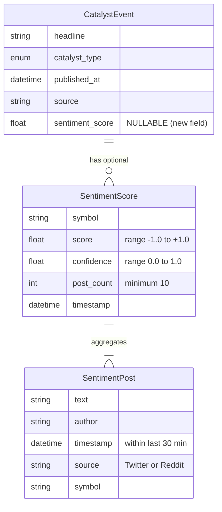

# Data Model: 034-sentiment-analysis-integration

## Entities

### CatalystEvent (Extended)
**Purpose**: News catalyst event with optional sentiment score

**Existing Fields** (from src/trading_bot/momentum/schemas/momentum_signal.py):
- `headline`: str - News headline text
- `catalyst_type`: CatalystType - Type of catalyst (EARNINGS, FDA, MERGER, PRODUCT, ANALYST)
- `published_at`: datetime - When news was published (UTC timezone)
- `source`: str - News source name (e.g., 'Alpaca News', 'Finnhub')

**New Field** (FR-003):
- `sentiment_score`: float | None - Aggregated sentiment score (-1.0 to +1.0, None if unavailable)
  - **Range**: -1.0 (very bearish) to +1.0 (very bullish), 0.0 (neutral)
  - **Default**: None (backward compatible, graceful degradation per NFR-005)
  - **Source**: Aggregated from Twitter/Reddit posts via FinBERT analysis

**Relationships**:
- Belongs to: MomentumSignal (stored in `details` dict)
- Has many: SentimentPost (via SentimentScore aggregation)

**Validation Rules**:
- `sentiment_score`: Must be in range [-1.0, 1.0] or None (from requirement FR-003)
- `published_at`: Must be datetime object (existing validation)
- **Backward compatibility**: Existing code without sentiment_score continues working (Optional field)

**State Transitions**:
- Initial: `sentiment_score=None` (no sentiment data)
- With Sentiment: `sentiment_score=float` (after successful sentiment analysis)
- Degraded: `sentiment_score=None` (if API fails, per NFR-005 graceful degradation)

---

### SentimentPost (New)
**Purpose**: Social media post data structure for sentiment analysis

**Fields**:
- `text`: str - Post content text (max 280 chars for Twitter, unlimited for Reddit)
- `author`: str - Username/handle of post author
- `timestamp`: datetime - When post was published (UTC timezone)
- `source`: str - Platform source ("Twitter" | "Reddit")
- `symbol`: str - Stock ticker mentioned in post (e.g., "AAPL", "$AAPL")

**Relationships**:
- Belongs to: Symbol (many posts per symbol)
- Generates: SentimentScore (via SentimentAnalyzer)

**Validation Rules**:
- `text`: Non-empty string (from requirement FR-008)
- `timestamp`: Within last 30 minutes (from requirement FR-008)
- `source`: Must be "Twitter" or "Reddit" (from requirement FR-001)
- `symbol`: Valid ticker format (1-5 uppercase letters, validated via validate_symbols())

**State Transitions**: N/A (immutable dataclass)

---

### SentimentScore (New)
**Purpose**: Aggregated sentiment result for a symbol

**Fields**:
- `symbol`: str - Stock ticker symbol (e.g., "AAPL")
- `score`: float - Aggregated sentiment score (-1.0 to +1.0)
- `confidence`: float - Confidence level (0-1, based on FinBERT probabilities)
- `post_count`: int - Number of posts analyzed
- `timestamp`: datetime - When analysis was performed (UTC timezone)

**Relationships**:
- Aggregates: Multiple SentimentPost records
- Generates: CatalystEvent.sentiment_score field

**Validation Rules**:
- `score`: Must be in range [-1.0, 1.0] (from requirement FR-003)
- `confidence`: Must be in range [0.0, 1.0]
- `post_count`: Must be >= 10 for reliable signal (from requirement FR-009 and US4)
- `symbol`: Valid ticker format (1-5 uppercase letters)

**State Transitions**: N/A (immutable dataclass)

---

## Database Schema (Mermaid)



**Note**: No traditional database. Entities are Python dataclasses stored in:
- CatalystEvent: In-memory (part of MomentumSignal.details dict)
- SentimentScore: Logged to `logs/sentiment-analysis.jsonl`
- SentimentPost: Ephemeral (not persisted, used for analysis only)

---

## API Schemas

**Request/Response Schemas**: See contracts/sentiment-api.yaml

**State Shape** (Python dataclasses):
```python
from dataclasses import dataclass
from datetime import datetime
from decimal import Decimal

@dataclass(frozen=True)
class SentimentPost:
    """Social media post for sentiment analysis."""
    text: str
    author: str
    timestamp: datetime
    source: str  # "Twitter" | "Reddit"
    symbol: str

    def __post_init__(self) -> None:
        # Validate text non-empty
        if not self.text.strip():
            raise ValueError("SentimentPost.text cannot be empty")

        # Validate source is valid platform
        if self.source not in ("Twitter", "Reddit"):
            raise ValueError(f"Invalid source: {self.source}")

        # Validate timestamp within last 30 minutes
        if (datetime.now(UTC) - self.timestamp).total_seconds() > 1800:
            raise ValueError("SentimentPost.timestamp must be within last 30 minutes")

@dataclass(frozen=True)
class SentimentScore:
    """Aggregated sentiment result for a symbol."""
    symbol: str
    score: float
    confidence: float
    post_count: int
    timestamp: datetime

    def __post_init__(self) -> None:
        # Validate score range
        if not (-1.0 <= self.score <= 1.0):
            raise ValueError(f"SentimentScore.score must be in range [-1.0, 1.0], got {self.score}")

        # Validate confidence range
        if not (0.0 <= self.confidence <= 1.0):
            raise ValueError(f"SentimentScore.confidence must be in range [0.0, 1.0], got {self.confidence}")

        # Validate minimum post count (from US4: min 10 posts for reliable signal)
        if self.post_count < 10:
            raise ValueError(f"SentimentScore.post_count must be >= 10, got {self.post_count}")

# Extended CatalystEvent (add sentiment_score field)
@dataclass(frozen=True)
class CatalystEvent:
    """Catalyst event from news sources with optional sentiment."""
    headline: str
    catalyst_type: CatalystType
    published_at: datetime
    source: str
    sentiment_score: float | None = None  # NEW FIELD (FR-003)

    def __post_init__(self) -> None:
        # Existing validation
        if not isinstance(self.published_at, datetime):
            raise ValueError("CatalystEvent.published_at must be a datetime object")

        # NEW: Validate sentiment_score range (if provided)
        if self.sentiment_score is not None:
            if not (-1.0 <= self.sentiment_score <= 1.0):
                raise ValueError(
                    f"CatalystEvent.sentiment_score must be in range [-1.0, 1.0] or None, "
                    f"got {self.sentiment_score}"
                )
```

---

## Migration Strategy

**Type**: Backward-compatible field addition (no breaking changes)

**Changes**:
1. Add `sentiment_score: float | None = None` to CatalystEvent dataclass
2. Add `__post_init__` validation for sentiment_score range
3. Update CatalystDetector.scan() to populate sentiment_score

**Backward Compatibility**:
- Existing code: `CatalystEvent(headline="...", catalyst_type=..., published_at=..., source="...")` continues working
- New code: `CatalystEvent(..., sentiment_score=0.75)` adds sentiment data
- Old logs: No sentiment_score field (reads as None)
- New logs: sentiment_score field present (backward compatible)

**Rollback**: Set `SENTIMENT_ENABLED=false` → sentiment_score remains None (degraded mode)

**Testing**:
- Unit test: CatalystEvent with sentiment_score=None (backward compat)
- Unit test: CatalystEvent with sentiment_score=0.5 (new behavior)
- Unit test: CatalystEvent with sentiment_score=2.0 (raises ValueError)
- Integration test: CatalystDetector.scan() with API failures (sentiment_score=None)
